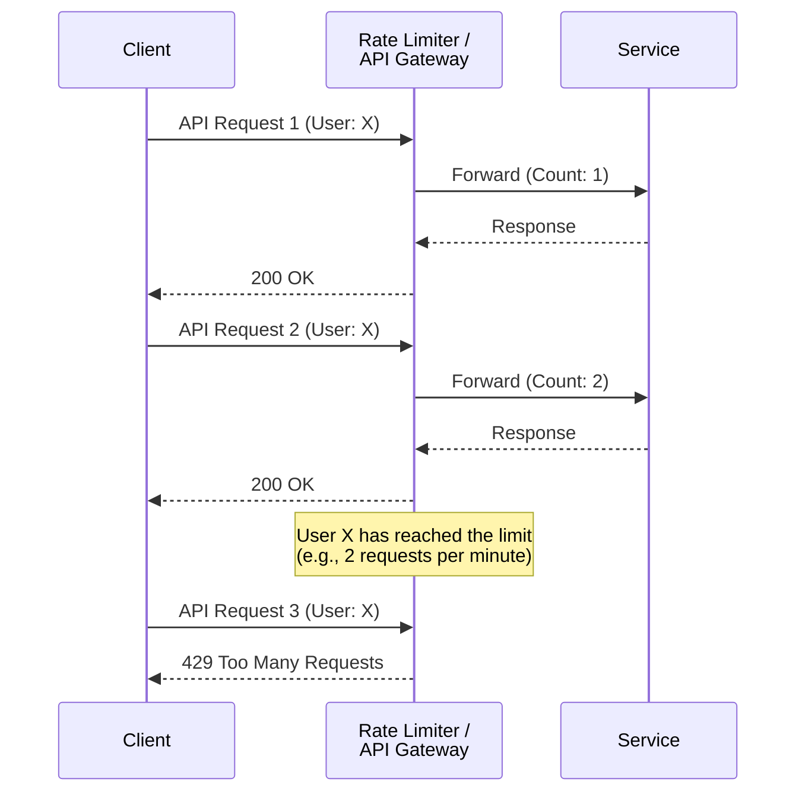

# Rate Limiting Pattern

The **Rate Limiting** pattern is a strategy for controlling the number of requests a client can make to a service within a specific time window. It is a crucial mechanism for protecting APIs and backend services from overuse, whether intentional (malicious attacks) or unintentional (buggy client code). Rate limiting is primarily about enforcing a **policy** on a per-client basis.

This pattern is fundamental to the design of public-facing APIs to ensure security, fair usage, and to manage different tiers of service.

*Description: The Rate Limiter tracks the number of requests per client. Once a client exceeds their predefined quota, subsequent requests within the time window are rejected with an HTTP 429 status code.*

---

## Rate Limiting vs. Throttling

While the underlying mechanisms are often identical, the *intent* behind Rate Limiting and [[throttling|Throttling]] is different:

- **Rate Limiting is client-focused.** It's about enforcing a contract or policy on a specific user or client. The primary questions are "Who is making the request?" and "Have they exceeded their quota?" It's a business or security rule.

- **[[throttling|Throttling]] is server-focused.** It's about protecting the health and availability of the server itself, regardless of who is making the request. The primary question is "Is the service healthy enough to process another request?" It's a measure of self-preservation.

In practice, a system often uses both. An [[api-gateway|API Gateway]] might apply rate limiting per client and also apply global throttling to protect the upstream services from a total traffic spike.

---

## Common Use Cases

- **Security:** Prevent malicious attacks like Denial-of-Service (DoS) or brute-force password guessing.
- **Fair Usage:** Ensure no single user can monopolize system resources, providing a better quality of service for everyone.
- **Commercial APIs:** Create different tiers of service (e.g., Free, Basic, Pro) with different rate limits, which is a common monetization strategy.
- **Cost Control:** Limit calls to expensive or third-party services to stay within budget.

---

## Common Rate Limiting Algorithms

1.  **Fixed Window Counter:** A simple algorithm that tracks the number of requests in a fixed time window (e.g., 100 requests per hour). A new window starts at the beginning of each hour.
    - **Pro:** Simple to implement.
    - **Con:** A burst of traffic at the edge of a window (e.g., at 10:59 and 11:01) can allow double the rate.

2.  **Sliding Window Log:** A log of timestamps for each request is kept for each user. When a new request comes in, the system checks how many timestamps in the log are within the last time window.
    - **Pro:** Very accurate.
    - **Con:** Can consume a lot of memory to store all the timestamps.

3.  **Token Bucket:** Each client has a bucket that is refilled with "tokens" at a fixed rate. Each request consumes one token. If the bucket is empty, the request is rejected. This is one of the most common and effective algorithms as it allows for short bursts of traffic.

4.  **Leaky Bucket:** Requests are added to a fixed-size queue (the bucket) and processed at a fixed rate. If the queue is full, new requests are rejected. This algorithm smooths out traffic into a steady stream.

---

## Challenges

- **Identifying the Client:** The effectiveness of rate limiting depends on being able to uniquely identify the client, typically via an API key, user ID, or IP address. Malicious actors may try to circumvent this by rotating IP addresses.
- **Distributed Systems:** Implementing a rate limit across a distributed system is challenging. It requires a centralized data store (like Redis or Memcached) to maintain a shared, consistent count for each client, which can introduce a new single point of failure and a performance bottleneck.
- **Choosing the Right Algorithm:** Different algorithms have different trade-offs in terms of accuracy, performance, and memory usage.
- **Communicating Limits:** It's important to communicate the rate limits to developers clearly, either through API documentation or via dynamic HTTP response headers (e.g., `X-RateLimit-Limit`, `X-RateLimit-Remaining`).

---

## Resources & Links

### Articles

1.  **[Rate Limiting pattern - Azure Architecture Center](https://learn.microsoft.com/en-us/azure/architecture/patterns/rate-limiting-pattern)**
    This article from Microsoft focuses on using rate limiting as a client-side pattern to interact with services that have throttling. It proposes a robust architecture where requests are sent to a durable messaging system (like Azure Event Hubs) first. Job processors then consume messages from this queue at a controlled rate that respects the downstream service's limits, effectively smoothing out traffic and preventing throttling errors. It also discusses strategies for coordinating rate limiting across multiple client instances.

2.  **[Rate Limiting in System Design - GeeksforGeeks](https://www.geeksforgeeks.org/system-design/rate-limiting-in-system-design/)**
    This article provides a broad overview of rate limiting as a fundamental system design concept. It covers the primary reasons for implementing it, such as preventing DoS attacks and ensuring fair resource usage. The article details the most common algorithms (Token Bucket, Leaky Bucket, Fixed Window, Sliding Window), explaining the pros and cons of each. It also discusses where rate limiting can be implemented in a system, from the API gateway to the application layer.