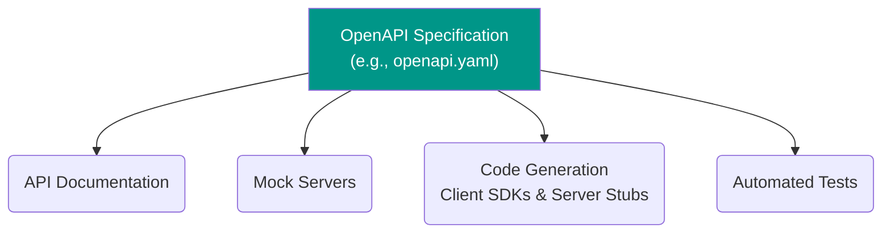

# API Documentation

API documentation is the user interface of an API. It is the primary contract between an API provider and its consumers, serving as a comprehensive reference guide that details how to effectively use and integrate with an API. High-quality documentation is not an afterthought; it is a critical component of the [[api-keys-and-management#The API Lifecycle|API lifecycle]] that directly drives adoption, reduces support load, and improves the overall developer experience.

Without clear, accurate, and accessible documentation, even the most powerful API will be underutilized or misused.

---

## The Specification-Driven Approach

Modern API documentation heavily relies on a **specification-driven** (or "design-first") approach. Instead of writing documentation manually after the code is complete, the development process starts with a machine-readable specification file that describes the API's entire surface. This file acts as the single source of truth.

The most widely adopted standard for this is the **[[openapi|OpenAPI Specification (OAS)]]**.

This approach ensures that the documentation is always in sync with the API's implementation and can be used to automate many parts of the development process.


*Description: An OpenAPI specification file acts as a central contract. From this single source of truth, you can automatically generate interactive documentation, mock servers for frontend development, client and server code, and test suites.*

---

## Core Components of Good Documentation

Effective API documentation must be comprehensive. It should leave no room for ambiguity and provide developers with everything they need to successfully integrate with the API.

| Component | Description | Related Concepts |
| :--- | :--- | :--- |
| **Introduction & Authentication** | A high-level overview of the API's purpose and a clear guide on how to authenticate requests. This is the first thing a developer needs to know. | [[api-security]], [[oauth]] |
| **Endpoint Reference** | A detailed list of all available endpoints, including their paths, supported HTTP methods, and a description of what each endpoint does. | [[rest]], [[http#HTTP Methods]] |
| **Request Details** | For each endpoint, a precise description of required path parameters, query parameters, and request headers. For `POST` or `PUT` requests, this includes the request body schema with data types and validation rules. | [[http#Resource Addressing in HTTP]] |
| **Response Details** | For each endpoint, a list of all possible responses, including success and error status codes, and the schema of the response body for each case. | [[http#HTTP Status Codes]], [[api-error-handling]] |
| **Code Examples** | Snippets of code in multiple popular programming languages (e.g., cURL, JavaScript, Python, Java) for each endpoint. This allows developers to copy-paste and get started quickly. | | 
| **Guides & Tutorials** | Step-by-step guides for common workflows that involve multiple API calls (e.g., "How to create a subscription" or "How to handle a multi-step payment"). | | 
| **Versioning & Changelog** | A clear explanation of the API's versioning strategy and a detailed changelog that documents all breaking and non-breaking changes. | [[api-versioning]] |

---

## Documentation Styles & Tools

Different tools and platforms cater to different documentation philosophies and use cases. They generally fall into two categories: generating a technical reference from a specification, or building a rich, collaborative developer portal.

### 1. Specification-Centric Tools

These tools focus on parsing an OpenAPI specification and rendering it as interactive API documentation.

#### OpenAPI (Swagger)
While **[[openapi|OpenAPI]]** is the specification itself, the **Swagger** toolset provides popular open-source tools that leverage it:
-   **Swagger UI**: Generates interactive API documentation from an OpenAPI spec. It allows users to visualize and interact with the API's resources without having any of the implementation logic in place. Its "Try it out" feature is iconic.
-   **Swagger Editor**: A browser-based editor where you can write OpenAPI specs in YAML or JSON and see the documentation rendered in real time.

**[OpenAPI Initiative](https://www.openapis.org/)**
**[Swagger Tools](https://swagger.io/tools/)**

**Example: A snippet of an `openapi.yaml` file:**
```yaml
paths:
  /users/{userId}:
    get:
      summary: Get user by user ID
      parameters:
        - name: userId
          in: path
          required: true
          schema:
            type: integer
      responses:
        '200':
          description: Successful operation
          content:
            application/json:
              schema:
                $ref: '#/components/schemas/User'
        '404':
          description: User not found
```

#### Redoc
Redoc is an open-source tool that also generates interactive documentation from an OpenAPI specification. It is often favored for its clean, three-pane design, which presents the navigation, endpoint details, and code examples in a clear and readable layout. It is a direct alternative to Swagger UI for rendering the final documentation.

**[Redoc](https://github.com/Redocly/redoc)**

### 2. Collaborative & Platform-Based Tools

These platforms provide a more holistic solution for the entire API design and documentation lifecycle, often with a focus on collaboration and developer experience.

#### Stoplight
Stoplight is a comprehensive, design-first API platform built around the OpenAPI specification. It provides a suite of tools for collaborative API design and documentation.
-   **Visual Editor**: Allows teams to design APIs visually without writing YAML by hand.
-   **Built-in Mocking**: Automatically generates mock servers from the OpenAPI spec.
-   **Style Guides**: Enforces design consistency across all APIs in an organization.
-   **Documentation Generation**: Publishes beautiful, interactive documentation from the spec.

Stoplight is ideal for teams that want to enforce a strict **design-first** approach, where the API contract is fully designed and validated before any code is written.

**[Stoplight](https://stoplight.io/)**

#### Postman
Postman is an incredibly popular API platform that is often used in a **code-first** or **test-first** workflow. While it also supports designing APIs from scratch, many teams use it to test existing endpoints and then generate documentation from their work.
-   **Collections**: Developers can create "collections" of API requests. These collections can be saved, shared, and executed as a group.
-   **Documentation from Collections**: Postman can automatically generate documentation for a collection, using the saved requests, headers, and example responses.
-   **Integrated Testing & Mocking**: Provides a single environment for designing, mocking, testing, and documenting APIs.

**[Postman](https://www.postman.com/)**

#### Readme.com
Readme is a platform focused on creating rich, interactive, and user-friendly **developer hubs**. It goes beyond simple API reference documentation by integrating guides, tutorials, and other explanatory content.
-   **Interactive Reference & Guides**: It combines API reference documentation (which can be synced from an OpenAPI file) with manually written guides, creating a seamless experience.
-   **Personalization**: Allows for features like suggesting API keys directly in the documentation for logged-in users.
-   **Collaboration**: Provides a collaborative environment for both technical writers and developers to contribute to the documentation.

**[Readme.com](https://readme.com/)**

---

## How to Choose the Right Documentation Tool

Choosing the right tool depends heavily on your team's workflow, the scope of your documentation, and your technical needs. There is no single "best" tool, only the right tool for the job.

Here's a summary to guide your decision:

| Tool | Best For... | Workflow | Key Strength |
| :--- | :--- | :--- | :--- |
| **Swagger UI / Redoc** | Simple, beautiful API reference | Any (Spec-driven) | Rendering an OpenAPI spec |
| **Stoplight** | Collaborative, design-first teams | Design-first | Governance & collaborative design |
| **Postman** | Teams already using it for testing | Code-first / Test-first | Integrated testing & documentation |
| **Readme.com** | Building a full developer portal | Any | Rich content & developer experience |

### Key Questions to Ask:

1.  **What is our workflow? (Design-first vs. Code-first)**
    -   If your team is committed to a **design-first** approach, where the OpenAPI specification is the contract created *before* implementation, you have two great options depending on your needs:
        -   **For a direct, spec-focused workflow**, the **[[#OpenAPI (Swagger)|Swagger]]** toolset itself is a primary choice. Using **Swagger Editor** or a similar tool allows developers to write the OpenAPI contract by hand and validate it in real-time. This is a straightforward, code-centric way to do design-first.
        -   **For a collaborative, platform-driven workflow**, a platform like **[[#Stoplight|Stoplight]]** is purpose-built. It provides powerful visual editors, style guides, and governance features to enforce consistency from the start, which is ideal for larger teams or organizations.
    -   If your team prefers a **code-first** or **test-first** approach, where documentation is generated from code annotations or from existing tests, **[[#Postman|Postman]]** is a natural fit. You can document your API by simply using it and saving your requests.

2.  **What is the scope of our documentation? (Reference vs. Full Hub)**
    -   If you just need to display a clean, interactive **API reference** from an existing OpenAPI file, a lightweight, open-source tool like **[[#Redoc|Redoc]]** or **[[#OpenAPI (Swagger)|Swagger UI]]** is perfect. They are easy to set up and focus on one thing: rendering the spec beautifully.
    -   If your goal is to build a complete **developer hub** with tutorials, getting-started guides, and marketing pages alongside your API reference, a dedicated platform like **[[#Readme.com|Readme.com]]** is the ideal choice. It excels at creating a rich, content-driven developer experience.

3.  **How important is collaboration and governance?**
    -   For large organizations that need to manage dozens of APIs with consistent standards, the governance and style guide features of **[[#Stoplight|Stoplight]]** are invaluable.
    -   For teams that value close collaboration between developers and QA, **[[#Postman|Postman]]**'s shared workspaces provide a unified environment for testing and documentation.

By answering these questions, you can select a tool that not only produces great documentation but also fits naturally into your team's existing processes.

---

## Best Practices for API Documentation
-   **Be Accurate and Up-to-Date**: Inaccurate documentation is worse than no documentation. Use a specification-driven approach to ensure it never goes stale.
-   **Provide Real-World Examples**: Show, don't just tell. Include request and response examples for every endpoint.
-   **Document Errors and Edge Cases**: Clearly document all possible error responses and what they mean, so developers can build resilient integrations.
-   **Focus on Workflows**: Supplement the technical reference with tutorials that guide developers through common multi-step processes.
-   **Make it Discoverable**: Ensure the documentation is easy to find, navigate, and search.

---

## Resources & Links

### Articles

1.  **[What is API Documentation? - Swagger](https://swagger.io/resources/articles/what-is-api-documentation/)**
    A foundational article from Swagger that explains the importance of API documentation and the different types that exist, from reference and tutorials to interactive documentation.

2.  **[API Documentation: Best Practices and Examples - Postman](https://www.postman.com/api-documentation-tool/)**
    Postman provides a comprehensive overview of what makes API documentation great, emphasizing clarity, completeness, and providing actionable examples for developers.

3.  **[The "Design-First" Approach to Building Microservices - Stoplight](https://stoplight.io/blog/the-design-first-approach-to-building-microservices)**
    This article from Stoplight makes a strong case for the design-first approach, where the OpenAPI specification is created before development begins, ensuring consistency and better collaboration.
