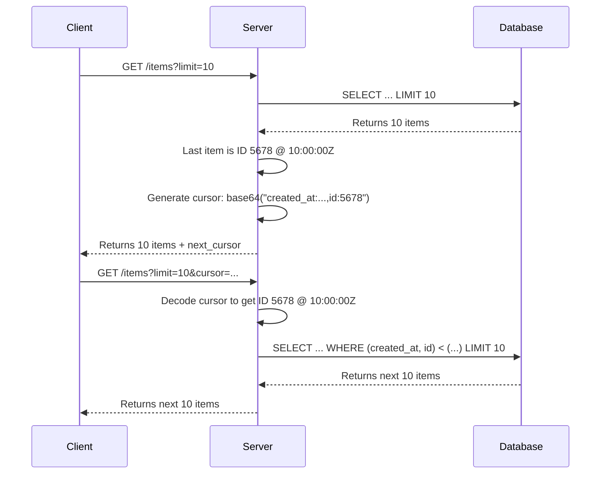

# API Pagination

API Pagination is the process of dividing a large set of data into smaller, more manageable chunks or "pages." When a client requests a large collection of resources, returning the entire dataset in a single response is inefficient and can overload both the server and the client. Pagination allows clients to fetch subsets of the data incrementally, improving performance, reliability, and the overall user experience.

This document outlines pagination strategies for both [[REST]] and [[graphql|GraphQL]] APIs.

---

## Pagination in REST APIs

For [[REST]] APIs, there is no single standard for pagination, but several common strategies have emerged, each with its own trade-offs.

### Core Strategies for REST APIs

Here are the most common pagination strategies, broken down by their core concepts.

#### 1. Offset-based Strategies
This family of strategies relies on skipping a certain number of records to get to the desired page.

- **Page-based Pagination:** This is the most user-friendly approach, where the client requests a specific page number and size.
  - **How it works:** The client requests a page number and the number of items per page.
  - **Example Request:** `GET /items?page=3&size=25`
  - **Server Implementation:** The server translates this into a database offset: `offset = (page - 1) * size`. For page 3 with a size of 25, the offset is 50. The resulting database query uses `LIMIT 25 OFFSET 50`.
  - **Cons:** Suffers from performance degradation on deep pages and can lead to inconsistent results ("page drift") if data is being added or removed during pagination.

- **Limit-Offset Pagination:** This is the direct, lower-level implementation of page-based pagination, where the client specifies the `limit` and `offset` directly.
  - **How it works:** The client asks for a specific number of items (`limit`) and specifies how many records to skip (`offset`).
  - **Example Request:** `GET /items?limit=100&offset=200`

#### 2. Keyset-based Strategies (The Seek Method)
This family of strategies avoids the `OFFSET` problem by using a `WHERE` clause on a sorted, unique column or set of columns (the "keyset"). This allows the database to directly **seek** to the beginning of the next page, making it highly performant and consistent.

- **Keyset Pagination:** This form uses the actual values of the sorted columns from the last record of the previous page as a filter.
  - **How it works:** For a list sorted by `created_at`, the client passes the timestamp of the last item it received.
  - **Example Request:** `GET /items?limit=100&created_before=2025-11-05T10:00:00Z`

- **Seek Pagination (by ID):** A very common and robust variant that uses a single, unique, sequential ID as the filter.
  - **How it works:** The client requests items that appear after a specific, last-seen ID.
  - **Example Request:** `GET /items?limit=100&after_id=12345`

- **Time-Based Pagination:** A specific implementation of Keyset pagination, essential for feeds and timelines.
  - **How it works:** The client requests items created `since` or `until` a specific timestamp. A unique ID is often used as a secondary tie-breaker for items with identical timestamps.
  - **Example Request:** `GET /logs?limit=100&since=2025-11-05T10:00:00Z`

- **Cursor Pagination (as an Implementation):** This is not a different strategy, but a more robust way to **implement** Keyset, Seek, or Time-based pagination. Instead of exposing implementation details like `after_id` or `created_before`, the server provides an opaque **cursor**—an encoded string that contains the information needed to fetch the next page.
  - **How it works:** The client receives a `next_cursor` in a response and sends it back in the next request.
  - **Example Request:** `GET /items?limit=50&cursor=aW10ZW1fMTIzNA==`

##### How Cursors Work: An Inside Look

The "magic" of the cursor is that it is generated and interpreted exclusively by the server. The client simply receives it and sends it back as-is.



1.  **Scenario:** A client requests a list of items sorted by `created_at DESC`, then `id DESC` (a common tie-breaker).
2.  **Server Response (Page 1):** The server returns a list of items. The last item in the list has these values: `created_at: '2025-11-05T10:00:00Z'` and `id: 5678`.
3.  **Cursor Generation (Server-side):** The server creates a string like `"created_at:2025-11-05T10:00:00Z,id:5678"` and encodes it (e.g., Base64) to create the opaque cursor, which is sent to the client.
4.  **Client Request (Page 2):** The client sends this exact cursor back to the server.
5.  **Cursor Interpretation (Server-side):** The server decodes the cursor, retrieves the values, and constructs a performant SQL query: `WHERE (created_at, id) < ('2025-11-05T10:00:00Z', 5678)`. 

**Important Distinction: Pagination vs. Filtering**

A pure cursor system is designed for **continuation**. It does not allow a client to jump to an arbitrary starting point. If that functionality is needed, the API must provide separate **filter** parameters (like `created_before`), which are typically mutually exclusive with the `cursor` parameter.

### Combined Pagination Strategies

In some cases, an API may need to support both efficient scrolling (cursors) and the ability to jump to an arbitrary page (offset). This can be achieved by supporting both methods as mutually exclusive parameters.

- **Use Case:** A data grid that allows users to both click "Next" and type in a page number.
- **Implementation:** The server inspects the query parameters to decide which logic to apply. If a `cursor` is provided, use Keyset/Seek logic. If `page` or `offset` is provided, use Offset logic.
- **Trade-offs:** This offers maximum flexibility but increases server-side complexity. The API must document that performance will differ depending on the method chosen.

### Implementation Examples in Frameworks

Most modern web frameworks offer built-in support or libraries to simplify pagination.

- **Java (Spring Boot):** Spring Data JPA's `PagingAndSortingRepository` uses a `Pageable` object to handle pagination and return a `Page` object.
- **.NET:** Libraries like `Pagination.EntityFrameworkCore.Extensions` or `CorePagination` integrate with Entity Framework Core.
- **Python:** Django's REST Framework has a configurable pagination system. For FastAPI, `fastapi-pagination` is a popular choice.
- **JavaScript (Node.js):** For SQL, ORMs like Sequelize have plugins (`sequelize-cursor-pagination`). For MongoDB, `mongoose-paginate-v2` is common.

### Returning Pagination Metadata

A paginated response must provide the client with enough information to navigate the dataset.

- **In the Response Body:** A `pagination` object is included in the JSON response.
  - **Example for Offset-based:** `{"total_items": 500, "total_pages": 20, "current_page": 2}`
  - **Example for Cursor-based:** `{"next_cursor": "aW10ZW1fMjc=", "has_more": true}`

- **In the `Link` HTTP Header:** A HATEOAS-style approach using the standard `Link` header.
  - **Example (Cursor-based):** `Link: <.../items?cursor=...>; rel="next", <.../items?cursor=...>; rel="prev"`

### Describing Pagination in OpenAPI

Your [[openapi|OpenAPI]] contract should clearly document the pagination parameters.

- **Example Snippet:**
  ```yaml
  parameters:
    - name: limit
      in: query
      # ... other properties
    - name: cursor
      in: query
      # ... other properties
  ```

---

## Pagination in GraphQL

[[graphql|GraphQL]] has a standardized, cursor-based pagination model known as the **Relay Cursor Connections Specification**. This provides a consistent and powerful pattern for all paginated queries.

- **How it works:** Instead of just returning a list, a paginated field returns a `Connection` object containing the items (`edges`) and pagination metadata (`pageInfo`).
- **Core Concepts:**
    - **`first` / `after`:** To paginate forward, you ask for the `first` N items `after` a specific cursor.
    - **`last` / `before`:** To paginate backward, you ask for the `last` N items `before` a specific cursor.
    - **`Connection`:** A wrapper object containing `edges` and `pageInfo`.
    - **`Edge`:** An object that wraps each individual item (`node`) and its unique `cursor`.
    - **`PageInfo`:** An object containing `hasNextPage`, `hasPreviousPage`, `startCursor`, and `endCursor`.

- **Example GraphQL Query:**
  ```graphql
  query GetItems {
    items(first: 10, after: "Y3Vyc29yX2E=") {
      edges {
        cursor
        node { id, name }
      }
      pageInfo {
        endCursor
        hasNextPage
      }
    }
  }
  ```

---

## Best Practices

- **Choose the Right Strategy:** Use **Offset Pagination** for smaller datasets where simplicity is key. Use **Cursor-Based Pagination** for large-scale applications where performance and consistency are critical.
- **Use Sensible Defaults:** Always apply a default page size (e.g., 25) if the client does not specify a `limit`.
- **Enforce a Maximum Page Size:** Protect your server by setting a reasonable maximum limit (e.g., 100).
- **Provide Clear Navigation:** Always include information that allows the client to fetch the next page.

---

## Resources & links

### Articles

1.  **[Everything You Need to Know About API Pagination](https://nordicapis.com/everything-you-need-to-know-about-api-pagination/)**
    This article from Nordic APIs provides a detailed breakdown of the core pagination strategies. It clearly explains the trade-offs between simple offset pagination and the more performant keyset and seek methods, highlighting issues like "page drift" and the benefits of using stable identifiers.

2.  **[REST API Pagination: An In-Depth Guide](https://apidog.com/blog/rest-api-pagination/)**
    This guide from Apidog offers a practical overview of offset-based and cursor-based pagination. It emphasizes the importance of choosing the right strategy based on performance and data consistency needs and provides a strong list of best practices, including the use of hypermedia links and allowing client control over page size.

3.  **[Unlocking the Power of API Pagination](https://dev.to/pragativerma18/unlocking-the-power-of-api-pagination-best-practices-and-strategies-4b49)**
    This dev.to article serves as a practical guide with concrete examples for multiple pagination methods, including time-based and keyset pagination. It provides valuable insights into best practices such as consistent naming, error handling, and combining pagination with sorting and filtering, complete with Python code snippets.
