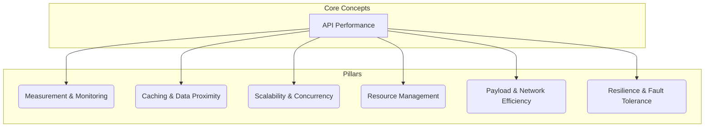

API performance is a critical, multi-faceted aspect of system design that directly impacts user experience, system stability, and operational cost. It is not a single feature but an outcome resulting from careful architectural choices across the entire request lifecycle.

A performant API is fast, reliable, and scalable. This document serves as a high-level guide to the key architectural concepts, or "pillars," that collectively determine API performance. Each pillar is a deep topic on its own, and this page links to the main documents for further detail.

---

## Measurement & Monitoring

*"You cannot improve what you cannot measure."*

The foundation of performance is understanding how the system behaves under load. This involves tracking key metrics to establish a baseline and identify bottlenecks.

-   **Performance Metrics**: Core indicators like latency, throughput, and error rate are essential for quantifying performance. These are often referred to as the **Golden Signals**. For a detailed breakdown of what to measure, see the [[monitoring#Performance Monitoring|Performance Monitoring]] section in the main monitoring document.
-   **Monitoring & Profiling**: Continuous [[monitoring]] provides real-time insight into system health, while profiling helps diagnose deep, code-level performance issues.
-   **Performance Testing**: Before releasing to production, APIs must undergo rigorous [[api-testing|performance testing]] (load, stress, and soak tests) to validate their behavior under anticipated and extreme conditions.

## Caching & Data Proximity

Reducing the distance data must travel is one of the most effective ways to improve response times.

-   **Caching**: Storing frequently accessed data in a temporary, high-speed layer significantly reduces latency and load on backend services. For a deep dive into different strategies (in-memory, distributed, etc.), see the main [[caching]] document.
-   **Content Delivery Network (CDN)**: A [[cdn|CDN]] is a geographically distributed network of proxy servers that caches content close to end-users, drastically reducing latency for static assets and cachable API responses.

## Scalability & Concurrency

A performant API must be able to handle a growing number of requests without degradation.

-   **Load Balancing**: Distributing incoming traffic across multiple servers is fundamental to achieving high availability and scalability. For more details, see the [[load-balancing]] page.
-   **Asynchronous Processing**: For long-running tasks, using [[asynchronous-messaging]] patterns with a [[message-queue]] prevents blocking the main request thread and improves perceived performance. The client can receive an immediate acknowledgment while the work is handled in the background.

## Resource Management

Protecting your API from overuse, whether malicious or unintentional, is crucial for maintaining stability for all consumers.

-   **Rate Limiting & Throttling**: Implementing a [[rate-limiting]] strategy prevents any single client from overwhelming the system, ensuring fair usage and protecting against denial-of-service attacks.
-   **API Keys**: Efficiently managing and validating [[api-keys-and-management|API keys]] is important, as this is often the first check for every incoming request.

## Payload & Network Efficiency

The size and structure of the data sent over the network have a direct impact on performance.

-   **Data Minimization**: Only return the data the client needs. This can be achieved through patterns like field selection (`?fields=...`) in [[rest|REST]] APIs or is a native feature of [[graphql]].
-   **Data Formats**: Choose efficient data formats. While JSON is human-readable, binary formats like Protocol Buffers (used by [[grpc|gRPC]]) can be smaller and faster to parse.
-   **Compression**: Use compression techniques like Gzip to reduce the size of HTTP payloads.

## Resilience & Fault Tolerance

Perceived performance is not just about speed; it's also about reliability. A fast API that fails often is not a performant API.

-   **Error Handling**: A well-defined [[api-error-handling|error handling]] strategy ensures that when things go wrong, the API fails gracefully and provides meaningful feedback to the client.
-   **Retry Mechanisms**: For transient failures, implementing a [[retry]] pattern (often with exponential backoff) on the client-side or in an [[api-gateway]] can increase the success rate of requests.
-   **Circuit Breaker**: The [[circuit-breaker]] pattern prevents an application from repeatedly trying to execute an operation that is likely to fail, allowing it to "heal" and preventing cascading failures.

---

## Resources & links

### Articles

1.  **[10 Practical Tips for API Performance](https://nordicapis.com/10-tips-for-improving-api-performance/)**
    A concise and actionable list of ten best practices for optimizing API performance. This article covers essential techniques such as effective caching, payload size limitation through pagination and compression, and the importance of asynchronous processing to reduce latency.

2.  **[Key Metrics and Best Practices for API Monitoring](https://www.catchpoint.com/api-monitoring-tools/api-performance-monitoring)**
    This article provides a thorough overview of why API monitoring is critical in modern distributed systems. It details key performance metrics to track, such as response time percentiles and error rates, and outlines best practices for logging, alerting, and implementing end-to-end tracing.

3.  **[A Deep Dive into API Profiling at Scale](https://medium.com/pinterest-engineering/api-profiling-at-pinterest-6fa9333b4961)**
    An insightful look into how a large-scale engineering team like Pinterest approaches API profiling. This article explains the difference between event-based and statistical profiling, and details their practical implementation for tracking memory usage, calculating endpoint operational costs, and even detecting dead code in production.

4.  **[A Guide to API Performance Testing](https://testsigma.com/blog/api-performance-testing/)**
    A comprehensive guide that defines the different types of API performance testing, including load, stress, endurance, and spike testing. It explains why each type is important and provides a framework for how to measure performance and build a robust testing strategy.