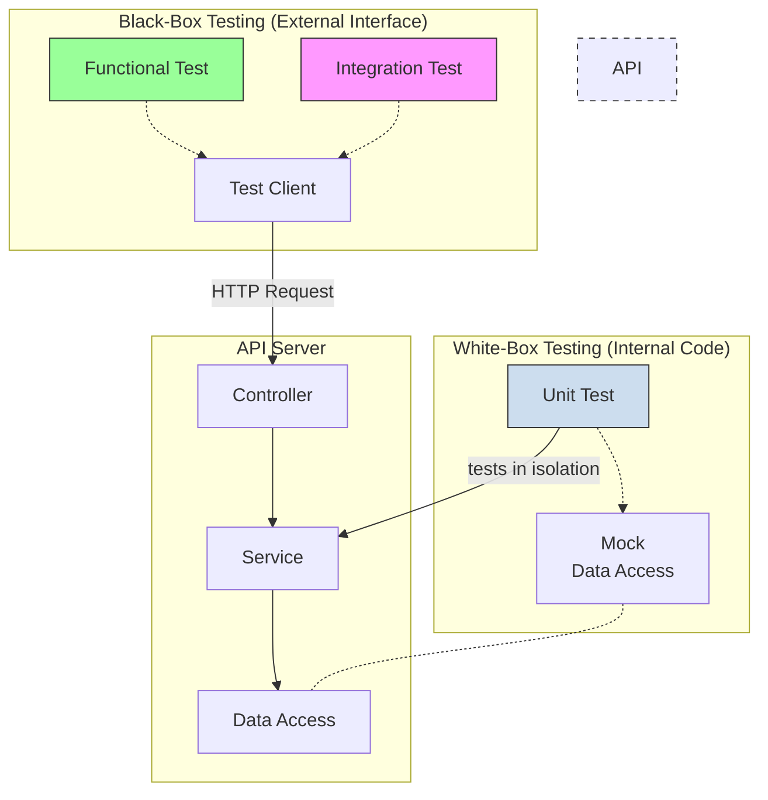

# API Testing

API Testing is a [[software-engineering-practices/testing/|software testing]] practice that verifies Application Programming Interfaces (APIs) directly to determine if they meet their expected functionality, reliability, performance, and security requirements. It is divided into two main categories: **[[functional-testing|black-box testing]]**, which validates the external behavior of the API without knowledge of the internal implementation, and **[[unit-testing|white-box testing]]**, which validates the internal code components of the API.

This practice is critical in modern architectures like [[microservices]], where services communicate via APIs.


*Description: This diagram shows the two main approaches to API testing. **[[functional-testing|Black-box testing]]** uses a client to make real HTTP calls to the API's public interface (the controller). **[[unit-testing|White-box testing]]** targets internal code components (like a service) in isolation, using mocks to replace dependencies like the database.*

---

## Black-Box Testing: Verifying the API Contract

[[functional-testing|Black-box tests]] interact with the API from the outside, via its public endpoints. They require a running API server and are focused on validating that the API contract—the expected requests and responses—is respected. This validation can also be rigorously enforced through [[#Contract Testing|contract testing]], which ensures compatibility between API consumers and providers.

### [[functional-testing|Functional Testing]]
[[functional-testing|Functional testing]] validates that the API behaves according to its specified business requirements. It is the most common form of API testing and answers the question: "Does the API do what it's supposed to do?"

- **What to Test:**
    - **Input Validation:** How the API handles valid and invalid request payloads (e.g., missing fields, incorrect data types).
    - **Business Logic:** The correctness of the outcomes. For an e-commerce API, does adding an item to the cart correctly update the total price?
    - **HTTP Status Codes & Responses:** Ensure a `201 Created` is returned after a successful creation, or a `400 Bad Request` for a malformed request.
    - **Authorization:** Verify that a user can only access the data they are permitted to see. While this is a key functional requirement, a more adversarial and in-depth examination of authorization vulnerabilities is conducted during [[#Security Testing|Security Testing]].
- **Example:** For a `POST /orders` endpoint, a [[functional-testing|functional test]] would:
    1. Send a valid order payload and assert that the response is `201 Created` and the order appears in the database.
    2. Send a payload with an invalid product ID and assert that the response is `400 Bad Request` with a clear error message.
    3. Send a valid order payload but with an authentication token for a user with insufficient permissions, and assert that the response is `403 Forbidden`.

### [[integration-testing|Integration Testing]]
[[integration-testing|Integration testing]] verifies that different parts of the system work together correctly. For APIs, this means testing the interactions between the API's components and its external dependencies like databases, other microservices, or third-party services.

- **What to Test:**
    - **Database Interaction:** Ensure the API can correctly create, read, update, and delete data in a real database.
    - **Service-to-Service Communication:** In a [[microservices]] architecture, verify that a call to one API correctly triggers the expected behavior in another.
    - **Multi-step Workflows:** Test complex business processes that span multiple API calls.
- **Example:** An [[integration-testing|integration test]] for a `POST /place-order` endpoint in an e-commerce system would:
    1. Call the endpoint with a valid order.
    2. Verify that the API correctly calls the external `payment-gateway-service` to process payment.
    3. Verify that it then calls the internal `inventory-service` to decrement the stock count.
    4. Assert that the final status of the order in the database is `CONFIRMED`.

### Load & Performance Testing
Load testing assesses the API's performance, reliability, and [[software-architecture/system-design-fundamentals/index#Scalability|scalability]] under specific loads. It helps identify the system's limits and potential bottlenecks before they affect users in production.

- **What to Test:**
    - **Response Time:** How long the API takes to respond under various levels of traffic.
    - **Throughput:** The number of requests per second the API can sustain.
    - **Resource Utilization:** CPU, memory, and network usage of the server under load.
- **Types of Performance Tests:**
    - **Load Test:** Simulates expected user traffic to ensure the API meets performance goals.
    - **Stress Test:** Pushes the API beyond its limits to see how and when it breaks, and how it recovers.
    - **Spike Test:** Simulates sudden, massive increases in traffic.
- **Example:** A load test might simulate 500 concurrent users browsing products (`GET /products`) and placing orders (`POST /orders`) for 10 minutes, while ensuring that the average response time stays below 200ms and the error rate is below 0.1%.

### Security Testing
[[software-architecture/security/security-fundamentals|Security testing]] aims to identify and fix vulnerabilities in the API. It involves probing the live endpoints for common security flaws, simulating the actions of a malicious actor.

- **What to Test:**
    - **Authentication & Authorization:** Ensure endpoints are protected and that users cannot access data or perform actions they shouldn't.
    - **Injection Flaws:** Test for SQL, NoSQL, or command injection vulnerabilities by sending malicious payloads.
    - **Data Exposure:** Verify that the API does not leak sensitive information (e.g., passwords, personal data) in its responses.
- **Example:** A common security test is for Broken Object Level Authorization (BOLA), the #1 vulnerability on the [[OWASP]] API Security Top 10. The test would involve:
    1. Authenticating as User A (e.g., with ID `123`).
    2. Making a request to an endpoint to access a resource belonging to another user, e.g., `GET /users/456/profile`.
    3. Asserting that the API returns a `403 Forbidden` or `404 Not Found` status, not the data for user `456`.

---

## White-Box Testing: Verifying the API Implementation

[[unit-testing|White-box tests]] validate the internal code and logic of the API. These tests do not require a running server; instead, they test the code components directly, using mocks to isolate them from their dependencies.

### [[unit-testing|Unit Testing]] API Components
The key difference between a generic [[unit-testing|unit test]] and an **API [[unit-testing|unit test]]** lies in the **nature of the unit being tested**. For APIs, the units are often specific architectural components responsible for handling aspects of the HTTP request/response lifecycle.

- **What makes it "API Unit Testing"?**
    - **Testing a Controller:** You are not just testing a function; you are testing the component that interprets HTTP requests, validates inputs, and formats HTTP responses. The test involves mocking the `request` and `response` objects, which are API-specific constructs.
    - **Testing a Middleware:** You are testing a component (e.g., for authentication, logging) that intercepts and processes the request pipeline. This is a concept almost exclusive to API frameworks.
    - **Testing a Service:** While the test may look classic (mocking a repository), its purpose is to validate the business logic that serves a specific API endpoint's use case.

- **Example (Testing an Express.js Middleware):**
  This test verifies that an authentication middleware correctly calls `next()` if the token is valid, and returns a `401` if it is not.

  ```javascript
  // auth.middleware.js
  const jwt = require('jsonwebtoken');

  function authenticateToken(req, res, next) {
    const token = req.headers['authorization'];
    if (token == null) return res.sendStatus(401);

    jwt.verify(token, process.env.TOKEN_SECRET, (err, user) => {
      if (err) return res.sendStatus(403);
      req.user = user;
      next();
    });
  }

  // auth.middleware.test.js
  const middleware = require('./auth.middleware');
  const jwt = require('jsonwebtoken');

  describe('Auth Middleware', () => {
    it('should call next() if token is valid', () => {
      const req = { headers: { 'authorization': 'valid_token' } };
      const res = {};
      const next = jest.fn(); // A mock function for next()
      
      // Mock the jwt.verify function to simulate a valid token
      jest.spyOn(jwt, 'verify').mockImplementation((token, secret, callback) => callback(null, { user: 'test' }));

      middleware.authenticateToken(req, res, next);
      expect(next).toHaveBeenCalled();
    });

    it('should return 401 if no token is provided', () => {
      const req = { headers: {} };
      const res = { sendStatus: jest.fn() };
      const next = jest.fn();

      middleware.authenticateToken(req, res, next);
      expect(res.sendStatus).toHaveBeenCalledWith(401);
      expect(next).not.toHaveBeenCalled();
    });
  });
  ```

---

## Specialized Strategies & Techniques

### Contract Testing
Contract testing is a technique that verifies that two separate systems (e.g., a client and an API, or two microservices) can communicate with each other. It ensures that both sides adhere to a shared "contract" without the complexity of a full [[integration-testing|integration test]].

- **How it Works (Consumer-Driven):**
    1. The **Consumer** (e.g., a web frontend) writes a test that defines its expectations for an API response (e.g., "I expect a `GET /user/123` to return a JSON object with a `name` that is a string and an `id` that is a number").
    2. This test generates a `contract file` (a "pact").
    3. The contract is shared with the **Provider** (the API).
    4. The Provider runs a test to verify it can generate a response that satisfies all the expectations in the contract.
- **Main Benefit:** It allows teams to evolve and deploy their services independently with confidence that they are not breaking their consumers. It is a cornerstone of maintaining a healthy [[microservices]] architecture.

### API Mocking
While mocking is a general [[software-engineering-practices/testing/|software testing]] technique, **API Mocking** refers to its specific application within the API development and testing lifecycle. It primarily involves creating simulated versions of APIs or their dependencies to provide predictable behavior and isolate the system under test.

- **Use Cases:**
    - **[[unit-testing|Unit]] & [[integration-testing|Integration Testing]]**: Replace dependencies with mocks to test a component in isolation. The middleware example above mocks `jwt.verify`.
    - **Frontend Development:** A frontend team can develop against a `mock server` that simulates the real API before it's even built, allowing for parallel work.
    - **Testing Edge Cases:** Easily simulate rare or hard-to-reproduce scenarios, such as a third-party API being down or returning a `500 Internal Server Error`.
- **Example:** A frontend developer can use a tool like Postman Mock Servers or Prism to create a mock API endpoint at `https://mock.api/users/123` that always returns a predefined JSON user object. This allows them to build and test the UI without needing a running backend.

---

## Resources & Links

### Articles

1.  **[API Testing Guide by Postman](https://www.postman.com/api-platform/api-testing/)**
    This guide from Postman provides a comprehensive overview of API testing, its importance in an API-first world, and the various types of tests involved. It covers best practices and how Postman's platform can be used to streamline testing processes from functional to performance testing.

2.  **[How to Write Unit Tests for Your REST API](https://medium.com/@oyetoketoby80/how-to-write-unit-test-for-your-rest-api-f8f71376273f)**
    This article offers a practical, step-by-step guide on writing unit tests for REST APIs, focusing on a Node.js environment. It demonstrates how to set up a testing suite with tools like Mocha and Chai to test API endpoints for status codes, headers, and response bodies.

3.  **[Postman Integration Testing Template](https://www.postman.com/templates/collections/integration-testing/)**
    This Postman Collection template provides a structured starting point for creating integration tests. It helps users build and organize tests for complex, multi-step workflows, ensuring that data flows and dependencies between different services are consistent and reliable.

4.  **[API Functional Testing Explained by Testsigma](https://testsigma.com/blog/api-functional-testing/)**
    This article clearly defines API functional testing as a method to validate an API's behavior against its specified requirements. It highlights the benefits of this approach for testing business logic directly and provides concrete examples and steps to get started with automation.

5.  **[Beginner's Guide to API Load Testing by Grafana Labs](https://grafana.com/blog/2024/01/30/api-load-testing/)**
    This guide from Grafana Labs introduces the core concepts of API load testing, explaining how to model workloads and set performance goals (SLOs). It provides practical examples using the Grafana k6 tool to help beginners understand how to simulate traffic and measure an API's performance under load.

6.  **[A Complete Guide to API Contract Testing by Testsigma](https://testsigma.com/blog/api-contract-testing/)**
    This comprehensive guide explains how API contract testing ensures reliable communication in a microservices architecture by verifying that consumers and providers adhere to a shared contract. It details the planning, documentation, and tool selection phases, clarifying when this method is most effective.

7.  **[API Mocking: Definition, Guide, and Best Practices](https://katalon.com/resources-center/blog/what-is-api-mocking)**
    This article from Katalon defines API mocking as the creation of a simulated API to mimic the behavior of a real one, enabling development and testing in isolation. It covers the key benefits, such as enabling parallel work between teams, reducing costs, and improving test coverage for edge cases.