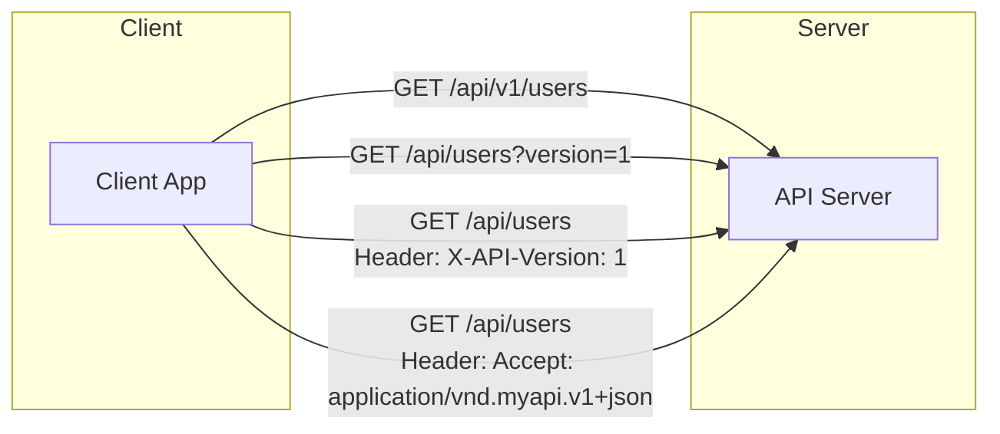

# API Versioning

API Versioning is the practice of managing and tracking changes to an Application Programming Interface (API). Its primary purpose is to allow an API to evolve and add new features or fix issues without breaking existing client applications that rely on older versions. Every time a **breaking change** is introduced, a new version of the API is released.

Versioning is a critical aspect of the API lifecycle, providing a clear contract to consumers and ensuring stability.

---

## Breaking vs. Non-Breaking Changes

The decision to release a new version hinges on whether a change is "breaking" or "non-breaking."

- **Breaking Changes (Require a New Version):** These are changes that will cause existing client applications to fail. A new major version (e.g., `v1` to `v2`) is required.
    - Removing or renaming an endpoint, a JSON field, or a query parameter.
    - Changing the data type of a field (e.g., changing an `integer` to a `string`).
    - Adding a new required field to a request body.
    - Changing authentication or authorization rules.

- **Non-Breaking Changes (Do Not Require a New Version):** These are additive changes that existing clients can safely ignore. They can be rolled out on the current version.
    - Adding a new, optional field to a JSON response.
    - Adding a new, optional query parameter.
    - Adding a new API endpoint.

---

## Common Versioning Strategies

There are four primary strategies for versioning a [[REST]] API. Each has distinct trade-offs in simplicity, cacheability, and REST compliance.


*Description: A visual comparison of the four main API versioning strategies, showing how the version is communicated from the client to the server in each case.*

### 1. URI Path Versioning
This is the most common and straightforward method. The version is placed directly in the URI path.

- **Example:** `https://api.example.com/v1/products`
- **Pros:**
    - **Explicit and Visible:** Very clear to anyone browsing the API which version they are using.
    - **Simple:** Easy for clients to implement and for developers to route requests.
- **Cons:**
    - **Pollutes URI Space:** The URI no longer points to a unique resource, but to a specific version of that resource, which some argue violates a core principle of [[REST]].
- **Impact on Caching:** Caching is simple and effective. From the perspective of any HTTP cache (browser, CDN, proxy), `/v1/products/123` and `/v2/products/123` are two completely different resources and are cached as separate entries.

### 2. Query Parameter Versioning
The version is specified as a query parameter at the end of the URI.

- **Example:** `https://api.example.com/products?version=1.2`
- **Pros:**
    - **Simple:** Easy for clients to use.
    - **Doesn't clutter the URI path:** The core URI remains clean.
- **Cons:**
    - **Less Explicit:** Can be overlooked more easily than URI path versioning.
    - **Can lead to messy URLs** if combined with other query parameters for filtering or [[api-pagination|pagination]].
- **Impact on Caching:** This method can be problematic for caching. Many caching proxies are not configured to cache responses based on query parameters, which can lead to them serving the wrong version of a resource or not caching at all.

### 3. Custom Header Versioning
The client requests a specific version by passing a custom HTTP header.

- **Example:** `GET /products` with the header `X-API-Version: 1`
- **Pros:**
    - **Keeps the URI clean:** The URI is not polluted with versioning information.
    - **Good for internal APIs:** Where developer control is high.
- **Cons:**
    - **Not visible:** Requires inspecting HTTP headers to know the version, making it harder to test and explore in a browser.
- **Impact on Caching:** Requires more complex cache configuration. For a cache to store different versions of the same resource, the server must include the `Vary: X-API-Version` header in its response. This instructs the cache to key its entries based on both the URI and the value of the `X-API-Version` header.

### 4. Media Type Versioning (Content Negotiation)
This is often considered the most "academically correct" or purist [[REST]] approach. The version is specified in the `Accept` header as part of a custom media type.

- **Example:** `GET /products` with the header `Accept: application/vnd.example.v1+json`
- **Pros:**
    - **Theoretically Pure:** It correctly uses HTTP headers for content negotiation, treating different API versions as different representations of the same resource.
    - **Excellent for HATEOAS:** This is the ideal strategy for hypermedia-driven APIs.
- **Cons:**
    - **Complex:** Significantly more complex for both clients and servers to implement.
    - **Obscure:** Very few developers are familiar with this method, making it difficult to use and debug.
- **Impact on Caching:** Similar to custom headers, this requires the server to send the `Vary: Accept` header. This is a standard and well-supported use of the `Vary` header, but it still relies on correct server-side configuration.

#### Versioning and HATEOAS

Hypermedia as the Engine of Application State (HATEOAS) is a core REST constraint where clients navigate the API by following links provided in server responses. Versioning strategy has a significant impact on how this works.

- **With Media Type or Header Versioning:** This is the ideal scenario for HATEOAS. Resource URIs remain clean and version-agnostic (e.g., `/products/123`). The links returned by the server can also be clean URIs. The client is responsible for continuing to send the correct `Accept` or `X-API-Version` header with each request it makes, ensuring it always receives the correct representation of the linked resources.

- **With URI or Query Parameter Versioning:** HATEOAS is still perfectly achievable, but it works differently. The version information must be embedded directly within the links returned by the server. For example, a response from `GET /api/v1/users/42` would contain links that also include the version:
  ```json
  {
    "id": 42,
    "name": "John Doe",
    "_links": {
      "self": { "href": "/api/v1/users/42" },
      "orders": { "href": "/api/v1/users/42/orders" }
    }
  }
  ```
  The client does not need to know about the versioning scheme; it simply follows the URLs provided by the server. This is a more pragmatic and widely used approach, even if it is less theoretically pure.

---

## Best Practices

- **Default to URI Versioning:** For most use cases, especially for public APIs, URI path versioning (`/v1/`, `/v2/`) is the clearest and most widely understood approach.
- **Have a Deprecation Strategy:** When you release `v2`, don't shut down `v1` immediately. Communicate a clear deprecation schedule to your consumers (e.g., "v1 will be supported for 12 months").
- **Maintain a Changelog:** Keep a public, detailed changelog so consumers can easily see what has changed between versions.
- **Consider No Versioning for Internal APIs:** If you control both the client and the server (e.g., a web app calling its own backend), you may be able to evolve the API without formal versioning by deploying changes in lockstep. This is a common strategy in [[microservices]] architectures where teams can coordinate changes.

---

## Resources & Links

### Articles

1.  **[What is API versioning? Benefits, types & best practices | Postman](https://www.postman.com/api-platform/api-versioning/)**
    This Postman article explains API versioning as the process of managing and communicating changes to an API without disrupting consumers. It covers the benefits, scenarios requiring versioning, common approaches like URL and header versioning, and best practices for successful implementation.

2.  **[API Versioning Strategies: Best Practices Guide - Daily.dev](https://daily.dev/blog/api-versioning-strategies-best-practices-guide)**
    This comprehensive guide from Daily.dev delves into various API versioning strategies, emphasizing their importance for maintaining stability and enhancing user experience. It outlines different methods such as URL path, query parameter, and header versioning, alongside best practices like early planning and clear communication.