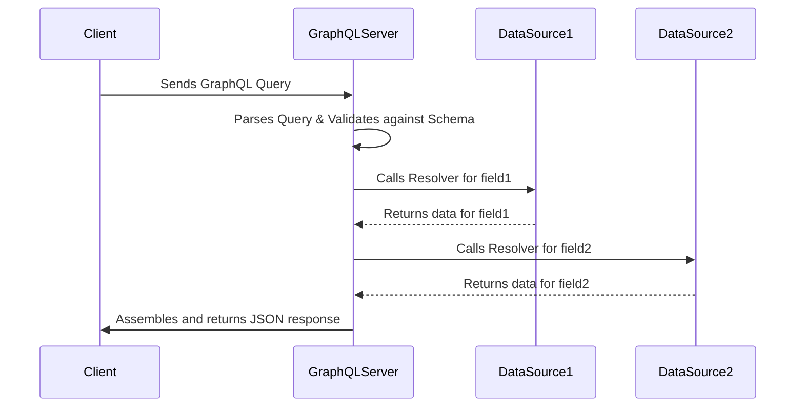

GraphQL is a query language for APIs and a server-side runtime for executing those queries. Developed by Facebook and open-sourced in 2015, it provides a powerful alternative to the traditional [[rest|REST]] architectural style.

Unlike REST, which exposes a multitude of endpoints for different resources, a GraphQL API typically exposes a single endpoint. The client sends a single, complex query to this endpoint that specifies the exact data it needs, and the server responds with a JSON object containing precisely that data—nothing more, nothing less.

It is often used as a query layer for multiple downstream data sources, acting as a gateway for clients to interact with a complex system, such as a [[microservices]] architecture.

## Core Concepts of GraphQL

GraphQL is built on a few central concepts that work together to provide its power and flexibility.

-   **Schema Definition Language (SDL)**: The heart of any GraphQL API is its schema. The schema is a strongly typed contract that defines all the capabilities of the API, including the types of data that can be queried and the relationships between them.
-   **Queries**: Queries are used to fetch data. They mirror the shape of the final JSON response, making them intuitive to write and understand.
-   **Mutations**: For any create, update, or delete operations, GraphQL uses mutations. While queries are executed in parallel by the GraphQL engine, mutations are executed sequentially to ensure data integrity.
-   **Subscriptions**: For real-time communication, GraphQL supports subscriptions, which allow a client to listen for changes on the server and receive updates as they happen, typically over WebSockets.
-   **Resolvers**: A resolver is a function on the server that is responsible for fetching the data for a single field in the schema. The GraphQL engine calls the necessary resolvers to construct the final response to a query.

## How GraphQL Works: A High-Level View


*Description: A client sends a single GraphQL query. The server parses it, calls the necessary resolvers (which can fetch data from multiple sources like databases or other APIs), and constructs a single JSON response with exactly the data the client asked for.*

## The Schema: The Heart of a GraphQL API

The schema is the most important concept in a GraphQL API. It is a contract between the client and the server that defines how they can communicate.

**Example Schema:**
```graphql
type Query {
  user(id: ID!): User
  posts: [Post]
}

type Mutation {
  createPost(title: String!, content: String!): Post
}

type User {
  id: ID!
  name: String
  email: String
  posts: [Post]
}

type Post {
  id: ID!
  title: String
  content: String
  author: User
}
```
*Description: This SDL defines the structure of our simple API. It has a `Query` type for fetching data and a `Mutation` type for writing data. The `User` and `Post` types define the shape of the resources.*

## Queries and Mutations

### Fetching Data with Queries

The client specifies which fields it is interested in.

**Example Query:**
```graphql
query {
  user(id: "123") {
    name
    posts {
      title
    }
  }
}
```
*Description: The client asks for a specific user (with id "123") and, within that user, requests only the `name` and the `title` of their posts. The structure of the query directly maps to the structure of the JSON response.*

**Example Response (JSON):**
```json
{
  "data": {
    "user": {
      "name": "John Doe",
      "posts": [
        { "title": "My First Post" },
        { "title": "GraphQL is Awesome" }
      ]
    }
  }
}
```

### Modifying Data with Mutations

Mutations are used for write operations.

**Example Mutation:**
```graphql
mutation {
  createPost(title: "New Post", content: "This is the content.") {
    id
    title
  }
}
```
*Description: The client uses the `mutation` keyword to call the `createPost` mutation, passing the required arguments. It also specifies which fields of the newly created post (`id` and `title`) it wants to receive back in the response.*

## Advantages of GraphQL

-   **Solves Over-fetching and Under-fetching**: This is the primary advantage. Clients query for the exact data they need, eliminating the multiple round trips (under-fetching) or large, unnecessary payloads (over-fetching) common in [[rest|REST]] APIs.
-   **Strongly Typed Schema**: The schema acts as a single source of truth and powerful documentation. It enables better tooling, static analysis, and validation, reducing bugs and miscommunication between frontend and backend teams.
-   **Rapid Product Development**: Frontend teams can explore the API and even mock its data using the schema. They can request new data fields without needing the backend team to create new endpoints.
-   **Introspection**: A GraphQL API is self-documenting. A client can query the schema itself to understand what queries, types, and mutations are available.

## Disadvantages of GraphQL

-   **API Complexity**: While simpler for the client, GraphQL shifts a lot of complexity to the server. Implementing a performant GraphQL server with features like batching (e.g., via DataLoader) to solve the N+1 problem requires careful design.
-   **[[caching|Caching]] Complexity**: Unlike [[rest|REST]], which can leverage standard HTTP caching for different resource URIs, GraphQL typically uses a single endpoint (e.g., `/graphql`). This makes caching on the HTTP layer more difficult, requiring more sophisticated client-side or server-side caching strategies.
-   **Steeper Learning Curve**: For teams accustomed to the simplicity of REST, adopting GraphQL requires learning a new query language, understanding schemas and resolvers, and a new way of thinking about API design.
-   **File Uploads**: GraphQL does not have a native specification for file uploads, requiring the use of extensions or multi-part form requests, which can add complexity.

## Resources & Links

### Articles

1.  **[Understanding GraphQL APIs From a REST API Point of View](https://medium.com/@elijahbanjo/understanding-graphql-apis-from-a-rest-api-point-of-view-08196600c667)**
    An article that explains GraphQL concepts by comparing them to their counterparts in REST, making it ideal for developers already familiar with REST.

### Videos

1.  **[GraphQL Explained in 100 Seconds](https://www.youtube.com/watch?v=Zg4XIpnLWQg)**
    A fast-paced introduction to the core concepts of GraphQL, perfect for a quick overview.

2.  **[GraphQL Crash Course](https://www.youtube.com/watch?v=yWzKJPw_VzM)**
    A more in-depth crash course that walks through building a GraphQL API.

### Official Resources

1.  **[GraphQL Official Website](https://graphql.org/)**
    The best place to start for official documentation, news, and community resources.

### Learning

1.  **[How to GraphQL](https://www.howtographql.com/)**
    A free and open-source tutorial series for learning GraphQL.
