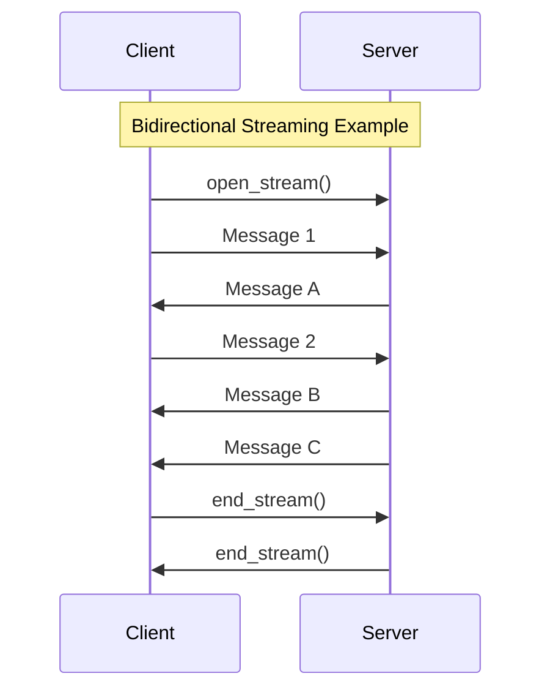

# gRPC

gRPC (gRPC Remote Procedure Call) is a modern, high-performance, open-source RPC framework developed by Google. It is a powerful evolution of the traditional [[rpc|RPC]] pattern, addressing many of its original drawbacks by providing streaming, strong typing, and high efficiency. It uses **Protocol Buffers (Protobuf)** as its interface definition language (IDL) and data serialization format, and it is built on top of [[communication-protocols#Evolution: HTTP/2 and HTTP/3|HTTP2]].

gRPC is commonly used for high-performance communication between internal [[microservices]].

## Core Concepts

### Protocol Buffers (Protobuf)
At the core of gRPC is the `.proto` file, which defines the services and message types. This file acts as a contract between the client and server.

**Example `user_service.proto`:**
```protobuf
syntax = "proto3";

service UserService {
  // A simple RPC
  rpc GetUser(UserRequest) returns (UserResponse);

  // A server-to-client streaming RPC
  rpc ListUsers(Empty) returns (stream UserResponse);
}

message UserRequest {
  int32 id = 1;
}

message UserResponse {
  int32 id = 1;
  string name = 2;
  string email = 3;
}

message Empty {}
```
From this file, gRPC tools can generate strongly-typed client and server code in various languages.

### Communication Types

gRPC leverages [[communication-protocols#Evolution: HTTP/2 and HTTP/3|HTTP2]] to support four types of communication:

1.  **Unary RPC**: The client sends a single request and gets a single response, just like a traditional RPC call.
2.  **Server Streaming RPC**: The client sends a single request and gets a stream of messages back from the server.
3.  **Client Streaming RPC**: The client sends a stream of messages to the server and gets a single response back.
4.  **Bidirectional Streaming RPC**: Both the client and server send a stream of messages to each other over a single connection.



## Advantages
- **High Performance**: Achieved through binary serialization with Protobuf and multiplexing over HTTP/2, making it significantly faster than text-based protocols like JSON.
- **Streaming**: Natively supports unary, client-streaming, server-streaming, and bi-directional streaming, enabling more complex and efficient communication patterns.
- **Strong Typing**: Service contracts defined in `.proto` files generate strongly-typed client and server code, reducing runtime errors and improving developer productivity.
- **Service Discovery Friendly**: While gRPC itself doesn't provide service discovery, its strong typing and contract-first approach (via `.proto` files) make it highly compatible with external service discovery mechanisms (e.g., Consul, etcd, Kubernetes). This facilitates dynamic lookup and connection to services in a distributed environment.
- **Language Agnostic**: A wide range of officially supported and community-supported languages.

## Disadvantages
- **Contract Coupling**: While the `.proto` contract file solves discovery, it still creates a form of tight coupling. Both client and server are bound to the exact service and message definitions. Any change to the contract requires regenerating client code, which is less flexible than the looser coupling of [[rest|REST]] APIs.
- **Caching Complexity**: Like other RPC frameworks, caching is not natively supported by standard web infrastructure. See [[rpc#Caching Challenges for RPC-Based Communication|RPC Caching Challenges]] for details.
- **Less Human-Readable**: The use of the binary Protobuf format makes it difficult to debug and inspect messages using standard text-based tools like `curl` or browser developer tools. Specialized tools (like `grpcurl`) are required.
- **Steeper Learning Curve**: For teams accustomed to REST and JSON, adopting gRPC, Protocol Buffers, and the associated tooling can require a significant initial learning investment.

## Security

gRPC has robust, built-in support for [[authentication]], which is integrated directly into its channel-based communication. Security can be handled at two main levels:

-   **Transport Security (Encryption)**: gRPC promotes the use of TLS (Transport Layer Security) to encrypt all traffic between the client and server. This is the most common and recommended approach for securing gRPC communication, preventing eavesdropping and man-in-the-middle attacks. This relies on the principles of [[pki|Public Key Infrastructure (PKI)]] to validate the server's identity.

-   **Channel Authentication (Credentials)**: gRPC provides a flexible mechanism for passing credentials with each call. This is managed by attaching credentials to a channel. Common authentication patterns include:
    -   **SSL/TLS with Certificates**: The client can present a certificate to the server to prove its identity (mutual TLS).
    -   **Token-Based Authentication**: A client can attach a token (e.g., an OAuth 2.0 token or a [[jwt|JWT]]) to the metadata (headers) of each RPC call. The server can then inspect this token to authenticate and authorize the client. This is a common pattern for securing [[microservices]].

## Resources & Links

### Articles

1.  **[Core concepts, architecture and lifecycle - gRPC Official Docs](https://grpc.io/docs/what-is-grpc/core-concepts/)**
    The official documentation from the gRPC team explaining the fundamental concepts and architecture. It covers service definitions with Protocol Buffers, the different types of RPCs (unary, streaming), and the request/response lifecycle. This is the authoritative source for understanding how gRPC works under the hood.

2.  **[Transform Your Microservice Architecture with gRPC - Medium](https://medium.com/@chaisarfati/transform-your-microservice-architecture-with-grpc-b76c88f2b5a9)**
    An article that makes a strong case for using gRPC in a microservices architecture. It compares gRPC with REST, highlighting the performance benefits of HTTP/2 and Protocol Buffers. It also discusses practical aspects like code generation and the improved developer experience that comes with strongly-typed contracts.

3.  **[What is gRPC?](https://www.wallarm.com/what/the-concept-of-grpc)**
    An overview of gRPC as a high-performance RPC framework, discussing its architecture based on HTTP/2 and Protocol Buffers, its advantages, and its limitations.
