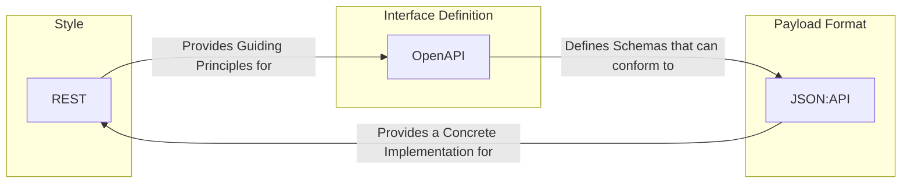

--- 
title: JSON:API
tags:
  - api-paradigm
  - json-api
  - specification
  - rest
date: 2025-11-02
---
# JSON:API Specification

JSON:API is a specification that defines a standard structure for building **RESTful** APIs in JSON. Its primary goal is to reduce the number of decisions that need to be made when designing an API, allowing developers to focus on business logic instead of the structure of JSON payloads. It provides conventions for common [[rest|RESTful]] API patterns like [[api-pagination|pagination]], filtering, sorting, and handling relationships.

It is important to distinguish JSON:API from the generic term "JSON API," which simply refers to any API that communicates using JSON. JSON:API is a formal, opinionated standard.

## Core Concepts of JSON:API

The specification revolves around a standardized document structure. Every JSON:API document is a JSON object with at least one of the following top-level members:

-   `data`: The primary data of the response, which can be a single resource object or an array of resource objects.
-   `errors`: An array of error objects.
-   `meta`: A meta object containing non-standard meta-information.

A **resource object** represents a single resource and contains:
-   `id`: The unique identifier for the resource.
-   `type`: A string that identifies the type of resource.
-   `attributes`: An object containing the resource's data.
-   `relationships`: An object describing the resource's relationships with other resources.

### Example JSON:API Response

```json
{
  "links": {
    "self": "http://example.com/articles"
  },
  "data": [{
    "type": "articles",
    "id": "1",
    "attributes": {
      "title": "JSON:API paints my bikeshed!"
    },
    "relationships": {
      "author": {
        "links": {
          "self": "http://example.com/articles/1/relationships/author",
          "related": "http://example.com/articles/1/author"
        },
        "data": { "type": "people", "id": "9" }
      }
    }
  }],
  "included": [{
    "type": "people",
    "id": "9",
    "attributes": {
      "firstName": "Dan",
      "lastName": "Gebhardt"
    }
  }]
}
```
*Description: This response for a collection of articles includes the primary data. The `links` object provides URLs for navigation and related resources, with `self` indicating the URL of the current resource. The `included` array provides linked resources (the author) in the same request, preventing the need for subsequent fetches.*

## How JSON:API Complements REST and OpenAPI

JSON:API, [[rest|REST]], and [[openapi|OpenAPI]] work together to create robust and well-defined APIs, but they operate at different levels of abstraction.

-   **[[rest|REST]]** is the **architectural style**. While it provides a powerful philosophy and constraints (resources, statelessness, uniform interface), its inherent flexibility means it doesn't dictate strict rules for payload structure or API description. This is precisely where specifications like JSON:API and OpenAPI become invaluable.

-   **[[openapi|OpenAPI]]** is the **interface definition**. It describes the API's surface area—its endpoints, parameters, and authentication methods. It plays a similar role for [[rest|REST]] APIs as **WSDL** does for [[soap|SOAP]] services: providing a formal, machine-readable contract. The schemas within an OpenAPI document can be defined to follow the JSON:API structure. This means your OpenAPI contract would specify that the API returns JSON payloads formatted according to the JSON:API specification.


*Diagram: REST provides the architectural foundation. OpenAPI describes the API contract, with its schemas capable of conforming to JSON:API. JSON:API specifies the format of the data exchanged within that architecture and contract.*

## Relationship with HATEOAS

**HATEOAS (Hypermedia as the Engine of Application State)** is a core constraint of the [[rest|REST]] architectural style. It states that a client should be able to discover and navigate an application's resources by following hyperlinks provided in the server's responses, rather than having to hardcode URI patterns.

JSON:API is not different from HATEOAS; rather, it is a **formal specification for implementing HATEOAS**. The `links` object, which is a fundamental part of the JSON:API specification, is the concrete mechanism for achieving this. By providing `self` and `related` links for resources and relationships, a JSON:API-compliant service allows clients to navigate the API dynamically.

## Implementation and Tooling

While it is possible to implement the JSON:API specification manually, it can be complex. Most modern frameworks rely on libraries or plugins that handle the heavy lifting of serialization, deserialization, and link generation.

Many server-side frameworks have mature libraries that fully support the specification:

-   **Ruby on Rails**: `jsonapi-resources` and `jsonapi-serializer` are widely used.
-   **PHP/Laravel**: The `laravel-json-api` package provides extensive support.
-   **Python/Django**: `django-rest-framework-json-api` integrates the spec into the popular Django REST Framework.
-   **Elixir/Phoenix**: The `jsonapi` library is a common choice.
-   **Node.js**: Libraries like `json-api-serializer` can be integrated with frameworks like Express or Koa.
-   **Java**: Libraries like `crnk` (a full-stack framework) and `jsonapi-converter` (for Spring Boot) provide robust implementations.

These tools typically automate the generation of the entire JSON:API structure, including `data`, `attributes`, `relationships`, and, crucially, the `links` objects, based on your application's data models and routes.

## Advantages of JSON:API

-   **Convention over Configuration**: Eliminates bikeshedding over JSON structure, leading to faster development.
-   **Efficient Data Loading**: The `included` mechanism allows related resources to be sent in a single request, preventing the "N+1 query problem" common in other API styles.
-   **Standardized Operations**: Provides clear conventions for complex operations like sparse fieldsets (requesting only specific fields), sorting, [[api-pagination|pagination]], and filtering.
-   **Rich Ecosystem**: A growing number of server and client libraries support the specification, simplifying its adoption.

## Disadvantages of JSON:API

-   **Verbosity and Complexity**: The structure can be more verbose than simple, ad-hoc JSON, and the specification has a learning curve.
-   **Opinionated**: The strong conventions may not fit every use case. For very simple APIs, it might feel like overkill.
-   **Tooling Overhead**: While the ecosystem is growing, it may require specific libraries or tooling to work with effectively, whereas plain JSON can be manipulated with built-in tools in any language.

## Resources & Links

### Articles

1.  **[JSON:API Official Website](https://jsonapi.org/)**
    The official source for the JSON:API specification. It provides the full, detailed specification, examples, and information about the community and tooling. This is the definitive reference for understanding the core concepts and advanced features of the specification.

2.  **[What is JSON API? - Medium](https://medium.com/@niranjan.cs/what-is-json-api-3b824fba2788)**
    A clear and concise introduction to the JSON:API specification. The article explains the main problems it solves (like reducing the number of server requests) and breaks down the key components of a JSON:API document, such as `data`, `attributes`, `relationships`, and `included`.

### Videos

1.  **[JSON:API // A specification for building APIs in JSON - YouTube](https://www.youtube.com/watch?v=M2d6t_m2ceE)**
    A presentation that introduces the JSON:API specification, covering its main goals of providing conventions to increase productivity and reduce the need for ad-hoc decisions in API design. It explains how the specification helps with caching, handling relationships, and avoiding common pitfalls.
