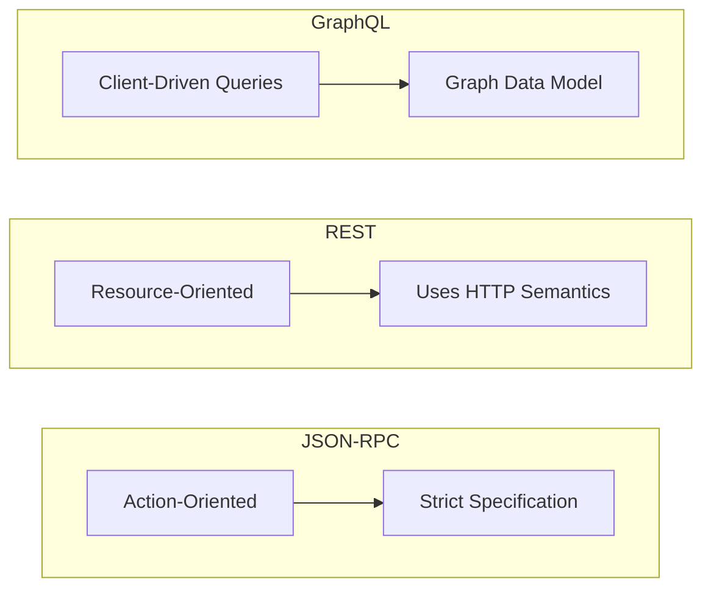

# JSON-RPC

**JSON-RPC** is a lightweight **[[rpc|Remote Procedure Call (RPC)]]** [[communication-protocols|protocol]] that uses JSON for its data format. It is a simple and explicit protocol designed to be easy to implement and use. Unlike [[rest|REST]], which is resource-oriented, JSON-RPC is action-oriented, focusing on calling methods on a remote server.

The core idea is to make a remote function call look and feel like a local one. The client sends a request object containing the method name and parameters, and the server returns a response object with the result or an error.

---

## Protocol Structure

The JSON-RPC 2.0 specification defines a clear and simple structure for requests and responses.

### 1. Request Object

A request is a single JSON object with the following members:
- `jsonrpc`: A string specifying the version, which must be exactly `"2.0"`.
- `method`: A string containing the name of the method to be invoked.
- `params`: A structured value that holds the parameters for the method. It can be an array `[]` of positional parameters or an object `{}` of named parameters.
- `id`: A unique identifier for the request, which can be a string, a number, or `null`. The server's response must include the same `id`. If the `id` is omitted, the request is considered a **notification**, and the server must not send a response.

**Example Request (Positional Parameters):**
```json
{
  "jsonrpc": "2.0",
  "method": "subtract",
  "params": [42, 23],
  "id": 1
}
```

**Example Request (Named Parameters):**
```json
{
  "jsonrpc": "2.0",
  "method": "subtract",
  "params": { "subtrahend": 23, "minuend": 42 },
  "id": 2
}
```

**Example Notification (No Response Expected):**
```json
{
  "jsonrpc": "2.0",
  "method": "logEvent",
  "params": { "event": "user_logged_in" }
}
```

### 2. Response Object

If the request was not a notification, the server must reply with a response.

#### Successful Response
- `jsonrpc`: Must be `"2.0"`.
- `result`: The value returned by the invoked method. Its type depends on the method.
- `id`: Must be the same as the `id` from the request.

**Example Successful Response:**
```json
{
  "jsonrpc": "2.0",
  "result": 19,
  "id": 1
}
```

#### Error Response
If an error occurred while processing the request, the `result` member must not exist, and an `error` member must be present.

- `jsonrpc`: Must be `"2.0"`.
- `error`: An object describing the error.
- `id`: Must be the same as the `id` from the request.

**Example Error Response:**
```json
{
  "jsonrpc": "2.0",
  "error": {
    "code": -32602,
    "message": "Invalid params"
  },
  "id": 1
}
```

---

## Error Handling Model

The error handling in JSON-RPC is one of its most well-defined features. Unlike [[rest|REST]], it does not rely on HTTP status codes for application-level errors. A JSON-RPC request that results in an error will still typically be transported over HTTP with a `200 OK` status. The error is communicated entirely within the `error` object in the response body.

### The Error Object Structure

- `code`: An integer indicating the error type. The specification defines a set of reserved codes and a range for application-specific errors.
- `message`: A string providing a short description of the error.
- `data` (Optional): A primitive or structured value containing additional information about the error.

### Standard Error Codes

| Code | Message | Meaning |
| :--- | :--- | :--- |
| -32700 | Parse error | Invalid JSON was received by the server. |
| -32600 | Invalid Request | The JSON sent is not a valid Request object. |
| -32601 | Method not found | The method does not exist or is not available. |
| -32602 | Invalid Params | Invalid method parameter(s). |
| -32603 | Internal error | Internal JSON-RPC error. |
| -32000 to -32099 | Server error | Reserved for implementation-defined server-errors. |

This strict, standardized structure makes error handling highly predictable for clients.

---

## Comparison with Other Paradigms



### JSON-RPC vs. REST

- **Paradigm:** JSON-RPC is action-oriented (verbs), while REST is resource-oriented (nouns).
- **Error Handling:** JSON-RPC uses error objects in the response body with a `200 OK` status. REST uses HTTP status codes (`4xx`, `5xx`) to communicate error states.
- **Specification:** JSON-RPC has a very simple and strict specification. REST is a looser set of architectural constraints, though specifications like [[openapi|OpenAPI]] and [[json-api|JSON:API]] can add structure.

### JSON-RPC vs. GraphQL

- **Data Fetching:** JSON-RPC calls specific, predefined methods. [[graphql|GraphQL]] allows clients to request exactly the data they need from a graph structure.
- **Error Handling:** Both use a `200 OK` status and place errors in the response body. However, GraphQL can return partial data alongside an array of errors, whereas a JSON-RPC call typically fails as a whole.

---

## Pros and Cons

### Pros
- **Simplicity:** The specification is small and easy to understand and implement.
- **Explicit:** The `method` name makes the intended action very clear.
- **Standardized Errors:** The error handling structure is well-defined, leading to predictable client-side logic.
- **Transport Agnostic:** It can be used over [[http|HTTP]], [[real-time-communication#WebSockets|WebSockets]], or any other [[communication-protocols|transport protocol]].

### Cons
- **No Caching:** Unlike REST, which can leverage standard HTTP caching mechanisms for `GET` requests, JSON-RPC requests (typically sent via `POST`) are not cacheable by default.
- **Limited Discoverability:** There is no standard way to discover available methods, unlike REST APIs which can be explored via HATEOAS or documented with OpenAPI.
- **Tight Coupling:** The client and server are more tightly coupled around the method signatures. A change in a method signature can break clients.

---

## Resources & links

### Articles

1.  **[JSON-RPC 2.0 Specification](https://www.jsonrpc.org/specification)**
    This is the official specification for the JSON-RPC 2.0 protocol. It provides a definitive and detailed description of the request, response, and error object structures. It also outlines the rules for notifications, batch requests, and the standard error codes, serving as the primary source of truth for any implementation.

2.  **[What is JSON-RPC 2.0: A Comprehensive Guide - A2A Protocol](https://www.a2aprotocol.org/en/docs/json-rpc-2-0)**
    This guide offers a practical overview of the JSON-RPC 2.0 protocol, explaining its core concepts with clear examples, including Python code snippets. It contrasts JSON-RPC with REST and GraphQL and discusses best practices for security, performance, and documentation, making it a great resource for developers starting with the protocol.
