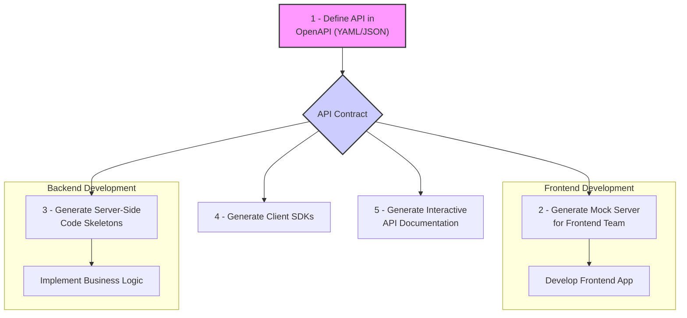

# OpenAPI Specification

The OpenAPI Specification (OAS) is a standard, language-agnostic interface description for [[rest|RESTful]] APIs. It allows both humans and computers to discover and understand the capabilities of a service without requiring access to source code, documentation, or network traffic inspection. In the [[rest|REST]] world, OpenAPI serves the same purpose as **WSDL** does for [[soap|SOAP]]: it provides a formal, machine-readable contract that defines what is possible with the API.

An OpenAPI definition file (typically written in YAML or JSON) describes the entire API, including:
-   Available endpoints (`/users/{id}`)
-   Operations on each endpoint (GET, POST, PUT, DELETE)
-   Parameters for each operation
-   Authentication methods (via `securitySchemes`)
-   Schemas for request and response bodies

Originally known as the Swagger Specification, it was donated to the OpenAPI Initiative in 2015 and has since become the industry standard for defining RESTful APIs.

## The Design-First (or Contract-First) Approach

OpenAPI is a key enabler of the **design-first** (or contract-first) approach to API development. In this workflow, the OpenAPI contract is created before any code is written. This contract then serves as a single source of truth for all stakeholders.


*Description: The OpenAPI contract acts as a central agreement, allowing frontend and backend teams to work in parallel with mock servers and generated code, drastically speeding up development time.*

## Key Benefits of OpenAPI

-   **Formal Contract**: The OpenAPI file acts as a formal, unambiguous contract. It programmatically defines the API's surface, including data schemas and [[authentication]] methods, which eliminates guesswork and ensures that clients and servers agree on how to communicate.

-   **Discoverability and Automatic Documentation**: The greatest strength of OpenAPI is its ecosystem of tools that generate human-readable documentation. Tools like **Swagger UI** (a separate tool that consumes the OpenAPI Specification) and **Redoc** create an interactive web interface from the OpenAPI file. This interface allows developers to:
    -   **Discover** all available endpoints and operations without reading any code.
    -   **Understand** the required parameters and expected response schemas for each operation.
    -   **Test the API** directly in the browser by making live calls to the endpoints.

-   **Automatic Code and Test Generation**: The formal contract allows for the automatic generation of client SDKs, server-side stubs, and test cases, which drastically reduces boilerplate code and accelerates development.

-   **Parallel Development**: By using the contract to generate mock servers, frontend and backend teams can work independently and in parallel, confident that their work will integrate correctly.

## Example OpenAPI 3.0 Definition

Here is a minimal example of an OpenAPI 3.0 definition in YAML for a simple User API. It includes a `securitySchemes` definition for [[jwt|JWT]] Bearer authentication and applies it to an endpoint.

```yaml
openapi: 3.0.0
info:
  title: Simple User API
  version: 1.0.0

paths:
  /users/{userId}:
    get:
      summary: Get a user by ID
      parameters:
        - name: userId
          in: path
          required: true
          schema:
            type: integer
      security:
        - bearerAuth: []
      responses:
        '200':
          description: A single user.
          content:
            application/json:
              schema:
                $ref: '#/components/schemas/User'

components:
  schemas:
    User:
      type: object
      properties:
        id:
          type: integer
        name:
          type: string
        email:
          type: string
  securitySchemes:
    bearerAuth:
      type: http
      scheme: bearer
      bearerFormat: JWT
```

## OpenAPI and JSON:API

While both are specifications related to APIs, they serve different purposes:

-   **OpenAPI** defines the **interface** of the API: the endpoints, operations, parameters, and data shapes. It is concerned with *how* to call the API.
-   **[[json-api|JSON:API]]** defines the **structure** of the JSON documents being exchanged. It is concerned with *what the payload looks like* to ensure consistency in areas like resource objects, relationships, and metadata.

They are highly complementary. An OpenAPI definition can and often does use schemas that conform to the JSON:API specification. By using them together, you get a well-defined API interface (from OpenAPI) that returns well-structured, conventional JSON payloads (from JSON:API).

## Resources & Links

### Articles

1.  **[OpenAPI Specification - Official Documentation](https://spec.openapis.org/oas/latest.html)**
    The official and definitive source for the latest version of the OpenAPI Specification. This document provides the complete technical details of the specification, including the structure of the OpenAPI document, data types, schema objects, and all other components. It is an essential resource for tool developers and for anyone needing a deep, authoritative understanding of the standard.

2.  **[An Introduction to OpenAPI: Building Better APIs - Medium](https://pguso.medium.com/an-introduction-to-openapi-building-better-apis-128a96f40431)**
    A beginner-friendly article that introduces the core concepts of OpenAPI. It explains why a specification is needed for REST APIs and walks through the main sections of an OpenAPI document, such as `info`, `paths`, and `components`. It's a great starting point for understanding the practical benefits of adopting a contract-first approach.

### Videos

1.  **[What is OpenAPI? - YouTube](https://www.youtube.com/watch?v=PenvYHJ9Koc)**
    A short, clear video explaining what the OpenAPI Specification is and the problems it solves. It visually breaks down the structure of an OpenAPI document and highlights the key benefits, such as generating documentation, client SDKs, and server stubs.

2.  **[OpenAPI Specification Explained - YouTube](https://www.youtube.com/watch?v=pRS9LRBgjYg)**
    A video that explains the relationship between REST and OpenAPI, clarifying that OpenAPI is a specification for describing REST APIs, not a replacement for them. It serves as a blueprint that makes APIs easier to design, understand, and consume.
