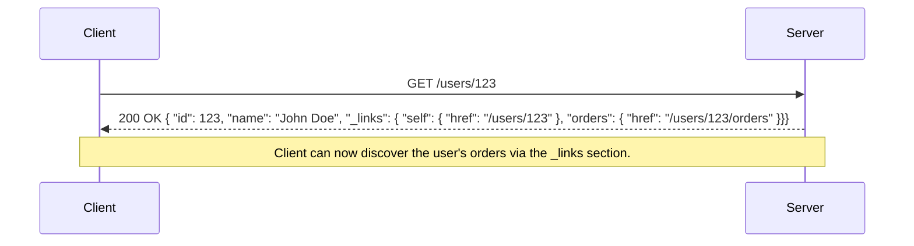

REST, or **RE**presentational **S**tate **T**ransfer, is an architectural style for designing networked applications. It is not a formal protocol or standard, but rather a set of architectural principles and constraints for building scalable, stateless, and reliable distributed systems. When a system conforms to these constraints, it is considered "RESTful."

Defined by Roy Fielding in his 2000 doctoral dissertation, REST has become the de facto standard for building web services and APIs, leveraging the existing and proven infrastructure of the web, most notably the [[communication-protocols#HyperText Transfer Protocol (HTTP)|HTTP]] protocol. While technically format-agnostic, the vast majority of modern REST APIs use JSON (JavaScript Object Notation) as the data format for representations.

## The Six Guiding Constraints of REST

For an architecture to be truly RESTful, it must adhere to six fundamental constraints. These are not rules to be followed blindly, but principles that lead to a well-designed, scalable, and [[cohesion-coupling|decoupled]] system.

1.  **[[client-server|Client-Server Architecture]]**: This enforces a strict separation of concerns. The client (the consumer of the data) is decoupled from the server (the manager of the resources). The client handles the user interface and experience, while the server manages the data and business logic. They evolve independently, as long as the interface contract is maintained.

2.  **Statelessness**: Every request from a client to the server must be self-contained. The server must not store any client context or session state between requests. All necessary information to process the request (like authentication tokens or versioning information) must be provided by the client. This constraint is a key enabler for scalability, as any server instance can handle any client request.

3.  **[[caching|Cacheability]]**: To improve performance and reduce network traffic, responses must explicitly define themselves as cacheable or non-cacheable. This allows clients and intermediaries (like CDNs or proxies) to store and reuse responses, avoiding redundant requests to the server. This is typically managed via [[communication-protocols#HTTP Message Structure|HTTP headers]] like `Cache-Control`.

4.  **Layered System**: The architecture can be composed of multiple layers of servers (e.g., proxies, gateways, [[load-balancing|load balancers]]). A client, however, connects to a single endpoint and has no visibility into the underlying layers. This allows for architectural flexibility, such as offloading security or applying load balancing, without affecting the client.

5.  **Uniform Interface**: This is the central principle of REST, simplifying and decoupling the architecture. It promotes a single, consistent way of interacting with the system, regardless of the resource type. This constraint is broken down into four sub-constraints explained in the next section.

6.  **Code on Demand (Optional)**: This is the only optional constraint. It allows a server to extend the functionality of a client by sending executable code (e.g., JavaScript). This is most commonly seen in web browsers rendering a web page.

## The Uniform Interface in Detail

The power of REST lies in its uniform interface, which dictates how clients interact with resources.

-   **Identification of Resources**: Every resource must be uniquely and consistently identified by a stable identifier. In web-based REST systems, this is the Uniform Resource Identifier (URI).
    -   **Example**: `/users/123` is the URI that uniquely identifies a specific user.

-   **Manipulation of Resources Through Representations**: The client interacts with a resource through its representation. While XML and other formats are possible, JSON is the most common choice for modern APIs. To avoid ambiguity and endless debates over structuring these JSON payloads, specifications like [[json-api|JSON:API]] provide a standardized convention.
    -   **Example**: To update a user's name, a client would `PUT` a modified JSON representation of that user to the `/users/123` URI.

-   **Self-Descriptive Messages**: Each message contains enough information for the receiver to understand and process it. This is achieved through the structure of the request and response, including verbs, status codes, and headers.

-   **Hypermedia as the Engine of Application State (HATEOAS)**: This is the most mature, yet often overlooked, aspect of REST. It means that a client should be able to navigate the API by following links provided in the server's responses. The server's response contains not just the data, but also the possible next actions (as links), decoupling the client from hardcoded URIs.

### Anatomy of a RESTful Request

A key part of the uniform interface is the consistent structure of messages. A standard HTTP request, as used by REST, is composed of four main parts:

*Image credit: [Mozilla Developer Network](https://developer.mozilla.org/en-US/docs/Web/HTTP/Guides/Messages)*

1.  **Method (or Verb)**: The action to be performed on the resource. The most common [[communication-protocols#Common HTTP Methods|HTTP Verbs]] are `GET` (read), `POST` (create), `PUT` (update/replace), `DELETE` (remove), and `PATCH` (partially update).
2.  **Path**: The URI that uniquely identifies the resource the action is being performed on (e.g., `/users/123`).
3.  **Headers**: Key-value pairs that provide metadata about the request, such as the format of the body (`Content-Type`), the acceptable response formats (`Accept`), or authentication credentials (`Authorization`).
4.  **Body (or Payload)**: The data for the resource, typically included in `POST`, `PUT`, and `PATCH` requests. It is almost always formatted in JSON for modern APIs, though XML is also seen in legacy systems.

### Securing REST APIs

REST does not prescribe a specific security mechanism, but its stateless nature makes it highly compatible with token-based [[authentication]] strategies. Because each request must be self-contained, sending a security token in the `Authorization` header is the most common approach.

-   **Bearer Tokens**: The most popular method involves the client obtaining a bearer token (such as a [[jwt|JWT]]) from an authentication server. The client then sends this token in the `Authorization` header with every request (e.g., `Authorization: Bearer <token>`).
-   **API Keys**: For simpler service-to-service communication, a static API key can be used.
-   **OAuth 2.0**: This framework is often used to allow third-party applications to access an API on behalf of a user. It provides different flows for obtaining access tokens.

The specific security mechanisms for a REST API can be formally defined using the `securitySchemes` object in an [[openapi|OpenAPI]] specification.

### Common Practices

#### Using HTTP Status Codes

Using standard [[communication-protocols#HyperText Transfer Protocol (HTTP)|HTTP Status Codes]] is a core part of a self-descriptive message. They immediately convey the outcome of a request.

-   **2xx (Success)**: The request was successful.
    -   `200 OK`: Standard success response.
    -   `201 Created`: A new resource was successfully created (e.g., after a `POST`).
    -   `204 No Content`: The request was successful, but there is no content to return (e.g., after a `DELETE`).
-   **3xx (Redirection)**: Further action needs to be taken.
    -   `301 Moved Permanently`: The resource has been moved to a new URI.
-   **4xx (Client Error)**: The request contains bad syntax or cannot be fulfilled.
    -   `400 Bad Request`: The server cannot process the request due to a client error (e.g., malformed JSON).
    -   `401 Unauthorized`: The client must authenticate itself.
    -   `403 Forbidden`: The client is authenticated but does not have permission.
    -   `404 Not Found`: The requested resource could not be found.
-   **5xx (Server Error)**: The server failed to fulfill a valid request.
    -   `500 Internal Server Error`: A generic error message for an unexpected condition.

#### Using Query Parameters

Query parameters are used to filter, sort, and paginate collections of resources without altering the resource's URI.

-   **Filtering**: `GET /users?status=active`
-   **Sorting**: `GET /users?sort=-created_at` (descending order)
-   **Pagination**: `GET /users?page=2&limit=50`
-   **Searching**: `GET /users?q=john`

*Description: A client requests a user resource. The server responds with the user's data and HATEOAS links, allowing the client to discover related resources dynamically.*

## The Challenge of Resource-Oriented Design

One of the biggest conceptual hurdles in REST is the strict focus on resources (nouns) over actions (verbs). Coming from an [[rpc|RPC]] background, developers are often tempted to design endpoints that expose actions.

-   **RPC-style (Action-oriented)**: `POST /createUser`, `POST /updateUser`, `POST /getUser`
-   **REST-style (Resource-oriented)**: `POST /users`, `PUT /users/{id}`, `GET /users/{id}`

Thinking in terms of resources and how they are manipulated via standard HTTP methods is fundamental to a clean REST API design. The key is to identify the "nouns" in your system. If you find yourself adding verbs to your URIs, it is often a sign that you are leaning towards an RPC style.

For example, instead of an endpoint like `/users/{id}/send-password-reset`, a RESTful approach would be to create a new resource: `POST /password-resets`. This request would create a new "password reset" resource.

## Advantages of REST

- **[[cohesion-coupling|Decoupling]]**: The separation of client and server and the uniform interface allow them to evolve independently.
- **Scalability**: Statelessness simplifies server design and makes horizontal scaling straightforward.
- **[[kiss|Simplicity]] & Visibility**: A uniform interface makes the system easier to understand and its interactions visible and transparent.
- **Leverages Web Standards**: It uses the proven and ubiquitous infrastructure of the web ([[communication-protocols#HyperText Transfer Protocol (HTTP)|HTTP]], URIs, caching).
- **[[caching|Cacheability]]**: Leverages the native caching capabilities of HTTP, allowing responses to be cached by clients and intermediaries, which significantly improves performance and scalability.

## Disadvantages of REST

- **Over-fetching and Under-fetching**: A client may receive more data than it needs (over-fetching) or may have to make multiple requests to get all the data it needs (under-fetching). This is a primary problem that [[graphql|GraphQL]] aims to solve.
- **Chattiness**: The need for multiple requests to retrieve related resources can lead to increased network traffic.
- **Performance**: For complex queries or high-performance scenarios between internal services, the overhead of [[communication-protocols#HyperText Transfer Protocol (HTTP)|HTTP]] and text-based formats like JSON can be a bottleneck compared to binary protocols used in frameworks like [[rpc#gRPC|gRPC]].
- **Rigid Hierarchy**: Resources are often structured in a rigid hierarchy, which may not be ideal for all data models.

## Resources & Links

### Articles

1.  **[RESTful API Principles](https://restfulapi.net/)**
    A comprehensive resource that covers the principles, constraints, and best practices of building RESTful APIs.

2.  **[Roy Fielding's Dissertation: Architectural Styles and the Design of Network-based Software Architectures](https://www.ics.uci.edu/~fielding/pubs/dissertation/top.htm)**
    The original source where REST was defined. A must-read for a deep understanding of the principles.

3.  **[What is REST - Codecademy](https://www.codecademy.com/article/what-is-rest)**
    A beginner-friendly introduction to the concepts of REST.

### Videos

1.  **[What is a REST API?](https://www.youtube.com/watch?v=-mN3VyJuCjM)**
    A video explaining the fundamentals of REST APIs, how they work, and why they are so widely used for web services.

2.  **[REST API Crash Course](https://www.youtube.com/watch?v=lsMQRaeKNDk)**
    A crash course for beginners on what REST APIs are and how to use them.
