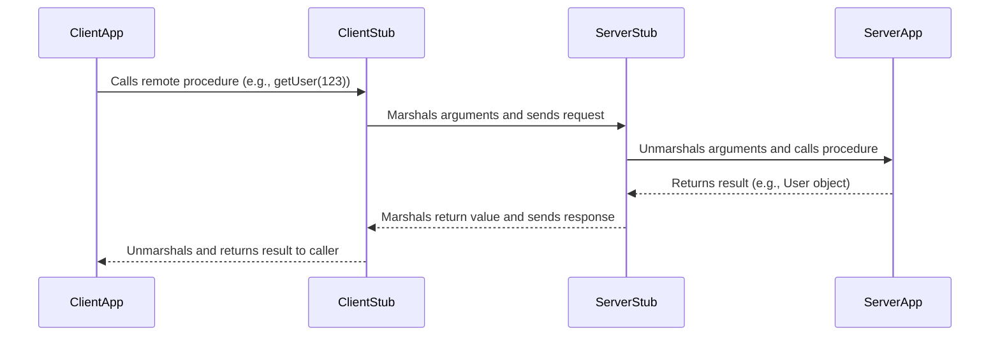

# Remote Procedure Call (RPC)

RPC is a communication style where a client executes a procedure on a remote server as if it were a local call. It abstracts the network communication, making distributed computing feel more like a traditional, single-process application.

## How it Works: Stubs and Marshalling

The core idea is to use a "stub" on the client side that mirrors the remote procedure. When the client calls the stub, it handles the process of **marshalling** (serializing) the arguments into a message, sending them to the server, awaiting the response, and **unmarshalling** (deserializing) the return value.

*Description: The client application makes a simple method call. Stubs on both the client and server handle the complexity of network communication.*

RPC is a foundational concept that has been implemented in many forms over the years, from early standards like CORBA and DCOM to modern frameworks. While **[[grpc|gRPC]]** stands out as the most prominent modern implementation, traditional RPC protocols (outside of gRPC) have largely seen a decline in new API development, often being replaced by [[rest|REST]] for external APIs or gRPC for internal, high-performance communication. Other examples of RPC frameworks include Apache Thrift and Apache Avro.

## General Advantages
- **Simplicity**: For internal, action-oriented APIs, defining a function and calling it can be simpler and more direct than designing a resource-based RESTful interface.
- **Performance**: RPC frameworks often use efficient binary serialization formats and can be highly optimized for low-latency, high-throughput communication between internal services.

## General Disadvantages

- **[[cohesion-coupling|Tight Coupling]]**: The client and server are tightly coupled. A change in the server-side procedure signature often requires the client to be updated.
- **Discovery**: Discovering what procedures are available can be difficult without a shared interface definition file.
- **Caching Complexity**: Caching is not natively supported by standard web infrastructure. See [[#Caching Challenges for RPC-Based Communication]] for details.

## Caching Challenges for RPC-Based Communication

Unlike [[rest|RESTful APIs]] which benefit from standardized HTTP semantics, RPC-based communication (including frameworks like [[grpc|gRPC]], Apache Thrift, and Avro) presents unique caching challenges. Standard infrastructure like public CDNs, browser caches, and generic reverse proxies cannot inspect or cache RPC calls out-of-the-box.

This is due to two main factors:
1.  **Non-Uniform Interfaces**: RPC calls don't use a uniform set of methods (like GET, POST) or resource paths (URLs) that a cache can easily understand.
2.  **Binary Protocols**: Many RPC frameworks use binary serialization formats (like Protobuf) that are opaque to intermediaries that expect plain text HTTP.

To overcome this, several strategies can be employed:
- **Client-Side Caching**: The client application itself implements logic to store and reuse responses, preventing redundant network calls for identical requests.
- **Proxy Caching**: A specialized intermediary proxy (e.g., Envoy) that is built to understand the specific RPC protocol (like gRPC) can be used. It terminates the call, inspects the payload, and serves a cached response when appropriate.
- **Data-Layer Caching**: A common and often simpler approach is to cache the underlying data that the service retrieves, rather than the RPC call itself. The service can use a distributed cache (e.g., Redis, Memcached) to store frequently accessed data, which speeds up responses without needing to intercept the RPC call.

## Resources & Links

### Articles

1.  **[How RPC Works - System Design Newsletter](https://newsletter.systemdesign.one/p/how-rpc-works)**
    This article provides a comprehensive overview of how Remote Procedure Calls (RPC) function, detailing the roles of client stubs, marshalling, network communication, and server skeletons. It also covers critical aspects like handling failures (timeouts, retries, circuit breakers), service discovery, API evolution, and various streaming patterns, making it an excellent resource for understanding RPC in distributed systems.

2.  **[Communication Protocols For RPCs](https://www.geeksforgeeks.org/computer-networks/communication-protocols-for-rpcs/)**
    This article details the underlying communication protocols for RPCs, including the Request (R), Request/Reply (RR), and Request/Reply/Acknowledgement-Reply (RRA) protocols.
