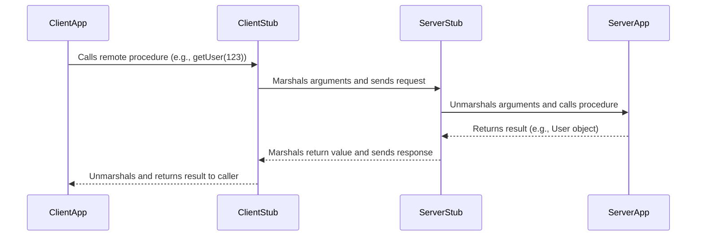
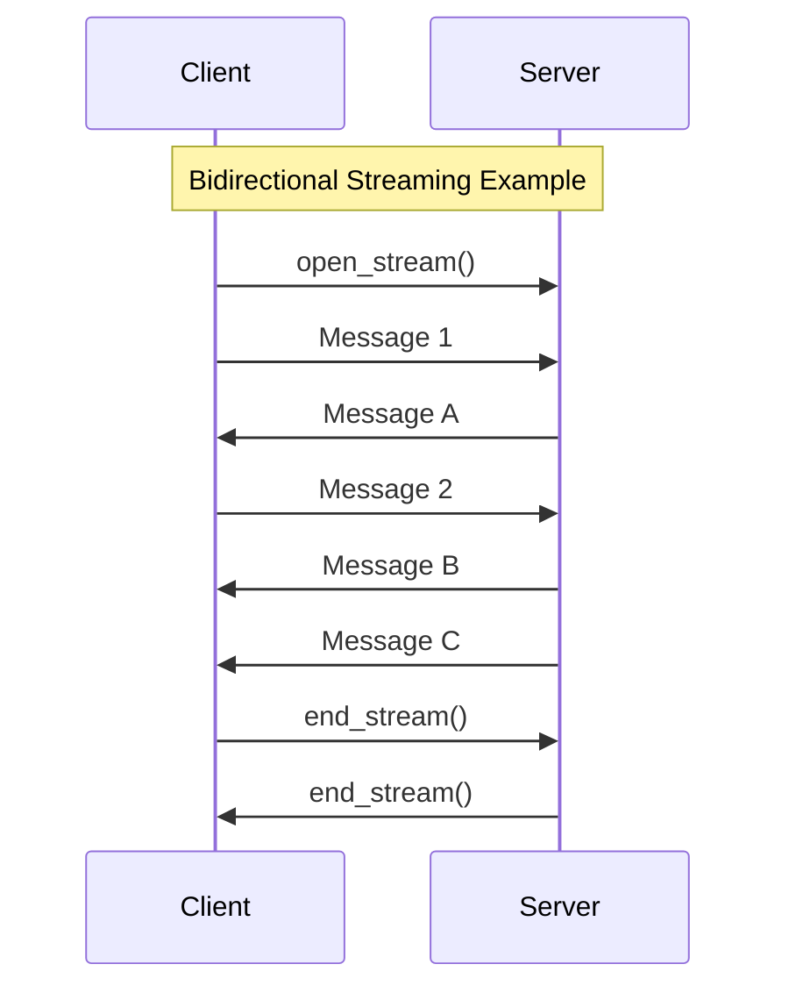

## Remote Procedure Call (RPC)

RPC is a communication style where a client executes a procedure on a remote server as if it were a local call. It abstracts the network communication, making distributed computing feel more like a traditional, single-process application.

### How it Works: Stubs and Marshalling

The core idea is to use a "stub" on the client side that mirrors the remote procedure. When the client calls the stub, it handles the process of **marshalling** (serializing) the arguments into a message, sending them to the server, awaiting the response, and **unmarshalling** (deserializing) the return value.

*Description: The client application makes a simple method call. Stubs on both the client and server handle the complexity of network communication.*

Popular RPC frameworks include **[[#gRPC]]**, **Apache Thrift**, and **Apache Avro**.

### Advantages
- **Simplicity**: For internal, action-oriented APIs, defining a function and calling it can be simpler and more direct than designing a resource-based RESTful interface.
- **Performance**: RPC frameworks often use efficient binary serialization formats and can be highly optimized for low-latency, high-throughput communication between internal services.

### Disadvantages

- **[[cohesion-coupling|Tight Coupling]]**: The client and server are tightly coupled. A change in the server-side procedure signature often requires the client to be updated.
- **Discovery**: Discovering what procedures are available can be difficult without a shared interface definition file (like a `.proto` file in [[#gRPC]]).
- **Caching Complexity**: Caching is not natively supported by standard web infrastructure. See [[#Caching Challenges for RPC-Based Communication]] for details.

## gRPC

gRPC is a modern, high-performance, open-source RPC framework developed by Google. It uses **Protocol Buffers (Protobuf)** as its interface definition language (IDL) and data serialization format, and it is built on top of [[communication-protocols#Evolution: HTTP/2 and HTTP/3|HTTP/2]].

### Advantages
- **High Performance**: Achieved through binary serialization with Protobuf and multiplexing over HTTP/2, making it significantly faster than text-based protocols like JSON.
- **Streaming**: Natively supports unary, client-streaming, server-streaming, and bi-directional streaming, enabling more complex and efficient communication patterns.
- **Strong Typing**: Service contracts defined in `.proto` files generate strongly-typed client and server code, reducing runtime errors and improving developer productivity.
- **Language Agnostic**: A wide range of officially supported and community-supported languages.

### Disadvantages
- **Contract Coupling**: While the `.proto` contract file solves discovery, it still creates a form of tight coupling. Both client and server are bound to the exact service and message definitions. Any change to the contract requires regenerating client code, which is less flexible than the looser coupling of REST APIs.
- **Caching Complexity**: Like other RPC frameworks, caching is not natively supported by standard web infrastructure. See [[#Caching Challenges for RPC-Based Communication]] for details.
- **Less Human-Readable**: The use of the binary Protobuf format makes it difficult to debug and inspect messages using standard text-based tools like `curl` or browser developer tools. Specialized tools (like `grpcurl`) are required.
- **Steeper Learning Curve**: For teams accustomed to REST and JSON, adopting gRPC, Protocol Buffers, and the associated tooling can require a significant initial learning investment.

### Protocol Buffers (Protobuf)
At the core of gRPC is the `.proto` file, which defines the services and message types. This file acts as a contract between the client and server.

**Example `user_service.proto`:**
'''protobuf
syntax = "proto3";

service UserService {
  // A simple RPC
  rpc GetUser(UserRequest) returns (UserResponse);

  // A server-to-client streaming RPC
  rpc ListUsers(Empty) returns (stream UserResponse);
}

message UserRequest {
  int32 id = 1;
}

message UserResponse {
  int32 id = 1;
  string name = 2;
  string email = 3;
}

message Empty {}
'''
From this file, gRPC tools can generate strongly-typed client and server code in various languages.

### Key Features & Communication Types

gRPC leverages [[communication-protocols#Evolution: HTTP/2 and HTTP/3|HTTP/2]] to support four types of communication:

1.  **Unary RPC**: The client sends a single request and gets a single response, just like a traditional RPC call.
2.  **Server Streaming RPC**: The client sends a single request and gets a stream of messages back from the server.
3.  **Client Streaming RPC**: The client sends a stream of messages to the server and gets a single response back.
4.  **Bidirectional Streaming RPC**: Both the client and server send a stream of messages to each other over a single connection.

gRPC is commonly used for high-performance communication between internal [[microservices]]. It is a powerful evolution of the traditional [[rpc|RPC]] pattern, addressing many of its original drawbacks by providing streaming, strong typing, and high efficiency.

## Caching Challenges for RPC-Based Communication

Unlike [[rest|RESTful APIs]] which benefit from standardized HTTP semantics, RPC-based communication (including frameworks like [[#gRPC]], Apache Thrift, and Avro) presents unique caching challenges. Standard infrastructure like public CDNs, browser caches, and generic reverse proxies cannot inspect or cache RPC calls out-of-the-box.

This is due to two main factors:
1.  **Non-Uniform Interfaces**: RPC calls don't use a uniform set of methods (like GET, POST) or resource paths (URLs) that a cache can easily understand.
2.  **Binary Protocols**: Many RPC frameworks use binary serialization formats (like Protobuf) that are opaque to intermediaries that expect plain text HTTP.

To overcome this, several strategies can be employed:
- **Client-Side Caching**: The client application itself implements logic to store and reuse responses, preventing redundant network calls for identical requests.
- **Proxy Caching**: A specialized intermediary proxy (e.g., Envoy) that is built to understand the specific RPC protocol (like gRPC) can be used. It terminates the call, inspects the payload, and serves a cached response when appropriate.
- **Data-Layer Caching**: A common and often simpler approach is to cache the underlying data that the service retrieves, rather than the RPC call itself. The service can use a distributed cache (e.g., Redis, Memcached) to store frequently accessed data, which speeds up responses without needing to intercept the RPC call.

## Resources & Links

### Articles

1.  **[Communication Protocols For RPCs](https://www.geeksforgeeks.org/computer-networks/communication-protocols-for-rpcs/)**
    This article details the underlying communication protocols for RPCs, including the Request (R), Request/Reply (RR), and Request/Reply/Acknowledgement-Reply (RRA) protocols.

2.  **[What is gRPC?](https://www.wallarm.com/what/the-concept-of-grpc)**
    An overview of gRPC as a high-performance RPC framework, discussing its architecture based on HTTP/2 and Protocol Buffers, its advantages, and its limitations.
