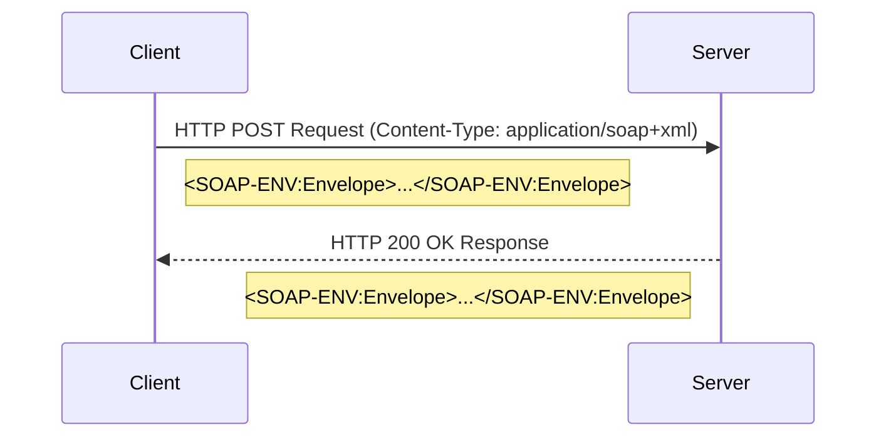

# SOAP (Simple Object Access Protocol)

**SOAP** is a protocol specification for exchanging structured information in the implementation of web services. Unlike [[rest|REST]], which is an architectural style, SOAP is a formal, standardized protocol governed by the W3C. It relies heavily on XML for its message format and is often seen as a successor to older [[rpc|RPC]]-based technologies.

SOAP defines a strict contract between the client and server. This contract is described in a **Web Services Description Language (WSDL)** file, which provides a machine-readable definition of the operations, data types, and communication patterns.

## Core Components of SOAP

A SOAP-based architecture is built on several key components that ensure its robustness and interoperability.

-   **SOAP Message Format**: Every SOAP message is an XML document consisting of an **Envelope**, which is the root element. The envelope contains an optional **Header** (for metadata like security or transaction information) and a mandatory **Body** (containing the actual message or remote procedure call). Errors are reported in a standardized **Fault** element within the body.

    **Example SOAP Request Envelope:**
    ```xml
    <soapenv:Envelope xmlns:soapenv="http://schemas.xmlsoap.org/soap/envelope/"
                      xmlns:web="http://www.example.com/webservice">
       <soapenv:Header/>
       <soapenv:Body>
          <web:GetUserDetails>
             <web:UserId>123</web:UserId>
          </web:GetUserDetails>
       </soapenv:Body>
    </soapenv:Envelope>
    ```
    *Description: A basic SOAP request envelope calling a `GetUserDetails` operation with a `UserId` parameter.*

-   **WSDL (Web Services Description Language)**: The WSDL file is the heart of a SOAP service. It is an XML-based contract that describes everything about the service:
    -   What operations are available.
    -   The data types used for messages.
    -   How messages are bound to a specific network protocol (e.g., [[communication-protocol#HyperText Transfer Protocol (HTTP)|HTTP]]).
    -   The endpoint (address) of the service.

    **Example WSDL Snippet (Service Definition):**
    ```xml
    <wsdl:definitions ...>
        <wsdl:types>
            <xsd:schema targetNamespace="http://www.example.com/webservice">
                <xsd:element name="GetUserDetails">
                    <xsd:complexType><xsd:sequence><xsd:element name="UserId" type="xsd:int"/></xsd:sequence></xsd:complexType>
                </xsd:element>
                <xsd:element name="GetUserDetailsResponse">
                    <xsd:complexType><xsd:sequence><xsd:element name="UserName" type="xsd:string"/></xsd:sequence></xsd:complexType>
                </xsd:element>
            </xsd:schema>
        </wsdl:types>
        <wsdl:message name="GetUserDetailsRequest"><wsdl:part name="parameters" element="web:GetUserDetails"/></wsdl:message>
        <wsdl:message name="GetUserDetailsResponse"><wsdl:part name="parameters" element="web:GetUserDetailsResponse"/></wsdl:message>
        <wsdl:portType name="UserPortType">
            <wsdl:operation name="GetUserDetails">
                <wsdl:input message="tns:GetUserDetailsRequest"/>
                <wsdl:output message="tns:GetUserDetailsResponse"/>
            </wsdl:operation>
        </wsdl:portType>
        <!-- ... binding and service definitions ... -->
    </wsdl:definitions>
    ```
    *Description: A simplified WSDL snippet defining the `GetUserDetails` operation, its input (`UserId`) and output (`UserName`) messages.*
-   **Transport Protocol**: While SOAP is technically transport-agnostic, it is almost universally transmitted using **[[communication-protocol#HyperText Transfer Protocol (HTTP)|HTTP]] POST** (or HTTPS). This reliance on POST has significant implications, notably for caching mechanisms, as POST requests are generally not cacheable by default.


*Description: A client sends a SOAP message encapsulated in an HTTP POST request. The server processes the message and returns a SOAP message in the HTTP response.*

## SOAP vs. REST

SOAP and [[rest|REST]] represent two different philosophies for API design.

| Feature           | SOAP                                                              | REST                                                                 |
| ----------------- | ----------------------------------------------------------------- | -------------------------------------------------------------------- |
| **Nature**        | A standardized **protocol**                                       | An **architectural style** with guiding principles                   |
| **Data Format**   | Strictly XML                                                      | Flexible (JSON, XML, HTML, etc.), with JSON being the de facto standard |
| **Contract**      | Formal and strict, defined by a **WSDL** file                     | Often defined by convention or an OpenAPI specification      |
| **State**         | Can be stateful or stateless                                      | Strictly stateless                                                   |
| **Error Handling**| Standardized via the `<SOAP-Fault>` element                       | Uses standard HTTP status codes (e.g., 404, 500)                     |
| **Transport**     | Agnostic, but usually HTTP/HTTPS                                  | Typically relies on HTTP/HTTPS                                       |
| **Performance**   | Generally more verbose and slower due to XML parsing overhead     | Generally lighter and faster, especially with JSON                   |

## Advantages of SOAP

-   **Standardization and Strong Typing**: The WSDL provides a rigid, strongly-typed contract that leaves little room for ambiguity. This is beneficial for enterprise-level applications where formal contracts are critical.
-   **Built-in Features**: The SOAP standard includes extensions for features like **WS-Security** (for enterprise-grade security), **WS-AtomicTransaction** (for [[acid|ACID]] transactions), and **WS-ReliableMessaging**.
-   **IDE & Tooling Support**: The strict, contract-based nature of WSDL allows for powerful tooling and IDE support, including automatic generation of client-side stubs.
-   **Transport Agnostic**: Can be used over various protocols, not just [[communication-protocol#HyperText Transfer Protocol (HTTP)|HTTP]].

## Disadvantages of SOAP

-   **Complexity**: The standards are numerous and complex, making it difficult to implement and debug compared to [[rest|REST]].
-   **Verbosity**: XML is inherently verbose compared to JSON, leading to larger message sizes and increased network latency.
-   **Performance Overhead**: Parsing XML is computationally more expensive than parsing JSON.
-   **Rigidity**: The tight coupling between client and server via the WSDL contract means that a change on the server often requires a change on the client.
-   **Poor Cacheability**: Unlike [[rest|REST]], which can leverage standard HTTP [[caching]] mechanisms with GET requests, SOAP messages are typically sent via HTTP POST, making them difficult to cache by intermediaries.

## Resources & Links

### Articles

1.  **[What Is a SOAP API? - Postman Blog](https://blog.postman.com/soap-api-definition/)**
    An introductory article from Postman that defines SOAP and its core components like the envelope, header, and body. It explains how SOAP differs from REST, highlighting its protocol-centric nature versus REST's architectural style. It also touches on the role of WSDL and provides a clear, high-level overview for those new to the concept.

2.  **[SOAP API Explained for REST API Developers - Medium](https://paul-d-chuang.medium.com/soap-api-explained-for-rest-api-developers-f78cfa40566f)**
    This article is specifically tailored for developers who already understand REST. It explains SOAP concepts by drawing direct comparisons to their REST counterparts (e.g., WSDL vs. OpenAPI, SOAP Envelope vs. HTTP Body). It's a very effective resource for bridging the knowledge gap between the two paradigms.

### Videos

1.  **[SOAP (+ Why REST APIs Became Popular) - YouTube](https://www.youtube.com/watch?v=CVIBALqn_0E)**
    A short, animated video that provides a simple and visual explanation of SOAP. It covers the basic structure of a SOAP message and its function as a protocol for web services, making it an accessible entry point for beginners.

2.  **[SOAP vs REST | Difference Between SOAP and REST API - YouTube](https://www.youtube.com/watch?v=_fq8Ye8kodA)**
    A video that focuses on the key differences between SOAP and REST. It compares them on various aspects such as the underlying protocol, message format (XML vs. JSON), statefulness, and performance, helping viewers understand the trade-offs and typical use cases for each.
