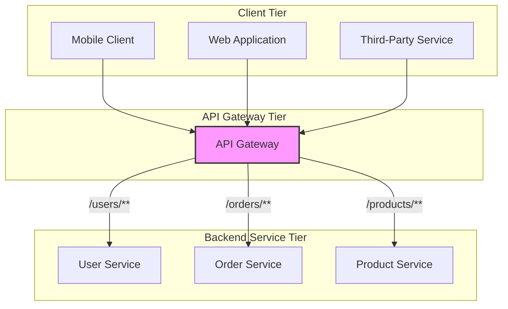

--- 
title: API Gateway
tags:
  - architectural-pattern
  - microservices
  - api
  - gateway
date: 2025-10-27
---

# API Gateway

An **API Gateway** is an architectural pattern that provides a single, unified entry point for a group of backend services, such as an application's [[microservices]]. It acts as a [[posa#Proxy|reverse proxy]], sitting between the client applications and the backend services, and is responsible for request routing, composition, and protocol translation.

By abstracting the underlying service architecture, the API Gateway simplifies the client-side implementation and [[cohesion-coupling|decouples]] clients from the internal structure of the application.

*An API Gateway providing a single entry point for various clients to access backend microservices.*

---

## The Problem it Solves

In a distributed architecture like [[microservices]], client applications would need to know the locations of many different services. This leads to several problems:

-   **High Client Complexity**: Clients must manage multiple endpoints, handle different API versions, and deal with the complexity of [[service-discovery]].
-   **[[performance-antipatterns|Chatty Communication]]**: A single client operation might require multiple calls to different backend services, resulting in high network latency and inefficient communication.
-   **[[cohesion-coupling|Coupling]]**: The client is tightly coupled to the internal service decomposition. Refactoring services becomes difficult without breaking client applications.
-   **Cross-Cutting Concerns**: Common functionalities like [[authentication]], [[ssl-tls|TLS encryption]], rate limiting, and [[monitoring]] would need to be implemented in every single service, leading to code duplication and inconsistency.

An API Gateway centralizes these concerns and provides a simplified, unified interface for clients.

---

## Core Functionalities & Implemented Patterns

An API Gateway is more than a simple reverse proxy. It implements several design patterns to manage and secure traffic. These are often described as **[[gateway-patterns|Gateway Patterns]]**.

-   **[[gateway-patterns#Gateway Routing|Gateway Routing]]**: It acts as a Layer 7 router, forwarding client requests to the appropriate backend service based on URL paths, headers, or other request metadata.
-   **[[gateway-patterns#Gateway Aggregation|Gateway Aggregation]]**: It can consolidate multiple backend service calls into a single client request, reducing chattiness and simplifying the client's interaction model. This is a key pattern for implementing a [[backend-for-frontend|Backend-for-Frontend]].
-   **[[gateway-patterns#Gateway Offloading|Gateway Offloading]]**: It offloads cross-cutting concerns from individual services. Common examples include:
    -   **SSL/TLS Termination**: The gateway handles HTTPS and forwards unencrypted traffic internally.
    -   **[[authentication|Authentication]] & Authorization**: It can validate credentials or tokens before forwarding a request.
    -   **Rate Limiting & Throttling**: Protects backend services from being overwhelmed.
    -   **[[caching|Caching]]**: Caches responses to reduce calls to backend services.
    -   **Logging & [[monitoring|Monitoring]]**: Centralizes request/response logging and metrics collection.

---

## Common Technologies

It's useful to categorize technologies based on whether they provide just the gateway component or a full management platform.

#### Standalone Gateways & Libraries
These are focused on being the core gateway component, often used when you need a powerful, lightweight proxy without the overhead of a full management suite.
-   **Spring Cloud Gateway**: A library for building gateways within the Spring ecosystem.
-   **Ocelot**: A .NET based API Gateway.
-   **NGINX / Envoy**: While powerful proxies, they can be configured and extended to act as highly performant API Gateways.

#### Full API Management Platforms
These are comprehensive solutions that include a gateway but also add developer portals, analytics, monetization, and advanced policy management.
-   **Google Apigee**
-   **Azure API Management**
-   **Amazon API Gateway**
-   **Kong** (often used as a full platform with its management interface, Kong Konnect)
-   **Gravitee**
-   **Tyk**

---

### API Gateway vs. API Management

While the terms are often used interchangeably, it's crucial to distinguish between the API Gateway and a full API Management platform.

*   An **API Gateway** is a runtime component, a proxy that processes live traffic. Its primary job is to route, secure, and mediate API calls as they happen. Think of it as the *enforcement point*.

*   An **API Management** solution is a comprehensive platform that covers the entire lifecycle of an API. It includes a developer portal for documentation, analytics dashboards, monetization features, and policy definition tools. The API Gateway is the core *enforcement component* within a broader API Management platform.

In short, you can use a standalone API Gateway without a full management platform, but you cannot have an API Management platform without a gateway to enforce the policies it defines.

---

## Related Patterns

-   **[[microservices]]**: The API Gateway pattern is a foundational component of most microservice architectures.
-   **[[gateway-patterns]]**: Describes the specific tactical patterns implemented by a gateway.
-   **[[service-mesh|Service Mesh]]**: While a gateway typically manages "North-South" traffic (client-to-service), a service mesh manages "East-West" traffic (service-to-service). They are complementary, and an ingress gateway is often a component of a service mesh.
-   **[[Backend-for-Frontend]]**: A pattern where a dedicated gateway is created for a specific client type, often using Gateway Aggregation.
-   **[[posa#Proxy|Reverse Proxy]]**: An API Gateway is a specialized form of a reverse proxy with additional application-level capabilities.

---

## Resources & links

### Articles

1.  **[API Gateways: Why They’re Critical for Modern and Legacy Systems - Medium](https://medium.com/@dmitry-baraishuk/api-gateways-why-theyre-critical-for-modern-and-legacy-systems-c4d0a592a92a)**
    A comprehensive article discussing the role of API Gateways in both modern microservices and legacy systems.

2.  **[What is an API Gateway? - freeCodeCamp](https://www.freecodecamp.org/news/what-are-api-gateways/)**
    A clear introduction to the concept of API Gateways, explaining their core functions and benefits.

### Videos

1.  **[What is an API Gateway? - IBM Technology](https://www.youtube.com/watch?v=hWRRdICvMNs)**
    An animated video explaining the fundamental purpose of an API Gateway and the problems it solves.

2.  **[API Gateway explained in 6 minutes! - ByteByteGo](https://www.youtube.com/watch?v=6ULyxuHKxg8)**
    A quick and visual explanation of the API Gateway pattern from a popular system design channel.

