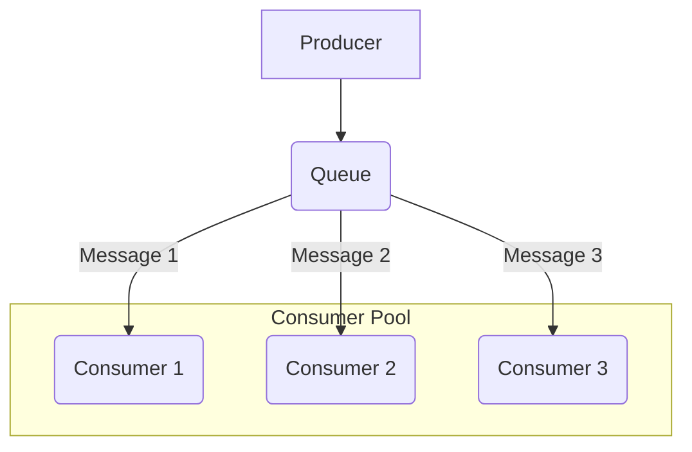
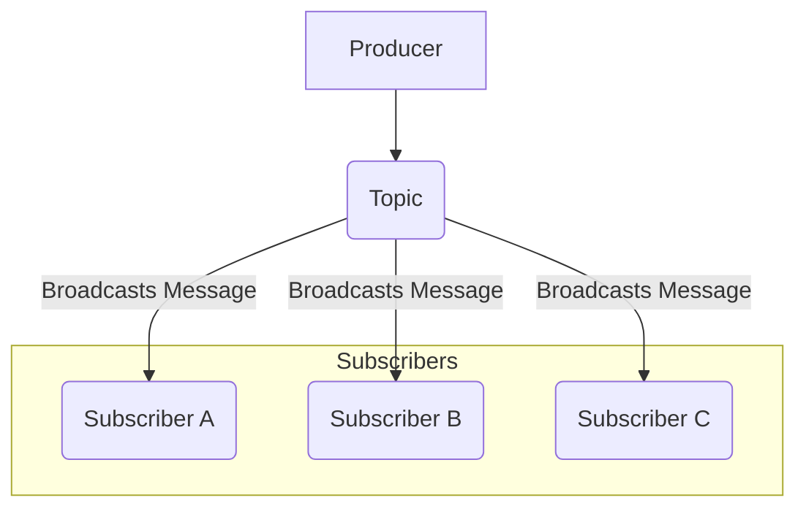

# **Asynchronous Messaging Patterns: Queues vs. Topics/Streams**

Asynchronous messaging is a foundational architectural approach for building decoupled, resilient, and scalable distributed systems. It relies on a central **[[broker]]** that acts as an intermediary between message **Producers** and **Consumers**. This document compares the two primary models of asynchronous messaging:

1.  **Point-to-Point Messaging (using a Queue):** In this model, a message is sent to a specific queue and is consumed by a **single** consumer. It's a one-to-one relationship. This is ideal for distributing tasks or offloading work to a pool of workers.

2.  **Publish/Subscribe Messaging (using a Topic or Stream):** In this model, a message is published to a topic and is broadcast to **multiple** interested consumers. It's a one-to-many relationship. This is ideal for notifying different parts of a system about an event.

### **Comparison: Queues vs. Topics/Streams**

| Characteristic | **Point-to-Point (Queue)** | **Publish/Subscribe (Topic/Stream)** |
| :--- | :--- | :--- |
| **Communication Model** | **One-to-One**. A single message is processed by exactly one consumer. | **One-to-Many**. A single message is broadcast to all interested consumers. |
| **Consumption Logic** | **Destructive Read**. When a consumer processes a message, it is removed from the queue. | **Non-Destructive Read**. Consumers read from a topic or stream without removing the message. Each consumer (or consumer group) tracks its own position (offset). |
| **Message Persistence** | Messages are typically removed after consumption. | Messages are often persisted in an immutable log and can be "replayed" from any point in time. |
| **Primary Use Case** | **Task/Command Distribution**. Ideal for distributing work among a pool of identical workers (e.g., processing a payment, generating a report). | **Event Notification**. Ideal for broadcasting that something has happened, allowing different parts of a system to react independently (e.g., `OrderPlaced` event). |

---

## **Communication Models in Detail**

### 1. Point-to-Point (Queue) Communication

This model is used to distribute tasks to a pool of workers. A message is sent to a queue and a single worker from the pool consumes it. This is often called the **Competing Consumers** pattern.

### 2. Publish/Subscribe (Topic/Stream) Communication

This model is used to broadcast events to multiple interested parties. A message is published to a topic, and every service subscribed to that topic receives a copy of the message.

---

## **Advantages and Technical Challenges**

### **Advantages (Benefits)**

* **[[cohesion-coupling|Decoupling]]**: Services have no direct dependency on one another, which simplifies system development, maintenance, and evolution.
* **Resilience**: If a **consumer** fails, messages are not lost; they remain in the **[[broker]]** until a service resumes processing.
* **Scalability**: The **[[broker]]** handles traffic spikes by acting as a buffer. It is easy to add more **consumers** to increase processing capacity without impacting the rest of the system.
* **Flexibility**: Different services can be developed using distinct technologies as long as they adhere to the common communication protocol with the **[[broker]]**.

### **Challenges**

* **Infrastructure Complexity**: Setting up and administering a **[[broker]]** introduces a new layer of operational complexity.
* **Debugging**: Following a message through an asynchronous distributed system can be complex, as there is no direct, synchronous request-response link.
* **Delivery Guarantees**: It is essential to understand the different delivery guarantees offered (**at-most-once**, **at-least-once**, **exactly-once**) to ensure messages are not lost or duplicated.
* **Eventual Consistency**: Systems based on this pattern are inherently **eventually consistent**, which may not be suitable for applications requiring immediate data consistency.

---

## **Related Patterns and Concepts**

These messaging models are often enhanced with other patterns to handle real-world complexities:

*   **Dead-Letter Queue (DLQ):** A dedicated queue for messages that cannot be processed successfully by a consumer after a certain number of retries. Instead of being discarded, the failed message is moved to a DLQ, where it can be analyzed by developers for debugging without blocking the main queue. This is a critical pattern for ensuring reliability.

*   **Message Priority:** Some message brokers allow producers to assign a priority to messages. The broker can then be configured to deliver higher-priority messages before lower-priority ones, ensuring that urgent tasks are processed first.

*   **Event Sourcing:** An architectural pattern where all changes to an application's state are stored as a sequence of events in a log (or stream). This provides a full audit trail and allows the application's state to be reconstructed at any point in time. This pattern relies heavily on the non-destructive, replayable nature of event streams.

---

## **Resources & links**

### **Articles**

1.  **[Message Queues vs Event Streams in System Design](https://www.geeksforgeeks.org/system-design/message-queues-vs-event-streams-in-system-design/)**

    This **GeeksforGeeks** article distinguishes between **Message Queues** and **Event Streams**, two crucial architectural patterns for asynchronous communication and real-time data processing. It details their characteristics, primary use cases, and implementations (like RabbitMQ and Kafka), emphasizing their roles in designing efficient and robust distributed systems.

2.  **[Message Queues or Streams? Simplifying Communication in Distributed Systems](https://medium.com/@harshverma7k/message-queues-or-streams-simplifying-communication-in-distributed-systems-a12711824c0d)**

    This **Medium** article by Harsh Verma explores **Message Queues** and **Event Streams** as paradigms for communication in distributed systems. It breaks down their features, such as asynchronous one-time transfer for queues and continuous flow for streams, and discusses when to use each, often suggesting a blend for complex systems.

---

### **Videos**

1.  **[Message Queues in System Design](https://www.youtube.com/watch?v=DYFocSiPOl8)**

    This video from **Hayk Simonyan** explains **Message Queues** in system design using an online store example. It covers how message queues, as durable components, support asynchronous communication, decouple services, and provide scalability and reliability by buffering requests for later processing.

2.  **[What is a Message Queue?](https://www.youtube.com/watch?v=xErwDaOc-Gs)**

    **Jamil Spain** from **IBM Technology** explains what a **Message Queue** is, defining it as an architectural technique for asynchronous communication in distributed applications. The video breaks down the concepts of messages and queues, provides examples like email, and discusses different messaging patterns (point-to-point, [[publish-subscribe|pub/sub]], request-reply) and the benefits of decoupling and scalability.