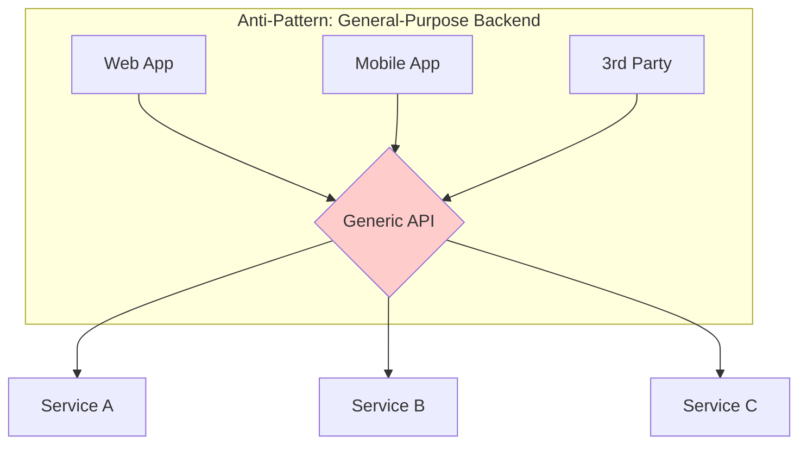
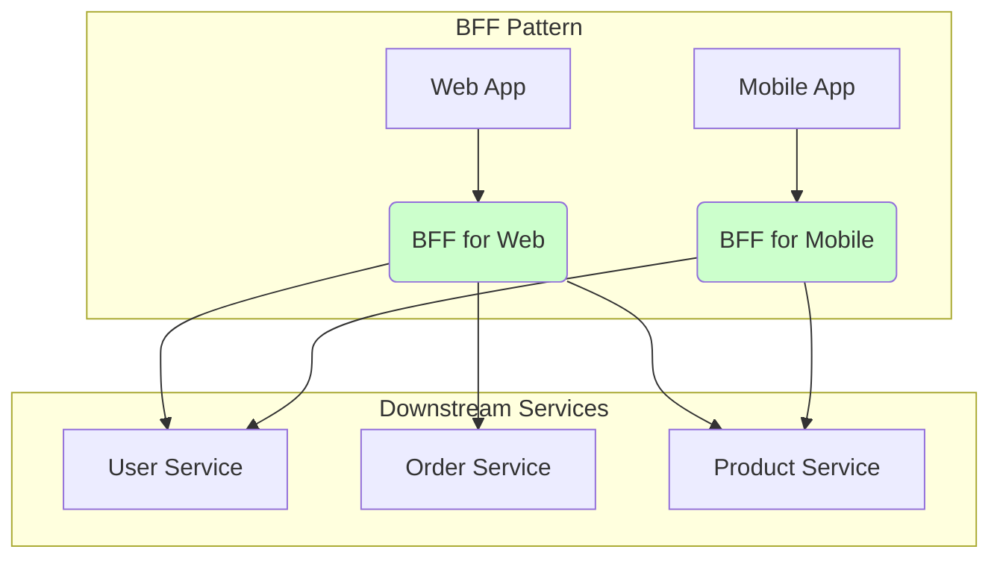

# Backends for Frontend (BFF)

The **Backends for Frontend** (BFF) is an architectural pattern where a dedicated backend service is created to serve a specific frontend application or user experience. Instead of a single, general-purpose API backend serving all types of clients (e.g., web, mobile, desktop), the BFF pattern advocates for creating a separate backend for each frontend. This pattern was first described by Sam Newman.

This backend acts as a [[gof#Facade|facade]], providing a tailored API that meets the specific needs of its corresponding frontend, simplifying the client-side application logic.

---

## The Problem it Solves

A single, generic backend API often becomes a bottleneck and a point of contention when it has to serve multiple, diverse frontend applications. Each frontend has different requirements:

-   A **desktop web app** might need rich, complex data structures to display on a large screen.
-   A **mobile app** needs lightweight data payloads to minimize network latency and data consumption.
-   A **third-party application** might require a completely different data format or authentication mechanism.

Forcing a single backend to cater to all these different needs leads to a bloated, complex, and inefficient API that is difficult to maintain and evolve. Frontend teams are often blocked, waiting for changes on a shared backend team's roadmap.

*A single, generic backend struggling to serve multiple different clients.*

---

## How it Works

The BFF pattern introduces a dedicated backend for each frontend. This BFF is not a general-purpose service; its sole purpose is to serve its specific frontend. It acts as a server-side aggregator and translator.

-   **Aggregation**: The BFF makes multiple calls to downstream [[microservices]] and aggregates the results into a single, optimized response for the frontend.
-   **Translation**: It can translate data from the generic format of the backend services into a format that is ideal for the frontend's view logic.
-   **Simplification**: It hides the complexity of the downstream microservices architecture from the client application.

*Each client (Web, Mobile) has its own dedicated BFF, which in turn communicates with the necessary downstream microservices.*

---

## Security Considerations

BFFs can enhance security by acting as a dedicated enforcement point for client-specific security policies:

-   **Client-Specific Authentication/Authorization**: A BFF can implement authentication and authorization logic tailored to the frontend's needs, potentially simplifying client-side security concerns. This is often achieved using patterns like [[federated-identity|Federated Identity]].
-   **Hiding Internal Service Details**: By acting as a [[gof#Facade|facade]], the BFF prevents the frontend from directly interacting with downstream microservices, thereby hiding the internal architecture and reducing the attack surface.
-   **Token Management**: It can manage and refresh access tokens for downstream services, abstracting this complexity from the client.

---

## Benefits & Trade-offs

### Benefits

-   **Improved Frontend Performance**: Payloads are optimized for each client, reducing the amount of data transferred and processed.
-   **Simplified Frontend Logic**: The client application is simpler as it only needs to make one call to its BFF, instead of orchestrating calls to multiple services.

-   **Team Autonomy**: Frontend teams can own and iterate on their own BFF, allowing them to move faster without being blocked by a central backend team.
-   **Technology Independence**: A BFF for a mobile app could be written in a stack optimized for low latency, while a BFF for a web app could use a different stack.
-   **Granular Scalability**: Each BFF can be scaled independently based on the specific load of its corresponding frontend, allowing for more efficient resource utilization compared to scaling a monolithic backend. The underlying microservices also retain their independent scalability.

### Trade-offs

-   **Increased Number of Services**: The most obvious drawback is the proliferation of backends that need to be built, deployed, and maintained.
-   **Code Duplication**: Logic for interacting with downstream services might be duplicated across different BFFs. This can be mitigated by sharing code through libraries.
-   **Operational Complexity**: More services mean more complexity in terms of [[monitoring]], logging, and CI/CD pipelines.

---

## When to Use / When Not to Use

### When to Use

-   **Multiple Diverse Clients**: When you have several distinct frontend applications (web, mobile, third-party) that require significantly different data formats, interaction patterns, or security policies.
-   **Independent Frontend Teams**: To empower frontend teams to iterate quickly on their specific client without being blocked by a shared backend team or a generic API.
-   **Complex Frontend Logic**: When the client-side application would otherwise need to orchestrate calls to many backend services and perform significant data transformation.
-   **Performance Optimization**: To tailor data payloads and API responses precisely for each client, optimizing network usage and rendering performance.

### When Not to Use

-   **Single Client or Homogeneous Clients**: If you only have one frontend application, or multiple frontends with very similar needs, a single well-designed API Gateway or backend might suffice.
-   **Simple Applications**: For applications with minimal complexity where the overhead of managing multiple BFFs outweighs the benefits.
-   **Limited Resources**: If your team lacks the resources or expertise to build, deploy, and maintain multiple backend services, the increased operational complexity of BFFs can be a significant drawback.

---

## Relationship with Other Patterns

-   **[[api-gateway|API Gateway]]**: The BFF pattern is often seen as a specialized implementation of an API Gateway. While a general API Gateway might handle routing and offloading for all services, a BFF is a gateway dedicated to a single frontend.
-   **[[gateway-aggregation|Gateway Aggregation]]**: This is the primary pattern used within a BFF. The BFF's main responsibility is to aggregate data from multiple downstream services.

-   **[[microservices]]**: The BFF pattern is most commonly used in the context of a microservices architecture, where it serves as the entry point for clients into the service mesh.

---

## Resources & links

### Articles

1.  **[Backends for Frontends pattern - Microsoft Azure](https://learn.microsoft.com/en-us/azure/architecture/patterns/backends-for-frontends)**
    The official Microsoft documentation for the BFF pattern, providing a detailed overview of the problem, solution, and considerations.

2.  **[Backend For Frontend by Sam Newman](https://samnewman.io/patterns/architectural/bff/)**
    An article by Sam Newman, who popularized the term, explaining the origins and rationale behind the pattern.

