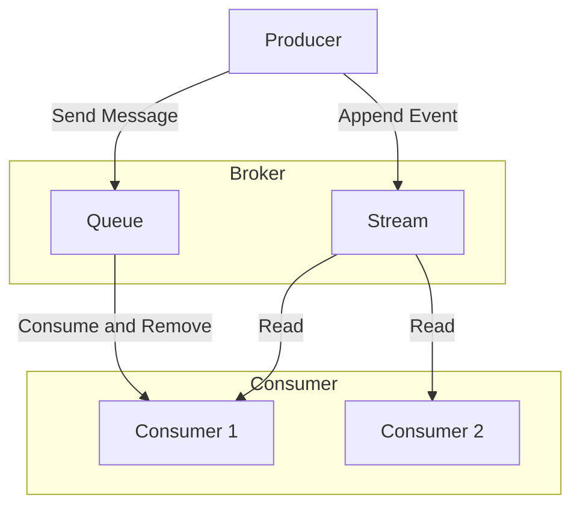

# **Message Queues / Streams Pattern**

The **Message Queues / Streams** pattern is a method for asynchronous communication that allows for the decoupling of system components. It separates responsibilities between message senders (**producers**) and receivers (**consumers**) via an intermediary. This pattern is more generic and high-level than the **Pub/Sub** pattern, which is actually one of its broadcast variants.

---

### **Core Principles**

This pattern is based on a **broker** (a message queue or a streaming platform) that acts as a buffer between services.

* **Message Queues**: This is a **point-to-point** model. A sent message is stored in a queue and is consumed by a single, unique **consumer**. Once processed, it is removed from the queue. This model is ideal for distributing tasks to a group of workers.
* **Message Streams**: This is a **broadcast** model. Messages are added to an ordered and persistent log. They are not deleted after being read, which allows multiple **consumers** to read the same data stream independently and at their own pace. This is the foundation of **Event-Driven Architectures**.

---

## **Key Components and Communication Flow**

1.  **Producer**: The application or service that creates and sends a message to the broker. It doesn't need to know who will process the message or when.
2.  **Broker**: The intermediary service that stores the messages. It can be a queue or a stream.
3.  **Consumer**: The application or service that retrieves and processes the messages. It can be a group of workers or multiple services that subscribe to data streams.

**Typical Data Flow**
* The **producer** sends a message to the **broker**.
* The **broker** stores the message in a queue or a log.
* The **consumer(s)** read the message and process it.
* The **consumer** sends an **acknowledgment** to confirm message processing.

---

## **Advantages and Technical Challenges**

### **Advantages (Benefits)**

* **Decoupling**: Services have no direct dependency on one another, which simplifies system development, maintenance, and evolution.
* **Resilience**: If a **consumer** fails, messages are not lost; they remain in the **broker** until a service resumes processing.
* **Scalability**: The **broker** handles traffic spikes by acting as a buffer. It is easy to add more **consumers** to increase processing capacity without impacting the rest of the system.
* **Flexibility**: Different services can be developed using distinct technologies as long as they adhere to the common communication protocol with the **broker**.

### **Challenges**

* **Infrastructure Complexity**: Setting up and administering a **broker** introduces a new layer of operational complexity.
* **Debugging**: Following a message through an asynchronous distributed system can be complex, as there is no direct, synchronous request-response link.
* **Delivery Guarantees**: It is essential to understand the different delivery guarantees offered (**at-most-once**, **at-least-once**, **exactly-once**) to ensure messages are not lost or duplicated.
* **Eventual Consistency**: Systems based on this pattern are inherently **eventually consistent**, which may not be suitable for applications requiring immediate data consistency.

---

## **Variations and Derived Architectures**

The **Message Queues / Streams** pattern is a foundation upon which many modern communication models are built.

* **2-Tier Architecture:** This is the basic model, with a **producer** communicating directly with a **consumer** via a queue.
* **Fan-out / Pub-Sub Architecture:** This variation is a derivative of **Message Streams**. A message sent by a **producer** is broadcast to multiple **consumers**.
* **N-Tier Architecture**: In complex systems, the pattern can be used to decouple different layers.
* **Microservices**: This is arguably the most common use case today. Each microservice can act as both a **producer** and a **consumer**, exchanging messages asynchronously.

---

## **Resources & Links**

### **Articles**
1.  **[Introduction to Message Queues](https://www.cloudamqp.com/blog/2014-04-16-introduction-to-rabbitmq.html)**
2.  **[Message Queues vs. Message Streams: A Comparison](https://www.confluent.io/blog/message-queues-vs-kafka-message-streams/)**

### **Videos**
1.  **[What are Message Queues?](https://www.youtube.com/watch?v=F3zV336N9tA)**
2.  **[Apache Kafka Explained](https://www.youtube.com/watch?v=Ch5XeQz82r0)**