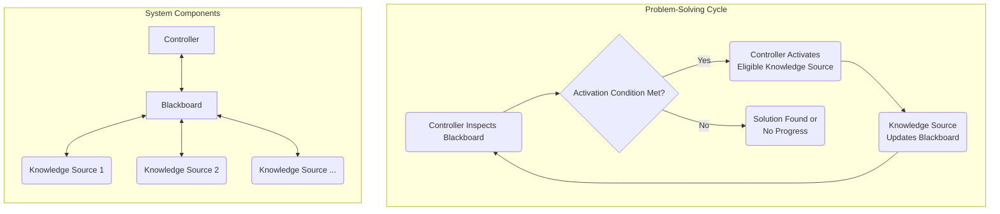

# **The Blackboard Architectural Pattern**

The **Blackboard Pattern** is a specialized [[software-architecture/architectural-patterns/|architectural pattern]] for solving complex problems where a deterministic solution path is not known in advance. The pattern gets its name from the physical analogy of a group of human experts collaborating to solve a problem by writing on a shared blackboard. Each expert watches the blackboard for new information and adds their own contributions, gradually building towards a solution.

This model is particularly suited for complex, opportunistic problem-solving systems, such as in Artificial Intelligence, sensor data fusion, and speech recognition.

* **Core Principles:**
    * **Shared Data Repository (The Blackboard):** This is a global data store accessible to all components. It contains the current state of the problem and the partial solutions. All communication and coordination between components happen through the Blackboard.
    * **Independent Components (Knowledge Sources):** These are autonomous modules, each specialized in a specific area of the problem. They react to changes on the Blackboard and contribute their own partial solutions. Each Knowledge Source has its own set of rules or logic.
    * **Centralized Control (The Controller):** Also known as the **Mediator** or **Scheduler**, this component orchestrates the overall process. It monitors the Blackboard for changes and decides which Knowledge Source to activate next. The Controller's primary role is to manage the flow of problem-solving until a final solution is found or a predefined termination condition is met.

---
## **Key Components and Communication Flow**

The interaction between the components is [[event-driven|event-driven]] and indirect, as the Knowledge Sources do not communicate with each other directly but only through the Blackboard.

1.  **Blackboard:** The central repository. It's often structured into different levels of abstraction or hierarchies to organize the data and solutions. For example, in a speech recognition system, the Blackboard might contain levels for phonemes, words, and sentences.
2.  **Knowledge Sources:** These components are self-contained and "know" how to solve a specific sub-problem. They continuously monitor the Blackboard, and when they detect a change they can act upon, they become active. Their contribution modifies the Blackboard, which in turn can trigger other Knowledge Sources.
3.  **Controller:** This is the strategic core of the system. Its role is to monitor the Blackboard and make decisions about which Knowledge Source to activate next. The control logic is what guides the system towards a solution and can range from simple to highly complex strategies, such as:
    *   **Focusing on the most promising lead:** Prioritizing Knowledge Sources that can act on the most recently added or highest-confidence data.
    *   **Exploring multiple paths:** Activating several Knowledge Sources in parallel to explore different solution paths.
    *   **Backtracking:** Reverting changes on the Blackboard if a particular solution path leads to a dead end.

**Typical Data Flow:**
* The process starts when the Controller places an initial problem on the Blackboard.
* Knowledge Sources monitor the Blackboard. When a condition they can act upon is met, they signal the Controller.
* The Controller selects one or more Knowledge Sources to activate.
* The activated Knowledge Source executes its logic, reading from and writing to the Blackboard, which represents a new partial solution.
* This process repeats in a cycle (perceive, act, react) until the final solution is complete or the Controller determines that no further progress can be made.

---
## **Advantages and Technical Challenges**

* **Advantages (Benefits):**
    * **Flexibility and Extensibility:** New Knowledge Sources can be added to the system easily without affecting existing ones. This makes the pattern ideal for research and development projects where the problem-solving strategy evolves.
    * **[[transversal-programming-models#1-concurrent-programming|Concurrent]] Processing:** Knowledge Sources can operate in parallel, which makes the pattern suitable for multi-core and distributed environments.
    * **Problem-Solving for ill-defined problems:** It is designed for problems where no single algorithm exists to find a solution directly. The emergent behavior from the collaboration of multiple simple components leads to a solution.
    * **[[soc|Separation of Concerns]]:** The pattern strictly separates the problem-solving logic (Knowledge Sources), the data (Blackboard), and the control flow (Controller).

* **Challenges:**
    * **Synchronization and [[transversal-programming-models#1-concurrent-programming|Concurrency]]:** Managing [[transversal-programming-models#1-concurrent-programming|concurrent]] access to the Blackboard can be complex, especially in a distributed environment. Mechanisms like locks, semaphores, or transactional systems are often required.
    * **Single Point of Failure (SPOF):** The Blackboard itself can become a **bottleneck** if not properly managed, as all communication must flow through it. If it fails, the entire system fails.
    * **Debugging and Testing:** The non-deterministic nature and the absence of a clear control flow make debugging and tracing the system's behavior very difficult. It can be hard to know which Knowledge Source made a particular modification.
    * **Overhead:** The constant monitoring and a complex Controller can introduce significant overhead, making it less efficient for simpler problems.

---
## Related Patterns, Concepts and Variations

* **Hierarchical Blackboard:** The Blackboard is organized into multiple levels of abstraction, with Knowledge Sources specialized to operate at specific levels. This is common in complex AI systems.
* **Open Blackboard:** This variation loosens the strict control of the Controller. Knowledge Sources can write directly to the Blackboard without a centralized scheduler, relying on event-based triggers. This is less common due to the increased complexity of managing concurrency.
* **Integration with other patterns:** The Blackboard pattern is often combined with other patterns. For example, Knowledge Sources can be implemented as **[[microservices]]** communicating via a message queue, which serves as a sort of "Blackboard" in a distributed system.
* **Modern Collaborative Tools:** Conceptually, modern real-time collaborative tools (like Google Docs or Figma) share similarities with the Blackboard pattern. The document or canvas acts as the "blackboard," and multiple users (the "knowledge sources") contribute [[transversal-programming-models#1-concurrent-programming|concurrently]] to build a final product.

This pattern, though less common in standard enterprise applications, remains a powerful tool for specific, highly complex domains. Its strength lies in its ability to manage complexity through a collaborative, incremental approach.

---

## **Resources & links**

### **Articles**

1.  **[Solving Non-Determinism with Blackboard Architecture](https://www.geeksforgeeks.org/system-design/solving-non-determinism-with-blackboard-architecture/)**

    This **GeeksforGeeks** article explains how the **Blackboard Architecture** pattern can be used to solve non-deterministic problems in system design. It details five methods this pattern uses, including parallelism, concurrency, and iterative refinement, to handle complex issues with incomplete information.

---

### **Videos**

1.  **[Blackboard architecture](https://www.youtube.com/watch?v=G8KroDXt4qc)**

    This video from **Sreelakshmi Manoharan** provides an overview of the **Blackboard architecture** in the context of problem-solving within AI. It defines the core components of the system—the blackboard, knowledge sources, and the control strategy—and discusses its applications in areas like healthcare and intelligent robotics.

2.  **[Blackboard Architecture](https://www.youtube.com/watch?v=gNiL6u_hIWY)**