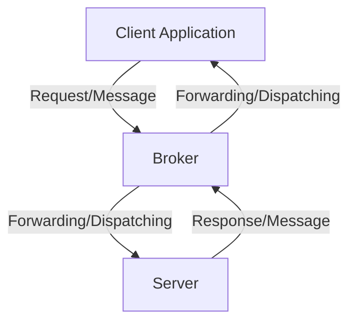

# **The Broker Pattern**

The Broker architectural style is a distributed system model that organizes components by [[cohesion-coupling|decoupling]] them via an intermediary component called a **Broker**. Its primary purpose is to allow heterogeneous entities to communicate without direct knowledge of each other. Components specialize as **clients** or **servers**, but their interaction is always mediated by the broker.

* **Core Principles:**
    * **[[cohesion-coupling|Decoupling]]:** This is the central principle. Clients and servers do not communicate directly, which reduces design dependencies and allows for independent development and maintenance.
    * **Abstraction and Transparency:** The broker hides the complexity of communication. A client does not need to know where the server is or how it works, and vice-versa.
    * **Message-based Communication:** Communication is typically done through the exchange of messages. The broker is responsible for mediating, distributing, and sometimes transforming these messages.

---

## **Key Components and Communication Flow**

1.  **Client:** A component that initiates a service request to the broker. The client can be any application that needs to consume a service.
2.  **Server:** A component that provides a service. A server registers with the broker to publish its available services.
3.  **Broker:** The intermediary component that orchestrates communication. It has several responsibilities:
    * **Registration:** Servers register with the broker, providing a description of their services.
    * **Publication:** The broker makes the services available to clients.
    * **Dispatching:** It forwards messages from clients to the appropriate servers and responses from servers back to clients.

**Typical Data Flow:**
* **Registration:** A server connects to the broker and registers a service, often with a unique identifier (e.g., "Payment Service").
* **Request:** A client sends a request to the broker, specifying the required service. The client knows nothing about which server will respond.
* **Mediation:** The broker uses its registry to identify the server(s) capable of handling the request.
* **Processing:** The broker forwards the request to the appropriate server. The server executes its business logic.
* **Response:** The server returns the response to the broker, which forwards it to the initial client.

---

## **Advantages and Technical Challenges**

* **Advantages (Benefits):**
    * **High Scalability:** It is easy to add new clients or servers without affecting existing components. The architecture is highly flexible.
    * **Robustness:** A failure in a client or server does not directly affect others, as long as the broker remains operational. The broker can also handle retry functionalities.
    * **Interoperability:** Due to decoupling, clients and servers can be developed using different languages, technologies, or platforms.
    * **Reduced Client Complexity:** Clients do not have to manage the logic for connection, service discovery, or error handling related to servers.

* **Challenges:**
    * **Broker Complexity:** The broker is a central point and a critical component. If poorly designed, it can become a **single point of failure (SPOF)** or a **bottleneck**. Its design is complex and requires careful attention to scalability and high availability.
    * **Performance Overhead:** The intermediary adds an extra communication step, which can increase latency compared to direct client-server communication.
    * **Security Risks:** The broker, as a mediator, is a potential target for attacks. Robust security measures are essential for the broker and the communication between components and the broker.
    * **Deployment and Configuration:** Deploying all components can be more complex due to the various configurations needed for communication with the broker.

---

### **Comparative Advantages (vs. Client-Server)**

The **Broker** style, while derived from the **[[client-server|Client-Server]]** model, offers significant advantages due to its intermediary layer.

* **Elegant Decoupling:** The lack of direct knowledge between client and server reduces design dependencies, allowing for independent evolution. Unlike **[[client-server|Client-Server]]** where components are tightly coupled, the **Broker** makes service management more flexible and less risky.
* **Resilience and Fault Tolerance:** The broker can queue messages if a server is unavailable, which increases system robustness. In a **[[client-server|Client-Server]]** architecture, a server failure can render the entire service unavailable.
* **Increased Scalability:** It is easier to add new servers to handle higher load without modifying existing clients. The broker distributes requests automatically, which simplifies **horizontal scaling**.
* **Simplified Interoperability:** The mediation of the broker allows heterogeneous components (developed in different languages or on different platforms) to communicate seamlessly, as long as they adhere to the broker's protocol.
* **Reduced Client-Side Complexity:** The client is relieved of the logic for service discovery, error handling, and communicating with multiple servers, as these tasks are centralized on the broker.

---

## **Variations and Derived Architectures**

The **Broker** style is a foundation for many modern, often specialized or extended models.

* **[[message-queue|Message Brokers]]:** Technologies like **Apache Kafka**, **RabbitMQ**, or **ActiveMQ** are direct implementations of this model. They manage message queues or [[publish-subscribe|publish-subscribe (Pub/Sub)]] systems.
* **[[soa|Service-Oriented Architecture (SOA)]]:** The broker is often implemented as an **Enterprise Service Bus (ESB)** that manages communication and orchestration between different enterprise services.
* **[[microservices|Microservices]]:** While microservices can use direct communication (**REST**), it is very common to pair them with an **API Gateway** or a **Service Mesh** that acts as a broker for service discovery, traffic management, and security.

---

---

## **Resources & links**

### **Articles**

1.  **[What are message brokers?](https://www.ibm.com/think/topics/message-brokers)**

    This **IBM** article explains **message brokers** as software that facilitates communication between different applications by translating messages. It details key messaging patterns like **point-to-point** and **publish/subscribe (pub/sub)** and compares message brokers to other technologies.

2.  **[Broker Pattern](https://www.geeksforgeeks.org/system-design/broker-pattern/)**

    This **GeeksforGeeks** article provides a comprehensive overview of the **Broker Pattern**, a crucial architectural design for distributed systems. It explains how a central broker decouples components to simplify communication, and it highlights the pattern's benefits and real-world use cases.

---

### **Videos**

1.  **[The Broker Design Pattern](https://www.youtube.com/watch?v=S9LytpENF3s)**

    Presented by **Design Patterns Lectures**, this video explains the **Broker design pattern** in the context of distributed systems. It details how a broker manages dynamic communication between clients and servers, focusing on key attributes like **decoupling** and **location transparency**.

2.  **[What Is a Message Broker?](https://www.youtube.com/watch?v=385Jtvxne4A)**

    This **IBM Technology** video provides a clear explanation of what a **message broker** is and its role as an intermediary for asynchronous communication in distributed applications. It covers different messaging patterns and the benefits of **decoupling** and **scalability**.
