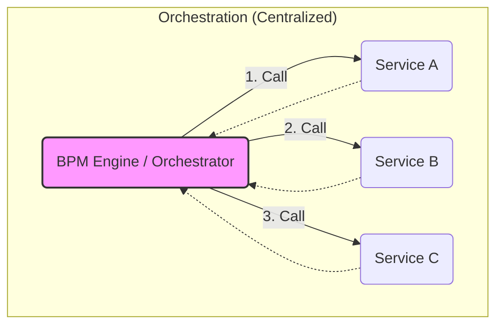
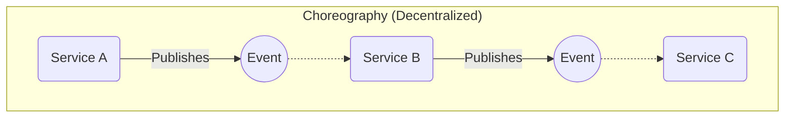

# Business Process Management (BPM) & Orchestration

**Business Process Management (BPM)** is a discipline and set of technologies used to model, analyze, and execute business processes. In the context of software architecture, it is closely tied to the concept of **Orchestration**, where a central coordinator (the "Conductor") manages the interactions between various services to achieve a business goal.

It is vital to distinguish between the *management* aspect (BPM) and the *execution* technologies (**BPEL**, Workflow Engines). While traditional BPM suites were often monolithic and heavy, the pattern of orchestration remains a fundamental concept in distributed systems.

---

## Key Technologies and Standards

### 1. BPMN (Business Process Model and Notation)
**BPMN** is the visual standard for modeling business processes. It provides a graphical notation (flowcharts) that is understandable by both business analysts and technical developers.
*   **Role**: The "Sheet Music" for the process.
*   **Example**: A diagram showing "Start -> Check Credit -> Ship Goods -> End".

### 2. BPEL (Business Process Execution Language)
**BPEL** (specifically WS-BPEL) is an XML-based language used to define the execution logic of business processes, primarily within a **[[soa]]** environment using **[[soap]]** services.
*   **Role**: The "Code" that executes the process.
*   **Characteristics**:
    *   **Stateful**: Maintains the state of a long-running process (e.g., waiting days for a manager's approval).
    *   **Service-Centric**: Designed to compose web services.
    *   **Strict**: Heavily structured and standardized.

---

## Orchestration vs. Choreography

The most critical architectural decision in process management is choosing between **Orchestration** and **Choreography**.

### Orchestration (The Conductor)
A central coordinator (the BPM Engine or [[esb]]) tells each service what to do and when.
*   **Analogy**: An orchestra conductor directing musicians.
*   **Pros**: Centralized visibility, easy error handling, clear process flow.
*   **Cons**: Tight coupling to the coordinator, potential bottleneck.

### Choreography (The Dancers)
Services react to events and collaborate without a central coordinator.
*   **Analogy**: Dancers in a ballet knowing their steps and reacting to the music/partners.
*   **Pros**: Loose coupling, high scalability.
*   **Cons**: Hard to visualize the global process, difficult debugging.

*Description: In Orchestration, a central "Conductor" (like a BPM Engine) explicitly controls the flow, invoking each service in a specific order.*

*Description: In Choreography, services collaborate by reacting to events. There is no central controller; the process flow emerges from the interactions between services.*

---

## Modern Evolution: From BPEL to Workflows

Traditional **BPEL** engines (often part of large ESB suites) have largely fallen out of favor due to their complexity and XML-heaviness. However, the *need* for orchestration has not disappeared.

In modern **[[microservices]]** architectures, we see a resurgence of orchestration through **Workflow Engines** and **Sagas**:

1.  **Lightweight Workflow Engines**: Tools like **[Camunda](https://docs.camunda.org/)**, **[Zeebe](https://docs.camunda.io/docs/components/zeebe/)**, or **[Netflix Conductor](https://conductor.netflix.com/)** allow for defining workflows (often in BPMN) but executing them in a distributed, scalable manner.
2.  **Code-Based Orchestration**: Frameworks like **[Temporal](https://docs.temporal.io/)** or **[Cadence](https://cadenceworkflow.io/)** allow defining workflows as code (e.g., Java, Go) rather than XML/JSON, providing better testability and versioning.
3.  **Saga Pattern**: For distributed transactions, the **[[saga]]** pattern (specifically the Orchestration-based Saga) is the direct successor to BPEL-style long-running transactions.

## Summary

| Concept | Description | Modern Equivalent |
| :--- | :--- | :--- |
| **BPM** | The discipline of managing processes. | Still BPM (often embedded in apps). |
| **BPEL** | XML language for SOAP orchestration. | **Temporal**, **Camunda**, **Logic Apps**. |
| **BPMN** | Visual notation standard. | Still widely used for visualization. |
| **Orchestrator** | Central engine executing the flow. | **Saga Orchestrator**, **Workflow Engine**. |
