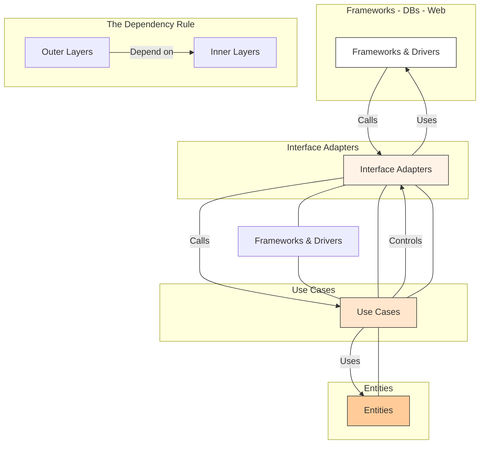

# **Clean Architecture**

**Clean Architecture** is a software architecture that focuses on separating concerns by organizing code into concentric layers. The main goal is to create systems whose most important parts (the **business rules**) are independent of external implementation details, such as frameworks, databases, user interfaces, or external services.

* **Core Principles (The Rules):**
    * **Framework Independence:** The system does not depend on external libraries or frameworks. They can be replaced or modified without impacting the core **business rules** of the application.
    * **Testability:** Business rules can be tested without the UI, database, web server, or any other external element.
    * **UI Independence:** The user interface can be changed easily without affecting the rest of the system.
    * **Database Independence:** You can change the database (e.g., from **PostgreSQL** to **MySQL** or **NoSQL**) without modifying the business logic.
    * **External Services Independence:** External services (e.g., **REST APIs**) are implementation details and do not pollute the core of the application.

---

## **Key Components and Communication Flow**

1.  **Entities (Enterprise Business Rules):** The innermost circle. It contains the most general and stable business rules. An **Entity** can be an object with methods that encapsulate the application's fundamental rules, independent of any other layer. These are the core domain classes.
2.  **Use Cases (Application Business Rules):** This circle contains the business logic specific to the application. It orchestrates the flow of data to and from the **Entities**. **Use Cases** are invoked by **controllers** to perform specific tasks (e.g., create a new user, validate an order).
3.  **Interface Adapters (Gateways, Controllers, Presenters):** This layer is a set of adapters that convert data between external formats (database, **web request**) and the internal formats used by the **Use Cases** and **Entities**. This is where you find **controllers**, **presenters**, and **gateways** to interact with external services.
4.  **Frameworks & Drivers (Web, DB, Devices):** The outermost circle, it contains implementation details. Web frameworks, databases, **ORMs**, the UI, etc. These are the least important elements for the business logic.

**The Dependency Rule:** Dependencies must only point inward. No inner layer should have knowledge of an outer layer. For example, a **Use Case** should not know that its data is stored in a **SQL** database via a specific **ORM**. This is managed by the **[[solid|Dependency Inversion Principle]]**.

**Typical Data Flow:**

1.  The UI or a **Framework** (the outermost layer) detects a user action.
2.  A **Controller** (in the **Interface Adapters** layer) receives the request and converts it into an internal data format. It then calls the appropriate **Use Case**, passing this data.
3.  The **Use Case** executes the application's business logic. It may interact with one or more **Entities** and use a **Gateway** to persist or retrieve data, without concern for the underlying mechanism (e.g., whether it's a database, a file, or an external API).
4.  **Gateways** (in the **Interface Adapters** layer) manage the interaction with the external world, such as a database. They implement an interface defined in the **Use Cases** layer (**Dependency Inversion**).
5.  Once the business logic is complete, the **Use Case** returns the result to the **Controller**.
6.  The **Controller** uses a **Presenter** (in the **Interface Adapters** layer) to format the output data for the UI, and the UI displays the result to the user.

---

## **Advantages and Technical Challenges**

* **Advantages (Benefits):**
    * **Longevity:** The business logic is at the core of the system and is not contaminated by rapidly evolving technology choices. The code remains relevant for a longer time.
    * **Increased Testability:** Due to the independence of the **business rules**, unit tests can be written quickly and easily without having to **mock** entire frameworks or databases.
    * **Flexibility:** Changing the database, framework, or even the user interface becomes a simple, isolated task.
    * **Maintainability:** The clear structure and separation of concerns make the code easier to understand and maintain, even for new teams.

* **Challenges:**
    * **Initial Complexity:** Setting up **Clean Architecture** requires more work and a more rigid structure at the outset.
    * **Boilerplate Code:** The addition of multiple layers (interfaces, **presenters**, **gateways**) can increase the amount of code to write, although using appropriate frameworks can mitigate this issue.
    * **Learning Curve:** The model can be difficult to grasp for less experienced teams who are used to simpler architectures.

---

## **Variations and Derived Architectures**

* **[[layered|Layered Architecture]]:** **Clean Architecture** is a form of **[[layered|layered architecture]]**, but with a stricter and more explicit dependency rule. In a classic **[[layered|layered architecture]]**, the dependency is often unidirectional (e.g., `Web Layer` -> `Business Layer` -> `Data Layer`), but the core of the system is not as protected from external technologies.

* **[[onion|Onion Architecture]]:** Proposed by Jeffrey Palermo, it is the conceptual basis of **Clean Architecture**. The concentric layers represent the same idea of inward dependency. The core contains the **Domain Model** and interfaces, while the outer layers handle infrastructure and the UI. **Clean Architecture** is a more formal and detailed vision of this concept.

* **[[hexagonal|Hexagonal Architecture]]:** Also known as **Ports and Adapters**, it focuses on isolating business logic from the outside. The application "core" exposes **ports** (interfaces), and external "adapters" (database, UI) connect to them. It's the same idea as **Clean Architecture** but expressed differently: the hexagon concept symbolizes that the system can be driven in any manner (UI, automated tests, batch script) and can interact with any external service. **Clean Architecture** integrates this concept by formalizing it through its layers.

---

## **Resources & links**

### **Articles**

1.  **[The Clean Architecture](https://blog.cleancoder.com/uncle-bob/2012/08/13/the-clean-architecture.html)**

    This seminal article by **Robert C. Martin (Uncle Bob)** introduces **Clean Architecture**, a software design philosophy that aims to create systems independent of frameworks, databases, and UI. The core principle is "The Dependency Rule," which states that source code dependencies must only point inwards, towards higher-level policies. The article details the architecture's concentric layers—from the core **Entities** to the outer **Frameworks & Drivers**—to show how this separation of concerns results in a system that is highly testable and maintainable.

2.  **[Clean Architecture](https://medium.com/@rudrakshnanavaty/clean-architecture-7c1b3b4cb181)**

    This **Medium** article by Rudrakshna Nanavaty provides a clear overview of **Clean Architecture**. It explains the core principles, such as the **separation of concerns** and the **Dependency Rule**, which ensures inner layers remain decoupled from outer layers. The article likens the architecture to an onion, detailing the four main layers: **Entity**, **Use Case**, **Controller**, and **Infrastructure**. It also explains how **Dependency Injection** helps manage the flow of dependencies, promoting a flexible, testable, and maintainable codebase.

---

### **Videos**

1.  **[The Beginner's Guide to Clean Architecture](https://www.youtube.com/watch?v=TQdLgzVk2T8)**

    This video by **Milan Jovanović** is a beginner-friendly guide to **Clean Architecture**. It explains the architecture's layered structure and its core components, including the **Domain**, **Application**, **Presentation**, and **Infrastructure** layers. The video highlights how the architecture helps in building highly testable systems with loose coupling and provides practical insights into its implementation and benefits in various contexts like [[monolithic|monoliths]] and [[microservices]].

2.  **[The Clean Architecture (Ian Cooper)](https://www.youtube.com/watch?v=SxJPQ5qXisw)**

    In this presentation at the **DevTernity Conference**, Ian Cooper explains the concepts behind **Clean Architecture**. He compares it to other patterns like **[[hexagonal|Hexagonal]]** and **[[onion|Onion Architectures]]** and emphasizes the importance of a layered approach where dependencies flow inward. He demonstrates how this design philosophy separates core business logic from technical concerns, making the application easier to test and more resilient to changes in external frameworks.