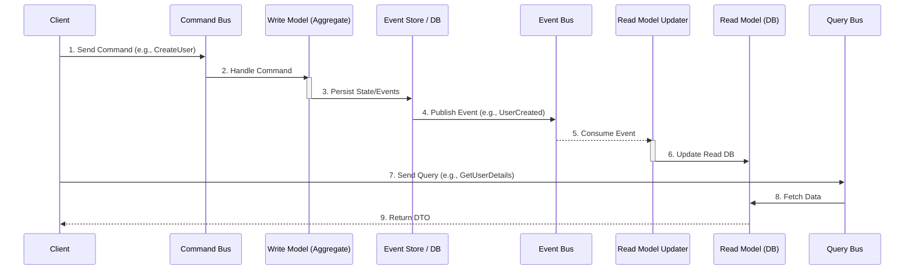

# CQRS (Command Query Responsibility Segregation)

**CQRS** is an [[software-architecture/architectural-patterns/|architectural pattern]] that separates the model for writing data (the **Command** side) from the model for reading data (the **Query** side). While in traditional architectures the same data model is used for both reading and writing, CQRS proposes that these two aspects have very different requirements and should be optimized independently.

* **Core Principles:**
    * **[[soc|Separation of Concerns]]:** The core idea is to have two distinct models:
        * The **Write Model** (or Command Model) is optimized for validation, business logic execution, and consistency. It processes commands and produces events or state changes.
        * The **Read Model** (or Query Model) is a denormalized and optimized representation of the data, designed specifically for efficient querying and display.
    * **Asymmetrical Models:** The write model can be a fully normalized, transactional database, while the read model could be a NoSQL database, a full-text search index, or simply materialized views.
    * **Data Synchronization:** The read model is updated based on changes occurring in the write model. This synchronization is often asynchronous, leading to eventual consistency.

---

## Key Components and Communication Flow

The flow starts with a client's intent, which is either a Command or a Query.

1.  **Command:** An object representing an intent to change the state of the system (e.g., `UpdateUserAddress`). It is [[imperative-programming|imperative]] and should not return data.
2.  **Write Model:** Handles the command, executes business rules, and persists the state change. In an [[event-sourcing|Event Sourcing]] context, this would be an **Aggregate** that produces events.
3.  **Write Database:** The data store for the write model. It is optimized for writes (e.g., a normalized SQL database or an Event Store).
4.  **Data Synchronization Mechanism:** A process that updates the read model. This is often done by publishing events from the write model (e.g., via a message bus) that the read side subscribes to.
5.  **Read Model:** A denormalized data store optimized for queries. It can be a NoSQL database, a search index, or any other suitable storage. It is essentially a materialized view of the data.
6.  **Query:** A request for data that does not change the state of the system. It returns a Data Transfer Object (DTO).

---

## Advantages and Technical Challenges

* **Advantages (Benefits):**
    * **Scalability:** The read and write workloads can be scaled independently. You can add more nodes to your read cluster to handle high query volumes without impacting the write side.
    * **Performance:** Each model can be aotomized with the best data store for its task. The read model can be denormalized to avoid complex joins, leading to very fast queries.
    * **Flexibility & Simplicity:** The write model can focus solely on business logic and transactional consistency without being polluted by read concerns. The read model is simple and doesn't contain complex business logic.
    * **Security:** It's easier to enforce security rules by restricting access to the command side.

* **Challenges:**
    * **Increased Complexity:** This is not a pattern for simple applications. It introduces more components and moving parts (e.g., data synchronization).
    * **Eventual Consistency:** Since the read model is updated asynchronously, there is a delay before changes are visible to the query side. The UI must be designed to handle this (e.g., by showing optimistic updates).
    * **Data Synchronization Logic:** The mechanism to update the read model must be robust and reliable. If events are lost, the read model becomes permanently inconsistent. Patterns like the **Transactional Outbox** can help.
    * **Development Overhead:** Requires a different way of thinking and more initial setup compared to a traditional CRUD approach.

---

## Related Patterns, Concepts and Variations

CQRS is often used with other patterns to build robust and scalable systems.

*   **[[event-sourcing|Event Sourcing]]:** CQRS and Event Sourcing are a natural fit. In this combination, the write model is an [[event-sourcing|Event Sourced]] system that persists a log of events. The read model is built by subscribing to these events and creating projections.
*   **[[microservices|Microservices]]:** In a microservices architecture, a single service might own the write model for a specific domain, while multiple other services could own different read models of that same data, tailored for their specific needs.
*   **Materialized View:** The read model in CQRS is essentially a materialized view of the write model's data.
*   **Transactional Outbox:** A pattern to ensure that events are reliably published to the message bus after the state has been successfully persisted in the write database.

## **Resources & links**

### **Articles**

1.  **[CQRS by Martin Fowler](https://martinfowler.com/bliki/CQRS.html)**

    A concise introduction by Martin Fowler, who helped popularize the term. It clarifies the core concept and its relationship with other patterns.

2.  **[Microsoft Docs - CQRS Pattern](https://docs.microsoft.com/en-us/azure/architecture/patterns/cqrs)**

    A very detailed and practical guide from the Microsoft architecture team. It covers the benefits, challenges, and implementation considerations, with code examples.

### **Videos**

1. **[Lesson 12 - CQRS and Microservices](http://www.youtube.com/watch?v=pUGvXUBfvEE)** (Software Architecture Monday)

    Explains **CQRS** to solve performance trade-offs by using **separate data models and databases** for **Reads (Queries)** and **Writes (Commands)**. Enables independent scaling, crucial for **Microservices**.

2. **[CQRS System Design Pattern](http://www.youtube.com/watch?v=vNplj9LwQSw)** (Piyush Garg)

    Detailed guide on separating **Commands and Queries** to eliminate database bottlenecks. Discusses using different DB types (SQL/NoSQL) for each side and integrating **Event Sourcing** via a message broker (Kafka) for **eventual consistency** in large-scale systems.