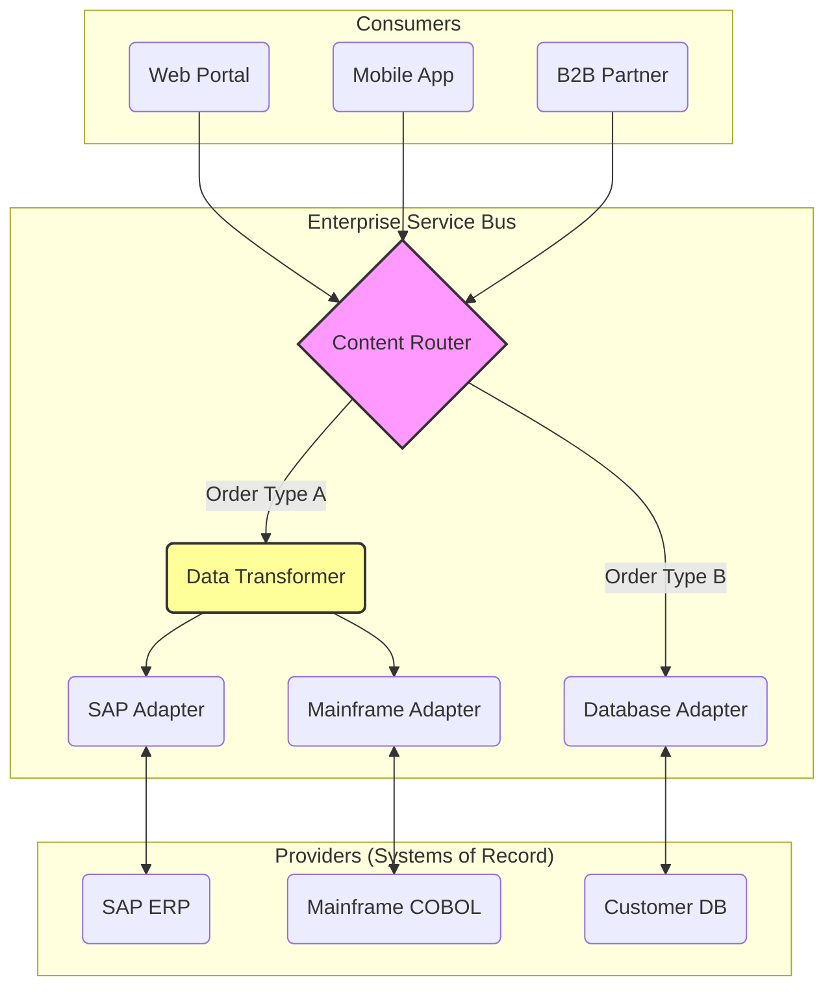

# Enterprise Service Bus (ESB)

**Enterprise Service Bus (ESB)** is an architectural pattern and middleware technology used to design and implement communication between mutually interacting software applications in a **Service-Oriented Architecture ([[soa]])**.

The ESB is the "nervous system" of a traditional enterprise landscape. It acts as a centralized communication backbone that allows different systems—regardless of their underlying technology, protocol, or data format—to talk to each other without needing to know the details of the other's implementation.

This pattern embodies the philosophy of **"Smart Pipes, Dumb Endpoints,"** where the intelligence (routing, transformation, orchestration) resides in the bus itself, leaving the services to focus purely on business logic.

---

## Core Capabilities

An ESB is defined by its ability to perform four key functions, often remembered as **VETRO**:

1.  **V - Validate**: Ensuring the message payload meets the required schema or business rules before processing.
2.  **E - Enrich**: Adding additional data to a message (e.g., looking up a customer ID from a database based on an email address in the payload).
3.  **T - Transform**: Converting data from one format to another (e.g., **XML** to **JSON**, or a legacy COBOL copybook to a SOAP envelope). This is critical for the **Anti-Corruption Layer** pattern.
4.  **R - Route**: Determining the destination of a message based on its content or header (Content-Based Routing).
5.  **O - Operate**: Managing the operational aspects, such as monitoring, error handling, and security.

### Protocol Conversion
One of the ESB's most powerful features is **Protocol Translation**. It can accept a request via **HTTP/REST**, convert it to **JMS** for a message queue, or **FTP** for a legacy mainframe, and then return the response over HTTP. This abstracts the complexity of the backend systems from the consumer.

---

## Architecture & Data Flow

The ESB sits between service consumers and service providers, decoupling them completely.

*Description: The ESB acts as a central hub, routing requests from various consumers (Web, Mobile, Partners) to the appropriate backend systems (ERP, Mainframe, Database), performing necessary transformations and protocol adaptations along the way.*

---

## ESB vs. Other Integration Patterns

It is crucial to distinguish the ESB from other integration components: [[api-gateway|API Gateway]], [[message-queue|Message Broker]] and [[service-mesh|Service Mesh]].

| Feature | Enterprise Service Bus (ESB) | API Gateway | Message Broker | Service Mesh |
| :--- | :--- | :--- | :--- | :--- |
| **Primary Focus** | **Integration** of heterogeneous internal systems (A-to-A). | **Exposure** of APIs to external consumers (B-to-C, B-to-B). | **Decoupling** via asynchronous message passing. | **Reliability & Security** of service-to-service communication. |
| **Logic Placement** | **Centralized** (Smart Pipes). Heavy orchestration/transformation. | **Edge** (Guard). Security, rate limiting, routing. | **Minimal**. Reliable delivery (Store & Forward). | **Decentralized** (Sidecar). Retries, observability, mTLS. |
| **Payload Handling** | Deep inspection, heavy transformation (XML<->JSON). | Lightweight transformation, protocol bridging. | Agnostic (treats payload as a blob). | Agnostic (TCP/HTTP) or Protocol-aware (HTTP/gRPC). |
| **Typical Protocol** | SOAP, JMS, FTP, JDBC, HTTP. | HTTP/REST, GraphQL, gRPC. | AMQP, MQTT, Kafka. | HTTP/2, gRPC, mTLS. |

---

## Advantages and Disadvantages

### Advantages
*   **Decoupling**: Consumers and providers don't need to know each other's location or protocol.
*   **Reuse**: Integration logic (security, logging, transformation) is centralized and reused across all services.
*   **Agility**: New services can be plugged into the bus without modifying existing consumers.
*   **Legacy Modernization**: Extends the life of legacy systems by wrapping them in modern interfaces (e.g., exposing a mainframe function as a SOAP service).

### Disadvantages
*   **Single Point of Failure (SPOF)**: If the ESB goes down, the entire enterprise integration halts.
*   **Performance Bottleneck**: All traffic flows through the bus. Heavy transformations (especially XML) can introduce significant latency.
*   **Complexity**: ESBs are complex, expensive, and require specialized skills to maintain.
*   **"God Object" Anti-Pattern**: Over time, too much business logic tends to leak into the ESB layer, making it a monolithic "God Object" that is hard to test and deploy.

---

## Modern Context: The "Death" of the ESB?

In the era of **[[microservices]]**, the centralized ESB pattern is often considered an anti-pattern. Microservices favor **"Smart Endpoints and Dumb Pipes"** (using lightweight protocols like HTTP or gRPC and [[message-queue|Message Queues]]).

However, the *capabilities* of an ESB (transformation, routing) are still needed. They have just shifted:
1.  **Distributed Integration**: Logic moves into the microservices themselves or into **Sidecars** (e.g., in a **[[service-mesh]]**).
2.  **API Gateways**: Modern **[[api-gateway|API Gateways]]** have absorbed many lightweight ESB functions like routing, basic transformation, and protocol bridging (e.g., REST to gRPC).
3.  **iPaaS**: For cloud-native integration, Integration Platform as a Service (iPaaS) solutions (like MuleSoft, Dell Boomi) often replace on-premise ESBs.

## Examples of Technologies
*   **[MuleSoft Anypoint Platform](https://www.mulesoft.com/platform/enterprise-integration)**
    A unified platform that combines ESB and iPaaS capabilities, allowing for API-led connectivity and integration of on-premise and cloud systems.

*   **[TIBCO BusinessWorks](https://www.tibco.com/products/tibco-businessworks)**
    A leading enterprise integration platform known for its visual, zero-code development environment and high-performance handling of complex integration scenarios.

*   **[Oracle Service Bus (OSB)](https://docs.oracle.com/en/middleware/fusion-middleware/service-bus/)**
    A lightweight, stateless, and scalable service bus designed for connecting, mediating, and managing interactions between heterogeneous services across the enterprise.

*   **[IBM App Connect](https://www.ibm.com/products/app-connect)** (formerly WebSphere ESB)
    An evolution of IBM's legacy ESB solutions, providing AI-infused integration capabilities for connecting applications and data across hybrid and multi-cloud environments.

*   **[Apache Camel](https://camel.apache.org/)**
    A powerful open-source integration framework based on Enterprise Integration Patterns (EIPs) that allows developers to define routing and mediation rules in Java, XML, or other DSLs.
