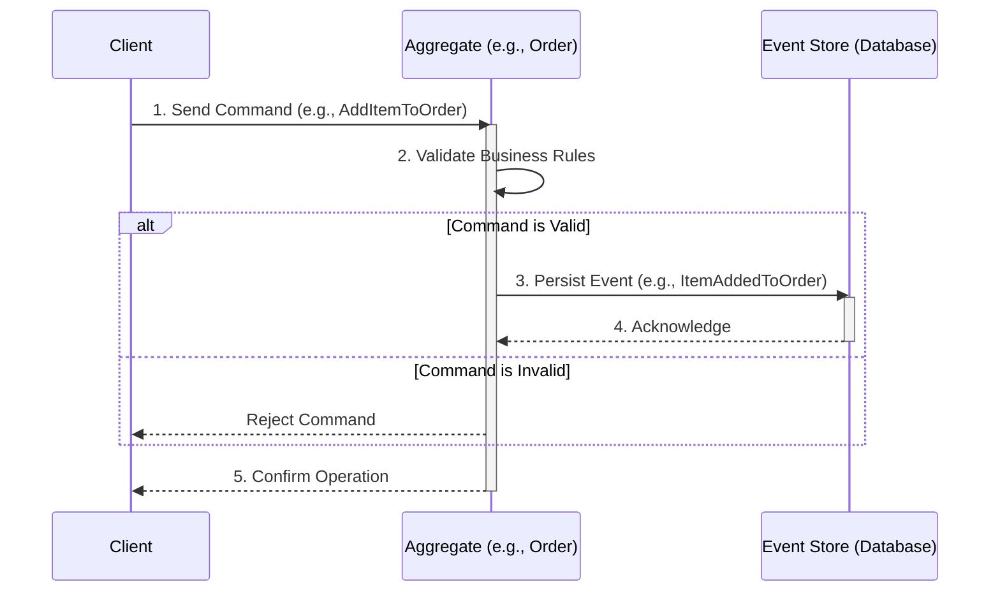

# Event Sourcing

**Event Sourcing** is an [[event-driven|event driven]] [[software-architecture/architectural-patterns/|architectural pattern]] where all changes to an application's state are captured and stored as an immutable sequence of events. Instead of persisting the current state of an entity, we record the full history of events that led to that state. The current state is then considered a derivative consequence, reconstructed by replaying these events. The event log becomes the single source of truth.

* **Core Principles:**
    * **Immutability of Events:** An event is a fact that occurred in the past. It is immutable and can neither be changed nor deleted. New events can be added to correct or alter the state.
    * **The Event Log as the Source of Truth:** The state of an entity (e.g., an account balance) is not the primary data. The primary data is the log of all transactions (deposits, withdrawals). The state is reconstructed on demand.
    * **State Reconstruction:** To get the current state of an entity (an "aggregate"), all events concerning it are replayed sequentially from its creation.
    * **Temporal Nature:** Each event is associated with a specific moment in time, allowing the system's state to be reconstructed at any point in the past.

---

## Key Components and Communication Flow

The typical flow in Event Sourcing involves transforming an intent (Command) into one or more facts (Events).

1.  **Command:** An object representing an intent to change the system's state (e.g., `CreateUserCommand`). It is [[imperative-programming|imperative]] and addressed to a specific aggregate.
2.  **Aggregate:** A domain entity that ensures the consistency of a set of objects. It receives commands, validates business rules, and, if successful, produces one or more events. To make its decision, the aggregate loads its state by replaying its past events.
3.  **Event:** An object that describes a change that has occurred (e.g., `UserCreatedEvent`). It is named in the past tense and contains all data relevant to the change.
4.  **Event Store:** A database optimized for appending events (append-only). It acts as an immutable log and allows retrieving the event stream for a given aggregate.

---

## Advantages and Technical Challenges

* **Advantages (Benefits):**
    * **Complete Audit Trail:** Provides a perfect and unalterable audit trail of all actions that have occurred in the system. This is a major asset for financial, medical, or regulated systems.
    * **Temporal Queries ("Time Travel"):** Allows for reconstructing the system's state at any point in time, which is extremely powerful for debugging, bug analysis, or business intelligence.
    * **Write Performance:** Writing is reduced to an `append` operation in a log, which is extremely fast and avoids complex transactional locks.
    * **Decoupling and Scalability:** Events can be published on a bus. Other services can subscribe to them to update read models, trigger workflows, or notify external systems, promoting a [[transversal-programming-models#2-reactive-programming|reactive]] and decoupled architecture.

* **Challenges:**
    * **Querying Complexity:** The event log is optimized for writing, not for reading. Answering a simple question like "What are all the active users?" may require replaying thousands of events. This problem is almost always solved by using the **[[cqrs|CQRS]]** pattern.
    * **Event Schema Evolution (Versioning):** The schema of events evolves over time. Managing different versions of the same event (e.g., a `userName` field becomes `fullName`) is a major technical challenge that requires migration or on-the-fly transformation strategies ("upcasting").
    * **Eventual Consistency:** In an architecture with **[[cqrs|CQRS]]**, the read models (projections) are updated asynchronously. The system thus becomes "eventually consistent," a paradigm shift from traditional transactional systems.
    * **Reconstruction Optimization (Snapshotting):** For long-lived aggregates (with thousands of events), state reconstruction can become slow. **Snapshots** are used in this case—captures of the aggregate's state at a specific version (e.g., every 100 versions) to speed up the replay process.

---

## Related Patterns, Concepts and Variations

Event Sourcing is rarely used alone. It is part of an ecosystem of complementary patterns.

* **[[event-driven|Event-Driven Architecture]]:** Event Sourcing is a specific implementation strategy for the persistence layer within a broader Event-Driven Architecture. It provides the immutable log of events that other services can react to.
* **[[publish-subscribe|Publish-Subscribe Pattern]]:** This pattern is the primary mechanism for broadcasting the events captured by Event Sourcing. After an event is persisted to the event store, it is often published on a topic so that any interested microservice or component can react to it.
* **[[microservices|Microservices Architecture]]::** Event Sourcing is a powerful pattern for inter-service communication in a microservices landscape. Services can publish events about their state changes, and other services can subscribe to these events to update their own local state, ensuring eventual consistency without creating tight coupling.
* **[[cqrs|CQRS (Command Query Responsibility Segregation)]]:** The almost inseparable partner of Event Sourcing. ES handles the "write" side (Command), while materialised projections of events create read models optimized for the "query" side.
* **[[saga|Saga Pattern]]:** In distributed architectures, sagas manage long-running transactions that span multiple services. These sagas are often orchestrated or choreographed in response to event streams.
* **Transactional Outbox:** A pattern that ensures events are reliably published *after* being persisted in the Event Store. This prevents inconsistencies where an event might be published without being saved, or vice versa.
* **Snapshotting:** An optimization technique to reduce the loading time of aggregates by periodically saving a snapshot of their state, thereby limiting the need to replay the entire event stream.

## **Resources & links**

### **Articles**

1.  **[Martin Fowler - Event Sourcing](https://martinfowler.com/eaaDev/EventSourcing.html)**

    The definitive article by Martin Fowler. It explains the concept with clarity, contrasting it with traditional persistence models and introducing challenges like event versioning.

2.  **[Event Sourcing Pattern](https://www.geeksforgeeks.org/system-design/event-sourcing-pattern/)** (GeeksforGeeks)
    The **Event Sourcing** pattern stores every state change as an immutable, sequential record (**Event**), making the event stream the single **source of truth**. The current state (**Projection**) is reconstructed by **replaying** these events. It offers a complete **audit trail**, time-travel capability for debugging/history, and is ideal for complex domains and **distributed systems**. Challenges include event versioning and managing **eventual consistency**.

---

### Videos

1. * **[Event Sourcing • Martin Fowler • YOW! 2016](http://www.youtube.com/watch?v=ck7t592bvBg)** (GOTO Conferences)
    Martin Fowler explains Event Sourcing using the analogy of a **Source Control System** (like Git), where the history of commits (events) is primary. Key benefits are unparalleled **auditability**, powerful debugging via event **replay**, and inherent support for **historical querying**. He emphasizes that it decouples change processing from state representation, facilitating patterns like **[[cqrs|CQRS]]** and high-performance **in-memory** systems.

2. * **[Master Event Sourcing in Just 10 Minutes](http://www.youtube.com/watch?v=ID-_ic1fLkY)** (ByteMonk)
    This video defines Event Sourcing as an architectural pattern that turns the application into a **"time machine"** by storing only events. It naturally fits with **[[cqrs|CQRS]]**, where the command side generates events and the query side builds **read models** by consuming them. To ensure performance, it leverages **snapshots** and **materialized views** to avoid replaying the entire history for every state retrieval (**hydration**).
