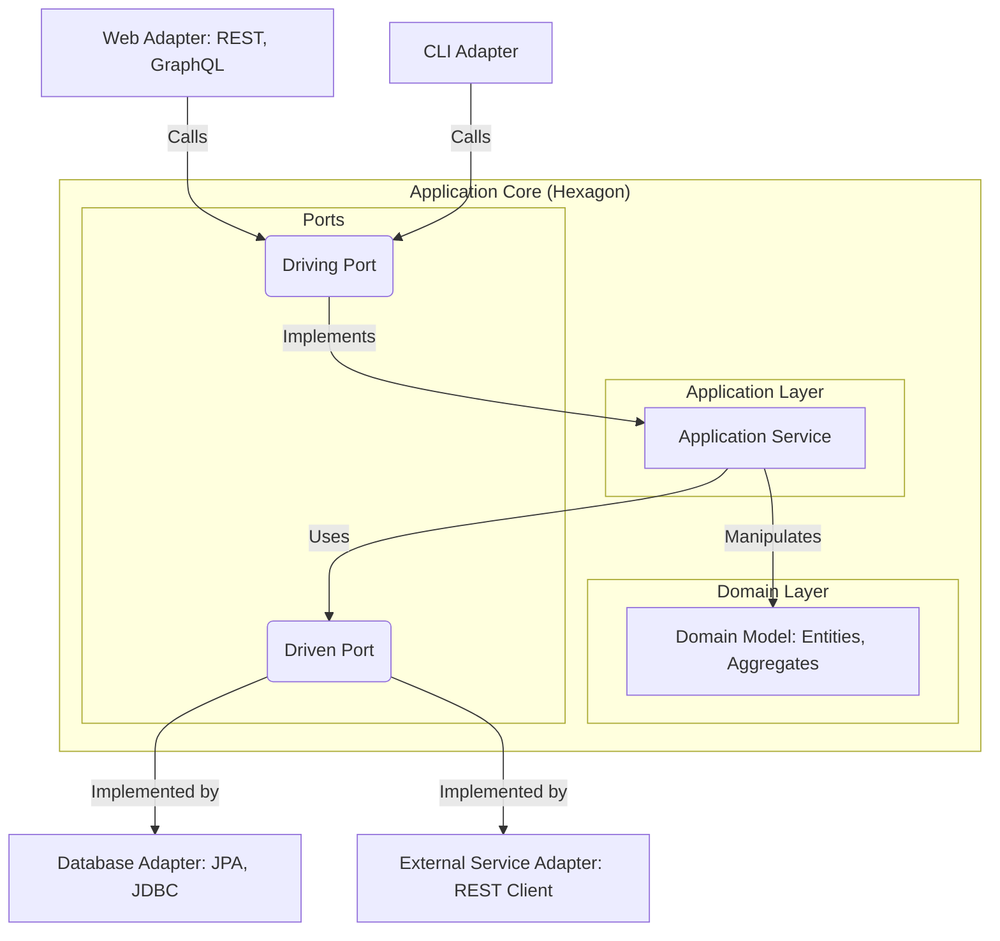

# **Hexagonal Architecture (Ports-and-Adapters)**

**Hexagonal Architecture**, also known as **Ports-and-Adapters**, is a software [[software-architecture/architectural-patterns/|architectural pattern]] created by Alistair Cockburn. Its primary goal is to create a strong [[cohesion-coupling|separation]] between the core application logic (the **domain**) and external infrastructure elements (such as databases, user interfaces, or web services). The idea is to isolate the application's core so that it does not depend on the technologies used to interface with the outside world.

* **Core Principles:**
    * **Isolation of the Business Core:** The business logic and rules of the application are at the center of the architecture and are independent of any infrastructure technology. The application's core contains only pure business code.
    * **Ports and Adapters:** Communication with the outside world occurs via "ports" and "adapters".
    * **The Dependency Rule:** All dependencies must point **inward**, toward the application core. The core business logic knows nothing about the outside world (e.g., databases, UI frameworks). This is achieved by applying the **[[solid|Dependency Inversion Principle]]**: the core defines the interfaces (ports), and the external components (adapters) implement them.
    * **Ports:** These are interfaces owned by the application core that define its communication contracts. They are the only entry and exit points to the hexagon.
        * **Driving Ports (Primary Ports or Application API):** These interfaces define the public API of the application. They are the entry points called by external actors (e.g., a UI or a test script) to interact with the application. They answer the question, "What can the application do?"
        * **Driven Ports (Secondary Ports or SPI):** These interfaces define the requirements that the application core has for the outside world. They are the exit points used by the core to get data from or send data to external systems (e.g., a database). They are essentially callbacks and represent a Service Provider Interface (SPI) that the outside world must implement.
        * **Adapters:** These are the concrete implementations of the ports. They translate requests between the outside world and the application's core interfaces.
            * **Driving Adapters:** They call the "driving port". For example, a `RESTController` or a `CLI` that translates an HTTP request or a command into a method call on the application's interface.
            * **Driven Adapters:** They implement the "driven port". For example, a `JpaStockRepository` or an `InMemoryStockRepository` that manages data persistence.

---

## **Key Components and Communication Flow**

The model is often visualized as a **hexagon**. The shape is not arbitrary; Alistair Cockburn chose it to emphasize that there can be multiple "ports" on the sides of the application core, not just the four sides of a traditional layered diagram (top, bottom, left, right). It symbolizes the ability to add new kinds of adapters as needed without disturbing the core.

1.  **Application Core (Hexagon):** This is the heart of the architecture. It contains the **[[poeaa#Domain-Model|Domain Model]]** ([[poeaa#Entity|entities]], [[poeaa#Value-Object|value objects]]) and the **[[poeaa#Usecase-Application-Service|Application Services]]** that orchestrate the business logic. It is completely independent of external technologies.
2.  **Ports:** These are interfaces that define the contract for communication with the outside world.
    * **Driving Ports (or API):** Interfaces that the application's core offers to external callers (e.g., a `UserService` interface).
    * **Driven Ports (or SPI):** Interfaces that the application's core needs to interact with external systems (e.g., a `[[poeaa#Repository|UserRepository]]` interface).
3.  **Adapters:** These are concrete implementations that connect the outside world to the Ports. They translate specific technologies into a format the core can understand.
    * **Driving Adapters:** They call a **Driving Port**. For example, a `RESTController` that receives an HTTP request and calls an `Application Service`.
    * **Driven Adapters:** They implement a **Driven Port**. For example, a `JpaUserRepository` that saves data to a database.

**Typical Data Flow:**
* The process begins when an external actor (like a user via a web browser) sends a request to a **Driving Adapter**.
* The **Driving Adapter** translates this request into a method call on a **Driving Port** (an interface within the Application Core).
* An **Application Service** within the core executes the business logic. If it needs to interact with a database or another external service, it calls a **Driven Port**.
* A **Driven Adapter** implementing that port handles the technical interaction (e.g., a database query) and returns the data to the Application Service.
* The Application Service completes its work and returns the result to the **Driving Adapter**, which then formats it and sends the response back to the external actor.

---

## **Advantages and Technical Challenges**

* **Advantages (Benefits):**
    * **Increased Testability:** The application's core is independent of databases or APIs. You can test the business logic in isolation by mocking the Adapters, which is simpler, faster, and more reliable.
    * **Flexibility and Interoperability:** It's easy to change infrastructure technologies. Switching from a SQL database to a NoSQL database only requires writing a new adapter. The application's core is not affected.
    * **Clarity of Design:** The architecture forces the separation of business code from infrastructure, making the code more readable and easier to maintain. The focus is on the **domain model**, which aligns with the principles of **[[ddd|Domain-Driven Design (DDD)]]**.
* **Challenges:**
    * **Initial Complexity:** The pattern can be excessive for simple applications. Setting up interfaces and multiple layers might seem "over-engineered" for a small project.
    * **Risk of Leaky Abstractions:** It is critical to ensure that no infrastructure-specific details (like database annotations or framework-specific classes) "leak" into the application core. The ports must use plain, technology-agnostic data structures.
    * **Concept of Ports and Adapters:** Understanding the concepts of **[[solid|Dependency Inversion]]** and interfaces is crucial. A poor implementation can turn the adapters into simple "glue code" without real benefits.

---

## Related Patterns, Concepts and Variations

Hexagonal Architecture is the foundation for many other [[modern-application-architectures|modern architectural patterns]], such as **[[onion|Onion Architecture]]** and **[[clean|Clean Architecture]]**. All these models share the same fundamental idea: the **domain** is at the center of the application and should not depend on anything else. Dependencies only flow from the outside in.

* **Usage in the Web Ecosystem:** In a **Spring Boot** or **Node.js** application, the **Driving Adapter** would be a `RestController`, the **Driving Port** a service interface annotated with `@Service`, the **Driven Port** a `Repository` interface, and the **Driven Adapter** a class implementing `JpaRepository`.

Hexagonal Architecture is an initial investment that pays off in the long run, especially for enterprise applications with complex business logic and a need for evolution. It ensures that today's technological choices will not be tomorrow's constraints.

---

## **Resources & links**

### **Articles**

1.  **[Hexagonal Architecture, There Are Always Two Sides to Every Story](https://medium.com/ssense-tech/hexagonal-architecture-there-are-always-two-sides-to-every-story-bc0780ed7d9c)**

    This article by Pablo Martinez discusses **Hexagonal Architecture**, also known as Ports and Adapters, as an alternative to the traditional [[layered|Layered Architecture]]. It explains how this design isolates the application's core business logic from external actors and technologies (like the user interface or databases) using **Ports** (technology-agnostic interfaces) and **Adapters** (technology-specific implementations). The article highlights how this approach improves testability, prevents technology lock-in, and aligns with **[[ddd|Domain-Driven Design]]**.

2.  **[Everything You Need to Know About Hexagonal Architecture: Kernel, Ports, Adapters](https://scalastic.io/en/hexagonal-architecture/)**

    This article provides a comprehensive overview of **Hexagonal Architecture** by defining its core principles: isolating business logic within a "hexagon" and using ports and adapters for communication with the outside world. It compares the architecture to other approaches like [[mvc|MVC]] and [[clean|Clean Architecture]], emphasizing its benefits for reducing functional regressions, simplifying feature additions, and making business logic easier to test. It also acknowledges the potential for increased project complexity in simpler contexts.

---

### **Videos**

1.  **[Hexagonal Architecture (Alistair Cockburn)](https://www.youtube.com/watch?v=k0ykTxw7s0Y)**

    In this talk, Alistair Cockburn, the creator of the **Hexagonal Architecture**, explains why he developed it—out of frustration with projects that couldn't easily swap out drivers or databases. He shows how the code for the pattern is simple, but the surrounding terminology can make it seem complicated. He uses examples in Java and Ruby to demonstrate the key concepts and stresses the importance of proper folder structure.

2.  **[Hexagonal Architecture: What You Need To Know - Simple Explanation](https://www.youtube.com/watch?v=bDWApqAUjEI)**

    This video by **Alex Hyett** offers a simple explanation of **Hexagonal Architecture**, also known as the Ports and Adapters pattern. It covers what the architecture is, how it works, and when to use it, emphasizing its ability to **decouple** application logic from external technologies (like databases and APIs) to improve **testability** and **maintainability**. The video also discusses the pros and cons of implementing this architectural style.