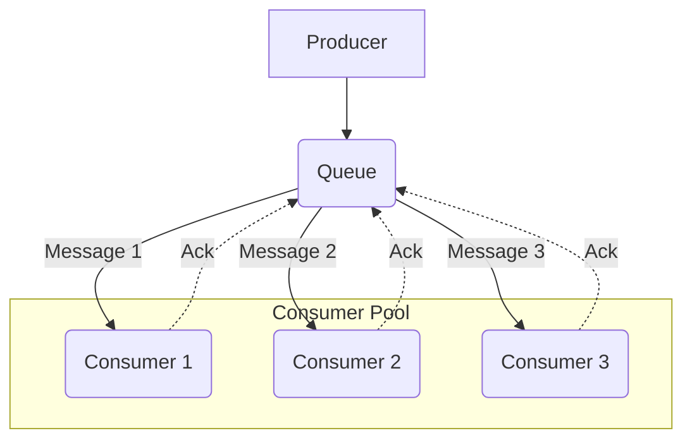

# The Message Queue Pattern

The **Message Queue** pattern is an [[software-architecture/architectural-patterns/|architectural pattern]] for [[asynchronous-messaging|asynchronous communication]] between distributed components. It uses a central **Queue** to manage messages sent from a **Producer** to a **Consumer**, ensuring reliable one-to-one delivery and decoupling the components.

In this model, a message producer sends a message to a specific destination called a **Queue**. The message is then delivered to a single consumer that is listening on that queue. This ensures a **one-to-one** relationship for each message, even if multiple consumers are available. This is often implemented using the **Competing Consumers** pattern, where several consumers compete to be the first to receive and process a message from the queue.

* **Core Principles:**
    * **One-to-One Delivery:** Each message is processed by exactly one consumer.
    * **[[cohesion-coupling|Decoupling]]:** The message producer does not know which specific consumer will process the message.
    * **Load Balancing:** The queue naturally distributes the load among available consumers.
    * **Task Distribution:** Ideal for offloading work, where each message represents a self-contained task or command.

---

## Key Components and Communication Flow

1.  **Producer:** The component that creates a message (often a **command**) and sends it to the queue.
2.  **Queue:** A durable channel that stores messages in a first-in, first-out (FIFO) order until a consumer is ready to process them.
3.  **Consumer:** A component that connects to the queue, retrieves a message, and processes it.
4.  **Broker:** The underlying messaging system that manages the queue and guarantees message delivery.

**Typical Data Flow:**
1.  The **Producer** sends a message (a command or task) to the **Queue**.
2.  The **Broker** delivers the message to one of the available consumers in the pool (e.g., `Consumer 1`). The message is now "locked" and invisible to other consumers to prevent duplicate processing.
3.  `Consumer 1` processes the message.
4.  Upon successful completion, `Consumer 1` sends an **acknowledgment (Ack)** back to the queue.
5.  The queue receives the `Ack` and permanently deletes the message. If the consumer fails and does not send an `Ack` (or sends a Nack), the message lock will time out, and it will be redelivered to another available consumer.

---

## Advantages and Use Cases

* **Advantages:**
    * **Reliable Task Offloading:** Perfect for background jobs like sending emails, generating reports, or processing images.
    * **Scalability:** You can easily increase processing throughput by adding more consumer instances to the pool.
    * **Resilience:** If a consumer fails while processing a message, the message can be safely re-processed by another consumer.
    * **Flow Control:** The queue acts as a buffer, smoothing out load spikes and preventing the system from being overwhelmed.

* **Use Cases:**
    * **Background Job Processing:** A web application can place a "GenerateThumbnail" job in a queue, and a pool of worker services can process these jobs asynchronously.
    * **Order Processing Systems:** Each step in an order fulfillment process (e.g., `ValidateOrder`, `ProcessPayment`, `UpdateInventory`) can be a message processed by a dedicated consumer.
    * **Data Ingestion Pipelines:** Ingesting and processing large volumes of data in a controlled, scalable manner.

---

## Related Patterns

*   **[[publish-subscribe|Publish-Subscribe]]:** The other fundamental messaging model, which uses a one-to-many broadcast approach instead of one-to-one.
*   **[[message-driven|Message-Driven Architecture]]:** The Message Queue pattern is a key enabler for command-driven architectures, a flavor of MDA.
*   **Dead-Letter Queue (DLQ):** A critical complementary pattern where messages that repeatedly fail processing are moved to a separate queue for manual inspection, preventing them from blocking the main queue.

---

## **Resources & links**

### **Articles**

1.  **[Message Queues - System Design (GeeksforGeeks)](https://www.geeksforgeeks.org/system-design/message-queues-system-design/)**

    This article details how **Message Queues (MQs)** are crucial for distributed systems, providing a buffer for **asynchronous communication**. It outlines the core components (**Producer**, **Queue**, **Consumer**, and optional **Broker**) and highlights key benefits like **scalability**, **fault tolerance**, and **load balancing**. It also differentiates between two main types: **Point-to-Point** and **Publish-Subscribe** message queues, and touches upon advanced features like **Dead Letter Queues (DLQs)** and **Message Prioritization**.

2.  **[Message Queues: The Backbone of Scalable Systems (Medium)](https://medium.com/@amoljadhav_48655/message-queues-the-backbone-of-scalable-systems-2d015d9fa645)**

    This article emphasizes MQs as the backbone for **scalable** and **reliable** microservices architectures. It explains the core concepts (**Producer**, **Consumer**, **Message**, **Queue**) and the main advantages, particularly **Decoupling** services to allow independent scaling. The text presents common MQ patterns (**Point-to-Point**, **Publish-Subscribe**, **Request-Reply**) and lists popular implementations like **RabbitMQ**, **Apache Kafka**, and **Amazon SQS**, alongside best practices such as ensuring message **Idempotency** and managing **DLQs**.

---

### **Videos**

1.  **[Message Queues in System Design](https://www.youtube.com/watch?v=DYFocSiPOl8)**

    This video from **Hayk Simonyan** explains **Message Queues** in system design using an online store example. It covers how message queues, as durable components, support asynchronous communication, decouple services, and provide scalability and reliability by buffering requests for later processing.

2.  **[What is a Message Queue?](https://www.youtube.com/watch?v=xErwDaOc-Gs)**

    **Jamil Spain** from **IBM Technology** explains what a **Message Queue** is, defining it as an architectural technique for asynchronous communication in distributed applications. The video breaks down the concepts of messages and queues, provides examples like email, and discusses different messaging patterns (point-to-point, [[publish-subscribe|pub/sub]], request-reply) and the benefits of decoupling and scalability.