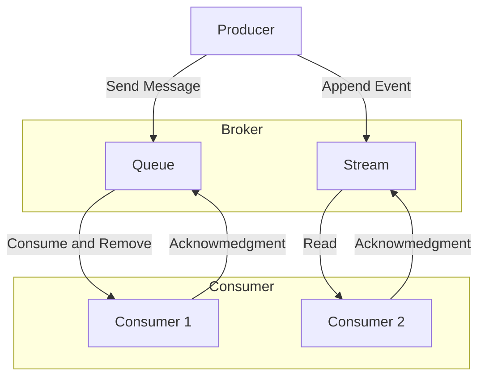

# **Message Queues / Streams Pattern**

The **Message Queues / Streams** pattern is an [[software-architecture/architectural-patterns/|architectural pattern]] for asynchronous communication that allows for the [[cohesion-coupling|decoupling]] of system components. It separates responsibilities between message senders (**producers**) and receivers (**consumers**) via an intermediary. This pattern is more generic and high-level than the **[[publish-subscribe|Pub/Sub]]** pattern, which is actually one of its broadcast variants.

---

### **Core Principles**

This pattern is based on a **broker** (a message queue or a streaming platform) that acts as a buffer between services.

### **Message Queues vs. Message Streams: Comparison Table**

| Characteristic | **Message Queues** | **Message Streams** |
| :--- | :--- | :--- |
| **Communication Model** | **Point-to-point** (one-to-one). | **Broadcast** (one-to-many). |
| **Consumption Logic** | A single **consumer** retrieves and deletes the message from the queue. The message is "consumed". | Multiple **consumers** can read the same message in parallel, and maintain their own position (**offset**) in the stream. The message is "read" non-destructively. |
| **Message Persistence** | Messages are generally temporary. They are deleted upon successful consumption. | Messages are persistent, stored in an immutable **log**. They are not deleted after being read and can be replayed. |
| **Ordering** | Generally guarantees **FIFO (First-In, First-Out)** order within the same queue. | Guarantees order within the same partition, but not globally across the entire stream. |
| **Typical Use Cases** | Task distribution, **job processing**, load balancing for a pool of **workers**. | **Event sourcing**, **Pub/Sub**, real-time data processing, analytics, data replication. |

---

## **Key Components and Communication Flow**

1.  **Producer**: The application or service that creates and sends a message to the broker. It doesn't need to know who will process the message or when.
2.  **Broker**: The intermediary service that stores the messages. It can be a queue or a stream.
3.  **Consumer**: The application or service that retrieves and processes the messages. It can be a group of workers or multiple services that subscribe to data streams.

**Typical Data Flow**
* The **producer** sends a message to the **broker**.
* The **broker** stores the message in a queue or a log.
* The **consumer(s)** read the message and process it.
* The **consumer** sends an **acknowledgment** to confirm message processing.

---

## **Advantages and Technical Challenges**

### **Advantages (Benefits)**

* **[[cohesion-coupling|Decoupling]]**: Services have no direct dependency on one another, which simplifies system development, maintenance, and evolution.
* **Resilience**: If a **consumer** fails, messages are not lost; they remain in the **broker** until a service resumes processing.
* **Scalability**: The **broker** handles traffic spikes by acting as a buffer. It is easy to add more **consumers** to increase processing capacity without impacting the rest of the system.
* **Flexibility**: Different services can be developed using distinct technologies as long as they adhere to the common communication protocol with the **broker**.

### **Challenges**

* **Infrastructure Complexity**: Setting up and administering a **broker** introduces a new layer of operational complexity.
* **Debugging**: Following a message through an asynchronous distributed system can be complex, as there is no direct, synchronous request-response link.
* **Delivery Guarantees**: It is essential to understand the different delivery guarantees offered (**at-most-once**, **at-least-once**, **exactly-once**) to ensure messages are not lost or duplicated.
* **Eventual Consistency**: Systems based on this pattern are inherently **eventually consistent**, which may not be suitable for applications requiring immediate data consistency.

---

## **Variations and Derived Architectures**

The **Message Queues / Streams** pattern is a foundation upon which many modern communication models are built.

* **[[layered|2-Tier Architecture]]:** This is the basic model, with a **producer** communicating directly with a **consumer** via a queue.
* **[[publish-subscribe|Fan-out / Pub-Sub Architecture]]:** This variation is a derivative of **Message Streams**. A message sent by a **producer** is broadcast to multiple **consumers**.
* **[[layered|N-Tier Architecture]]**: In complex systems, the pattern can be used to [[cohesion-coupling|decouple different layers]].
* **[[microservices|Microservices]]**: This is arguably the most common use case today. Each microservice can act as both a **producer** and a **consumer**, exchanging messages asynchronously.
* **Event Sourcing**: A variation of the pattern that uses a **stream** as the single source of truth for an application's state. Every state change is an event recorded in the stream.

---

## **Resources & links**

### **Articles**

1.  **[Message Queues vs Event Streams in System Design](https://www.geeksforgeeks.org/system-design/message-queues-vs-event-streams-in-system-design/)**

    This **GeeksforGeeks** article distinguishes between **Message Queues** and **Event Streams**, two crucial architectural patterns for asynchronous communication and real-time data processing. It details their characteristics, primary use cases, and implementations (like RabbitMQ and Kafka), emphasizing their roles in designing efficient and robust distributed systems.

2.  **[Message Queues or Streams? Simplifying Communication in Distributed Systems](https://medium.com/@harshverma7k/message-queues-or-streams-simplifying-communication-in-distributed-systems-a12711824c0d)**

    This **Medium** article by Harsh Verma explores **Message Queues** and **Event Streams** as paradigms for communication in distributed systems. It breaks down their features, such as asynchronous one-time transfer for queues and continuous flow for streams, and discusses when to use each, often suggesting a blend for complex systems.

---

### **Videos**

1.  **[Message Queues in System Design](https://www.youtube.com/watch?v=DYFocSiPOl8)**

    This video from **Hayk Simonyan** explains **Message Queues** in system design using an online store example. It covers how message queues, as durable components, support asynchronous communication, decouple services, and provide scalability and reliability by buffering requests for later processing.

2.  **[What is a Message Queue?](https://www.youtube.com/watch?v=xErwDaOc-Gs)**

    **Jamil Spain** from **IBM Technology** explains what a **Message Queue** is, defining it as an architectural technique for asynchronous communication in distributed applications. The video breaks down the concepts of messages and queues, provides examples like email, and discusses different messaging patterns (point-to-point, [[publish-subscribe|pub/sub]], request-reply) and the benefits of decoupling and scalability.
