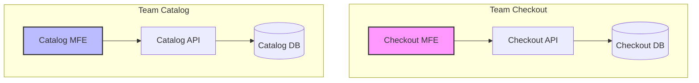
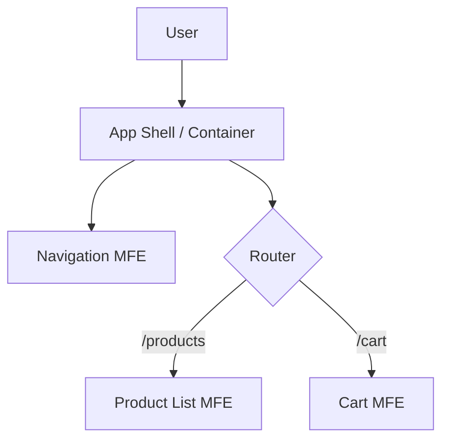

# Microfrontends

**Microfrontends** is an architectural pattern where independently deliverable frontend applications are composed into a greater whole. It extends the concepts of [[microservices|microservices]] to the frontend world.

Instead of building a powerful, feature-rich, but monolithic frontend application (often called a "Frontend Monolith"), the application is broken down into smaller, vertical slices. Each slice is built, tested, and deployed independently by autonomous teams.

## Core Philosophy

The primary goal of microfrontends is to decouple teams and enable them to move faster by reducing the coordination cost of a large monolithic codebase.

### 1. Technology Agnostic
Each team should be able to choose and upgrade their technology stack without coordinating with other teams. Custom Elements (Web Components) are a great way to hide implementation details while providing a neutral interface to others.
*   *Caveat*: While possible, mixing frameworks (e.g., React inside Angular) has a significant performance cost. In practice, teams often agree on a common framework version to share dependencies.

### 2. Isolated Code
Don't share a runtime, even if all teams use the same framework. Build independent apps that are self-contained. Don't rely on shared state or global variables.

### 3. Team Ownership
Teams own a vertical slice of functionality, from the database to the user interface.



## Integration Approaches (Composition)

How do you stitch these independent applications together?

### 1. Client-Side Composition
The most common approach. A "Container Application" (or App Shell) is loaded first, which then dynamically mounts the microfrontends based on the URL or layout.

*   **Web Components**: The standard way to create framework-agnostic components.
*   **Module Federation (Webpack/Vite)**: Allows loading separately compiled bundles at runtime, sharing dependencies where possible.
*   **iFrames**: The strongest isolation but comes with significant UX and performance downsides (layout constraints, slow loading).

### 2. Server-Side Composition
The server assembles the final HTML page by stitching together fragments from different services.
*   **SSI (Server Side Includes)** / **ESI (Edge Side Includes)**: Ancient but effective techniques often used at the [[cdn|CDN]] level.
*   **Tailored Servers**: Using a backend service (like a [[backends-for-frontend|BFF]]) or an [[api-gateway|API Gateway]] to fetch HTML fragments and compose them.

### 3. Build-Time Composition
Publishing microfrontends as NPM packages and importing them into a container application.
*   *Drawback*: This re-introduces coupling. To update a microfrontend, you must rebuild and redeploy the container. This is often considered an anti-pattern for "true" microfrontends.



## Communication & Shared State

Decoupling is key, but microfrontends still need to talk to each other.

### Communication Patterns
*   **Custom Events**: Use standard DOM events for communication. This is loosely coupled and native to the browser.
    ```javascript
    // Dispatching
    const event = new CustomEvent('product-added', { detail: { id: 123 } });
    window.dispatchEvent(event);

    // Listening
    window.addEventListener('product-added', (e) => { ... });
    ```
*   **Windowed Pub/Sub**: A lightweight event bus attached to the window object.

### Shared State Management
Sharing state creates coupling, so it should be minimized.

1.  **URL as Source of Truth**: The most robust pattern. Store ID, filters, and navigation state in the URL. If Team A links to `/product/123`, Team B's microfrontend reads `123` from the URL.
2.  **Browser Storage**: Use `localStorage`, `sessionStorage`, or Cookies for persistent user sessions or preferences.
3.  **Props/Attributes**: The container passes initial data (like the current user) to microfrontends via props or HTML attributes.
4.  **Shared Libraries (Caution)**: Using a shared Redux store or RxJS Subject. This is **risky** as it couples the microfrontends to a specific implementation and schema.

## Practical Implementation Examples

### 1. Web Components Wrapper
One common pattern is to wrap your framework-specific component (e.g., React) inside a standard Web Component. This allows the container to be framework-agnostic.

**Example: Wrapping a React Component**
```javascript
import React from 'react';
import ReactDOM from 'react-dom';
import MyReactComponent from './MyReactComponent';

class MyWebComponent extends HTMLElement {
  connectedCallback() {
    const mountPoint = document.createElement('div');
    this.appendChild(mountPoint);
    
    // Pass attributes as props
    const name = this.getAttribute('name');
    
    ReactDOM.render(<MyReactComponent name={name} />, mountPoint);
  }
  
  disconnectedCallback() {
    ReactDOM.unmountComponentAtNode(this.firstChild);
  }
}

customElements.define('my-web-component', MyWebComponent);
```

### 2. Module Federation (Webpack)
Module Federation allows you to dynamically load code from another build at runtime.

**Remote Configuration (Product MFE)**
```javascript
// webpack.config.js
new ModuleFederationPlugin({
  name: 'productApp',
  filename: 'remoteEntry.js',
  exposes: {
    './ProductList': './src/ProductList',
  },
  shared: { react: { singleton: true }, 'react-dom': { singleton: true } },
});
```

**Host Configuration (App Shell)**
```javascript
// webpack.config.js
new ModuleFederationPlugin({
  name: 'appShell',
  remotes: {
    productApp: 'productApp@http://localhost:3001/remoteEntry.js',
  },
  shared: { react: { singleton: true }, 'react-dom': { singleton: true } },
});
```

### 3. Cross-MFE Composition
Once exposed, you can import the remote component lazily.

**Usage in App Shell**
```javascript
import React, { Suspense } from 'react';

// Lazy load the remote component
const RemoteProductList = React.lazy(() => import('productApp/ProductList'));

const App = () => (
  <div>
    <h1>Main Shop</h1>
    <Suspense fallback="Loading Products...">
      <RemoteProductList />
    </Suspense>
  </div>
);
```

## Challenges & Trade-offs

*   **Payload Size**: If every microfrontend bundles its own React/Vue, the user downloads the framework multiple times. Module Federation helps, but requires careful tuning.
*   **Operational Complexity**: You are deploying many applications instead of one. You need a mature [[ci-cd|CI/CD]] pipeline and [[infrastructure-as-code|Infrastructure as Code]].
*   **UX Consistency**: Keeping a consistent look and feel is hard. A shared Design System (published as an NPM package) is essential.
*   **Performance**: The browser has to do more work to stitch things together.

## Tooling Ecosystem

Choosing the right tool depends on your integration approach.

### 1. Single-SPA (The Orchestrator)
**[Single-SPA](https://single-spa.js.org/)** is a javascript router for front-end microservices. It is a "meta-framework" that handles the lifecycle (bootstrap, mount, unmount) of your applications.
*   **What it does**: It lets you use multiple frameworks (React, Angular, Vue) in a single-page application. It handles the routing and ensures that the correct application is mounted for the current URL.
*   **Best for**: Teams migrating from a legacy monolith or when mixing different frameworks is a hard requirement.

### 2. Module Federation (The Bundler)
**[Module Federation](https://module-federation.io/)** (available in Webpack 5, Vite, Rspack) allows a JavaScript application to dynamically load code from another application at runtime.
*   **What it does**: It enables "runtime composition". You can expose components from one build and consume them in another, sharing dependencies (like React) to avoid payload duplication.
*   **Best for**: Teams wanting high performance, shared dependencies, and seamless integration at the bundler level. It is currently the industry standard for modern microfrontends.

### 3. Bit (The Component Workflow)
**[Bit](https://bit.dev/)** is a toolchain for component-driven development. It treats every component (UI, hook, logic) as an independent entity.
*   **What it does**: It provides a workspace to build, version, and deploy components independently. It handles dependency graphs and ensures that if you change a button, only the button and its consumers are rebuilt.
*   **Best for**: Teams focusing on extreme granularity and reusability, moving beyond "micro-apps" to "composable components".

## Related Concepts

*   [[microservices|Microservices]]: The backend equivalent.
*   [[backends-for-frontend|Backends for Frontend (BFF)]]: Often used to serve specific microfrontends.
*   [[modular-monolith|Modular Monolith]]: A simpler alternative if you want code separation without deployment complexity.
*   [[component-based|Component-Based Architecture]]: The foundation of modern UI development.

## Resources & Links

### Articles

1.  **[Micro Frontends - Michael Geers](https://micro-frontends.org/)**
    A comprehensive guide covering techniques, strategies, and recipes for building modern web apps with multiple teams. It explains core ideas like "The DOM is the API" and provides detailed examples of page composition and isolation.

2.  **[Micro Frontends - Martin Fowler](https://martinfowler.com/articles/micro-frontends.html)**
    The definitive guide by Cam Jackson. It covers the core concepts, integration techniques (server-side, build-time, run-time), and provides a full example implementation. It also discusses the trade-offs like payload size and operational complexity.

3.  **[Micro-Frontends: a Sociotechnical Journey toward a Modern Frontend Architecture - InfoQ](https://www.infoq.com/articles/adopt-micro-frontends/)**
    This article emphasizes the sociotechnical aspect of micro-frontends, aligning architecture with team structure (Conway's Law). It discusses the journey from a monolith to micro-frontends, focusing on incremental adoption and handling cross-cutting concerns.

### Videos

1.  **[Micro-Frontends in Just 10 Minutes - Jack Herrington](https://www.youtube.com/watch?v=s_Fs4AXsTnA)**
    A quick and practical tutorial demonstrating how to create and share a Micro-Frontend between SolidJS and React using Module Federation.

2.  **[Micro-Frontend Architecture Setup & Key Concepts Explained - Cosden Solutions](https://www.youtube.com/watch?v=OmLsV8Dljzo)**
    A breakdown of Micro-Frontend architecture, explaining when to use it and how to manage a massive codebase by splitting it into smaller, manageable pieces.

3.  **[MicroFrontend Playlist - YouTube](https://www.youtube.com/playlist?list=PLSb9EIKHdE9Vr2uLrSOyz6jKJ4ZH-yOsu)**
    A complete playlist containing numerous resources, tutorials, and deep dives into Micro-Frontend concepts and implementations.
