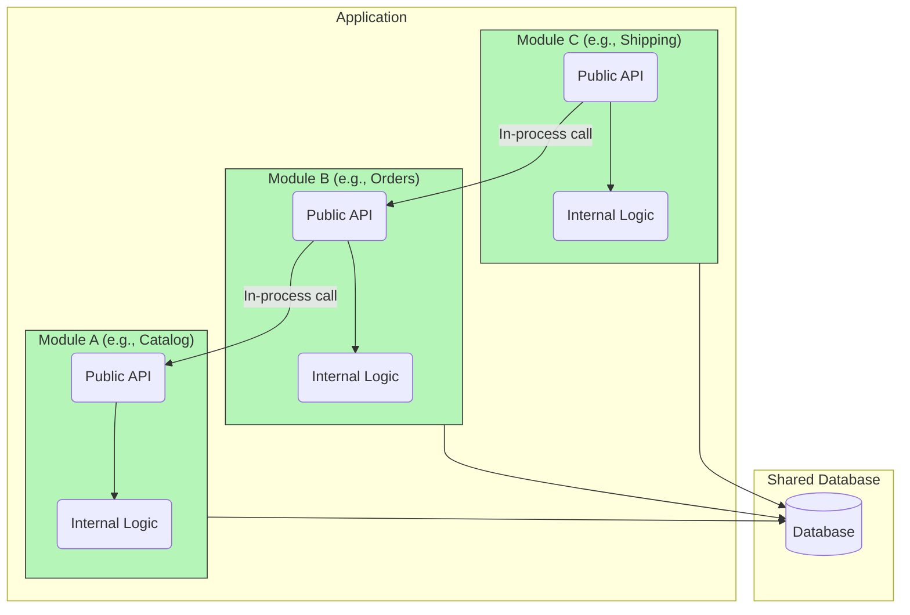

# Modular Monolith

The **Modular Monolith** is an [[software-architecture/architectural-patterns/|architectural pattern]] that represents a pragmatic middle ground between a traditional [[monolithic|monolith]] and a distributed [[microservices]] architecture. The application is built as a **single deployment unit**, but its internal structure is divided into highly decoupled, independent **modules**.

The core trade-off of this pattern is to intentionally accept **data coupling** (typically a single database) in order to gain the immense operational simplicity of a [[monolith]], while still achieving the **loose logical [[cohesion-coupling|coupling]]** and developer autonomy benefits of [[microservices]].

* **Core Principles:**
    * **[[soc|Separation of Concerns]]:** Each module is a self-contained functional unit, with its own business logic, internal API, and, ideally, its own data schema. It does not directly access other modules' data.
    * **[[cohesion-coupling|Loose Coupling]]:** Modules communicate via well-defined interfaces (like services or internal [[event-driven|events]]), which reduces direct dependencies. This allows a team to work on one module with less risk of breaking the rest of the application.
    * **[[cohesion-coupling|High Cohesion]]:** A module's code is tightly related and serves a single business responsibility. This makes the code easier to understand and maintain.

---

## Comparison: Classic Monolith vs. Modular Monolith

| Characteristic | Classic Monolith | Modular Monolith | Microservices |
| :--- | :--- | :--- | :--- |
| **Structure** | A single application, a single codebase, often without clear boundaries between parts. | A single application, a single codebase but divided into autonomous modules. | A collection of independent, deployable services. |
| **[[cohesion-coupling|Coupling]]** | Strong Coupling, components call each other directly and share the same state and database. | Loose Coupling internally between modules via well-defined interfaces. | Loose Coupling between services, communication over the network (e.g., REST, gRPC). |
| **Deployment** | A single binary to deploy. | A single binary to deploy. | Multiple deployments, one per service. |
| **Database** | A [[monolithic|monolithic]] [[software-architecture/databases/|database]] shared by the entire application. | A single database, but each module is responsible for its own data schema. Discipline is required to manage this. | Each microservice has its own database. |

---

## Use Cases and Benefits

* **Ideal for:**
    * **Startups and initial projects:** It allows for quick time to market with simple deployment, while laying the groundwork for a future migration to [[microservices]].
    * **Complex Enterprise Applications:** A CRM (Customer Relationship Management) system can have modules for contact management, sales, and customer support, allowing dedicated teams to work on each module.
    * **Migration Preparation (Transition to [[microservices|Microservices]]):** This is an excellent stepping stone. Once module boundaries are well-established, they can be extracted from the [[monolithic|monolith]] and deployed as independent services with less risk. This is often referred to as the **"strangler fig pattern"**.

* **Advantages (Benefits):**
    * **Simplicity of Deployment:** Like a [[monolithic|monolith]], there is only one application to deploy, which simplifies CI/CD pipelines.
    * **Performance:** Communication between modules happens in memory, which is much faster than network calls between [[microservices]].
    * **Maintainability and Internal Scalability:** The modularity makes maintenance and modifications easier. While the entire application is deployed together, it is easier to identify and resolve internal bottlenecks.

--- 

## Challenges and Technical Considerations

* **Enforcing Modularity:** This is the biggest challenge. Relying on team discipline alone is risky. Architects should use technical means to enforce boundaries:
    *   **Code Structure:** Organize the code into distinct modules (e.g., separate packages, projects, or source folders).
    *   **Visibility Modifiers:** Use language features like `public`, `private`, and `internal` to ensure modules only expose their intended public API and hide their implementation details.
    *   **Static Analysis:** Use linting rules or static analysis tools (like ArchUnit for Java or NetArchTest for .NET) to create automated tests that fail the build if an architectural rule (like an illegal cross-module dependency) is violated.
    *   **[[hollywood-principle|Inversion of Control (IoC)]]:** Use dependency injection frameworks to enforce module boundaries. Instead of letting modules create their dependencies directly, an IoC container can be configured to provide instances, preventing direct coupling and enforcing communication through public, defined interfaces. This aligns with the [[hollywood-principle]].
* **Data Coupling:** Managing a single [[software-architecture/databases/|database]] for multiple modules is tricky. Each module should logically own its own tables, and direct foreign key relationships between tables owned by different modules should be avoided to maintain independence.
* **Scalability:** While you can replicate the entire [[monolithic|monolith]] behind a **[[load-balancing|Load Balancer]]**, you cannot scale a single module independently.
---

## **Resources & Links**

### **Articles**

1.  **[What Is a Modular Monolith?](https://www.milanjovanovic.tech/blog/what-is-a-modular-monolith)**
    This article by Milan Jovanović gives a clear explanation of what a **modular monolith** is and why it can be an excellent alternative to [[microservices]]. It highlights how to get the benefits of decoupling without the complexity of a distributed system.

2.  **[When (modular) monolith is the better way to build software](https://www.thoughtworks.com/insights/blog/microservices/modular-monolith-better-way-build-software)**
    Published by Thoughtworks, a leader in software architecture, this article argues that the **modular monolith** is often a better starting point for projects. It emphasizes the simplicity of management, deployment, and the ability to evolve toward a [[microservices]] architecture if the need arises.

### **Videos**

1.  **[Understanding the Modular Monolith Architecture](https://www.youtube.com/watch?v=ikuu3QIuJuc)**
    This video offers a comprehensive overview of the modular monolith concept, explaining its principles, benefits, and how it can be implemented in real-world projects.

2.  **[Choosing the Modular Monolith Architecture](https://www.youtube.com/watch?v=Xo3rsiZYsJQ&list=PLYpjLpq5ZDGvOGMF2tIHEkPKf7_5tXwr4)**
    This resource discusses the key factors and decision-making process for choosing a modular monolith over other architectural styles, providing practical advice for architects and development teams.

3.  **[The Simon Brown Conference that Introduced the Concept](https://www.youtube.com/watch?v=5OjqD-ow8GE)**
    This is the original talk by Simon Brown, who is often credited with popularizing the concept of the **modular monolith**. This is a bonus resource to give you the origin of the idea.