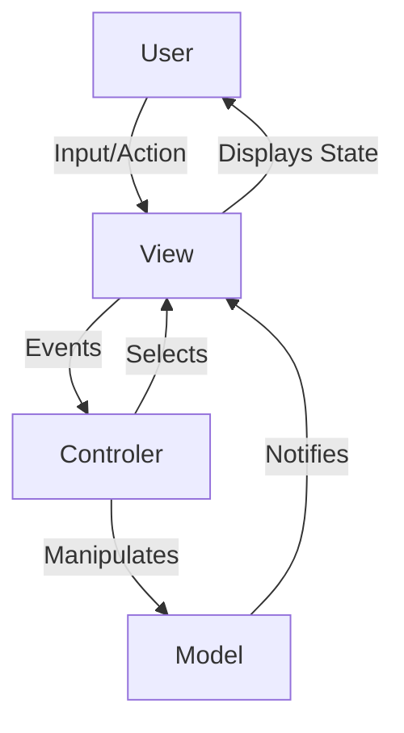

# Model-View-Controller (MVC) Pattern

The **Model-View-Controller (MVC)** [[software-architecture/architectural-patterns/|architectural pattern]] is a fundamental design pattern used to develop user interfaces. Its main objective is to separate an application into three interconnected and well-defined components to manage complexity.

* **Core Principles:**
    * **Separation of Concerns:** MVC clearly separates responsibilities. The **Model** handles data and business logic, the **View** is responsible for presentation to the user, and the **Controller** acts as an intermediary, handling user input and orchestrating interactions between the Model and the View.
    * **[[cohesion-coupling|Loose Coupling]]:** The components are designed to be as independent as possible. The Controller does not need to know the implementation details of the View, and the Model is completely independent of the UI. This increases the reusability and testability of the components.
    * **Triadic Interaction:** The pattern implements a specific communication flow. The user interacts with the View, which triggers an action in the Controller. The Controller updates the Model, which in turn can notify the View of any changes so it can refresh itself.

---

## Key Components and Interaction Flow

1.  **Model:** The core of the application. It is the object that contains the **data** and the **business logic**. It is completely unaware of Views and Controllers. Its role is to manage the application's state and notify its observers (often the Views) when its data changes.
2.  **View:** This is the user interface. It presents the Model's information to the user. The View does not contain business logic; it simply displays the data and sends user inputs to the Controller. There can be multiple Views for a single Model.
3.  **Controller:** The intermediary. It receives user inputs (via the View), interprets these actions, and updates the Model accordingly. It then selects the appropriate View to display.

**Typical Data Flow:**
* The user interacts with the **View** (clicks a button, fills out a form).
* The View notifies the **Controller** of the user action.
* The Controller processes the input, executes the business logic by interacting with the **Model** (for example, it asks the Model to save data).
* The Model updates its state and notifies the View(s) attached to it.
* The View refreshes its display to reflect the Model's new state.

---

## Advantages and Technical Challenges

* **Advantages (Benefits):**
    * **Enhanced Organization:** The architecture clearly separates responsibilities, making the code easier to understand and maintain, especially in complex applications.
    * **Testability:** Since the Model and Controller are separate from the View, they can be tested independently (**unit testing**) without needing a graphical interface.
    * **Parallel Development:** Different development teams can work simultaneously on the three components without blocking each other; for example, one team can focus on the front-end (View) while another develops the back-end (Model and Controller).
    * **Reusability:** The Model can be reused by multiple different Views. For example, the same data can be displayed on a web interface and a mobile application.

* **Challenges:**
    * **Increased Complexity:** For simple applications, implementing the pattern can be overkill and make the project more complex than it needs to be.
    * **Tight Coupling (MVC "Fat Controller"):** In practice, Controllers can become too "big" or complex, handling too much logic and creating a tight coupling with the Views, which goes against the principle of loose coupling.
    * **Learning Curve:** The complexity of MVC is relative. While the basic concept is simple to understand, its correct implementation, particularly in avoiding the trap of "Fat Controllers" where business logic accumulates in the controller, can present a challenge. For novice developers, learning the flow of indirect interactions between the three components and the specific implementation in different frameworks can also require an initial effort, although the pattern remains an excellent starting point for modern application architecture.

---

## Variations and Derived Architectures

The MVC pattern has given rise to [[mvw|several variants]] that attempt to solve its challenges and adapt to new environments, particularly the web.

* **[[mvp|Model-View-Presenter (MVP)]]:** The Presenter is a stronger intermediary than the Controller. It manipulates the View directly via an interface, making the View passive and easier to test. This is a common model in **Android** applications.
* **[[mvvm|Model-View-ViewModel (MVVM)]]:** The ViewModel acts as an abstraction layer between the View and the Model. It exposes data and commands through **"bindings,"** allowing the View to update automatically when the data changes, without direct interaction. This is the pattern behind frameworks like **Angular** and **Vue.js**.

This pattern, though dating back to the 1970s, remains the foundation for many modern frameworks and is essential for understanding web and mobile application architectures.

---

## **Resources & links**

### **Articles**

1.  **[MVC in Computer Science – The MVC Model](https://www.freecodecamp.org/news/what-does-mvc-mean-in-computer-science/)**

This freeCodeCamp article provides a clear and simple introduction to the **MVC** pattern. It explains the roles of the **Model**, **View**, and **Controller** using an easy-to-understand analogy and highlights the principle of **separation of concerns**.

2.  **[Model-view-controller (MVC)](https://www.techtarget.com/whatis/definition/model-view-controller-MVC)**

This TechTarget resource offers a concise and technical definition of **MVC**. It introduces the pattern, its terminology, and its main advantages and disadvantages.

---

### **Videos**

1.  **[What is MVC Architecture?](https://www.youtube.com/watch?v=mtZdybMV4Bw)**

This video from **Abhay Redkar Academy** provides a clear and concise introduction to the **MVC** pattern. It explains how it works based on a request/response system analogy and details the role of each component.

2.  **[MVC Explained in 4 Minutes](https://www.youtube.com/watch?v=DUg2SWWK18I)**

This video from **Web Dev Simplified** explains what the **MVC** pattern is, why it's important, and how the three components interact in a web application in under four minutes.