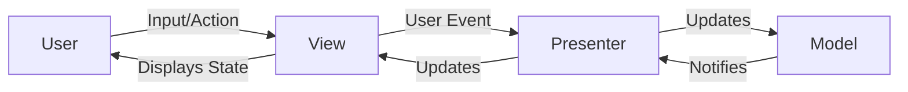

# MVP (Model-View-Presenter) Architecture

The **MVP** pattern is a user interface design pattern that decouples an application's presentation from its business logic. Its primary goal is to make the code easier to test, maintain, and evolve by clearly separating responsibilities. This architecture is often used in **desktop** and mobile applications, but its principles are also applicable in the context of **web** applications.

---

## Core Principles:

* **Separation of Concerns:** **MVP** divides the application into three interconnected components.
* **Testability:** The strict decoupling between the **View** and the **Presenter** allows the **Presenter**'s business logic to be tested independently of the user interface.
* **Presenter as a mediator:** The **Presenter** acts as an intermediary between the **Model** and the **View**. It receives user actions from the **View**, updates the **Model** accordingly, and then updates the **View** to reflect the changes.

---

## Key Components and Communication Flow

1.  **Model:** The **Model** represents the application's data layer and business logic. It knows nothing about the **View** or the **Presenter**. It exposes data and methods to manipulate that data. This can be a simple **POJO** (Plain Old Java Object) class or an interaction with a database or a remote **REST API**.
2.  **View:** The **View** is the user interface. It is **passive** and contains no logic. Its sole responsibility is to display the data the **Presenter** sends to it and to notify the **Presenter** of user actions (clicks, input, etc.). It implements a contractual interface that the **Presenter** uses.
3.  **Presenter:** The **Presenter** contains all the presentation logic. It interacts with the **Model** to retrieve or update data and with the **View** to display the results. Unlike the **Controller** in the [[mvc|MVC]] pattern, the **Presenter** has a direct reference to the **View** (via the interface) and programmatically manipulates the interface.

**Typical Data Flow:**
* The user interacts with the **View** (e.g., by clicking a button).
* The **View** notifies the **Presenter** of the action.
* The **Presenter** processes the action, interacting with the **Model** to retrieve/update data.
* The **Model** notifies the **Presenter** of a data change (or the **Presenter** checks the **Model** directly).
* The **Presenter** tells the **View** to update itself with the new data.

---

## Advantages and Technical Challenges

* **Advantages (Benefits):**
    * **High Testability:** Decoupling the **Presenter**'s presentation logic makes it very easy to test with unit tests, without needing a graphical interface environment.
    * **Improved Maintainability:** The separation of responsibilities simplifies maintenance. Changes to business logic do not affect the user interface, and vice versa.
    * **Portability:** The **Model** and **Presenter** can be reused with different **Views** (for example, a web application and a mobile application can share the same **Presenter** and **Model**).
* **Challenges:**
    * **Increased Complexity:** The **MVP** pattern introduces more classes and interfaces, which can make the initial code more complex to set up for simple applications.
    * **Tight Coupling (for passive views):** In the most common variant (**passive view**), the **Presenter** has a strong dependency on the **View** via its interface. This can be worked around with variants like **Supervising Controller**.
    * **Communication Overhead:** The communication between the three components can become verbose, especially with interfaces and notifications.

---

## MVP vs. [[mvc|MVC]]: Similarities and Differences

Both **MVP** and [[mvc|MVC]] are user interface design patterns that aim to separate responsibilities to improve maintainability and testability.

* **Similarities**
    * **Model:** Both patterns have a **Model** that represents the data layer and business logic.
    * **Separation of Concerns:** The fundamental principle of separating the **Model** from the **View** is the basis of both architectures.

* **Differences**

| Characteristic | MVP (Model-View-Presenter) | [[mvc|MVC (Model-View-Controller)]] |
| :--- | :--- | :--- |
| **View/Presenter Relationship** | The **View** has a reference (via a contractual interface) to the **Presenter**. The **Presenter** has a direct reference to the **View**. | The **View** has no reference to the **Controller**. The **Controller** does not directly manipulate the **View**. |
| **View Responsibility** | The **View** is **passive** and only displays what the **Presenter** tells it to. | The **View** is **active**. It can manage its own rendering and interact directly with the **Model** to display data. |
| **Intermediary's Role** | The **Presenter** acts as a direct **intermediary**. It is responsible for the presentation logic and updates to the **View**. | The **Controller** acts as an **action router**. It receives user actions and decides which **Model** to update or which **View** to display. |
| **Communication** | The **Presenter** is the single entry point for presentation logic. The **View** notifies the **Presenter** of events, and the **Presenter** updates the **View**. | User events are captured by the **Controller**, which updates the **Model**. The **View** observes the **Model** to update itself (in "Observer" variants). |

**MVP** is not a complement to [[mvc|MVC]] but rather an **alternative** that solves some of its weaknesses, particularly in contexts where the testability of the presentation layer is critical. It is a particularly relevant architecture for **desktop** and mobile applications.

---

## Variations and Derived Architectures

* **Passive View:** The **View** is entirely managed by the **Presenter**. It has no logic of its own and simply displays what the **Presenter** requests.
* **Supervising Controller:** The **Presenter** delegates some of the data binding logic to the **View**. It only intervenes for complex tasks or business logic.
* **MVVM (Model-View-ViewModel):** A pattern derived from **MVP** where the **Presenter** is replaced by a **ViewModel**. The **ViewModel** exposes properties and commands that the **View** can bind to (**data binding**), which reduces the explicit communication boilerplate found in **MVP**. This is the predominant pattern in modern frameworks like **Angular**, **Vue.js**, and **React**.

The **MVP** pattern, although sometimes considered "legacy" compared to **[[mvvm|MVVM]]**, remains a solid foundation for understanding the separation of concerns in user interface applications. Its principles have directly influenced modern architectures and continue to form the basis for designing robust and testable software.

---

## **Resources & links**

### **Articles**

1.  **[Understanding the Model-View-Presenter (MVP) Pattern in Java – A Comprehensive Guide](https://moldstud.com/articles/p-understanding-the-model-view-presenter-mvp-pattern-in-java-a-comprehensive-guide)**

    This **MoldStud** article provides a detailed guide to the **Model-View-Presenter (MVP)** pattern in Java. It explains the roles of the **Model**, **View**, and **Presenter**, and emphasizes how this approach improves testability and the separation of concerns in an application.

2.  **[Model-view-presenter (MVP)](https://java-design-patterns.com/patterns/model-view-presenter/)**

    This **Java Design Patterns** guide introduces the **MVP** pattern using a simple analogy (a restaurant) to explain the interaction between the three main components. It also provides a Java code example and discusses the advantages and disadvantages of the pattern.

---

### **Videos**

1.  **[What is MVP? A WinForms Demo Application](https://www.youtube.com/watch?v=XHw4bBLM8Vk)**

This video by **Robert G. Marquez** uses a **WinForms** demo application to explain the components of the **MVP** pattern and their interactions. The creator also discusses topics such as services and data repositories, as well as the structure of a Visual Studio project.

2.  **[Model-View-Presenter in iOS - An Introduction](https://www.youtube.com/watch?v=2Ew_j4GQYF4)**

This video introduces the **MVP** design pattern in the context of **iOS** application development. The creator explains the role of each component and shows basic and more advanced examples, as well as how **MVP** facilitates unit testing.