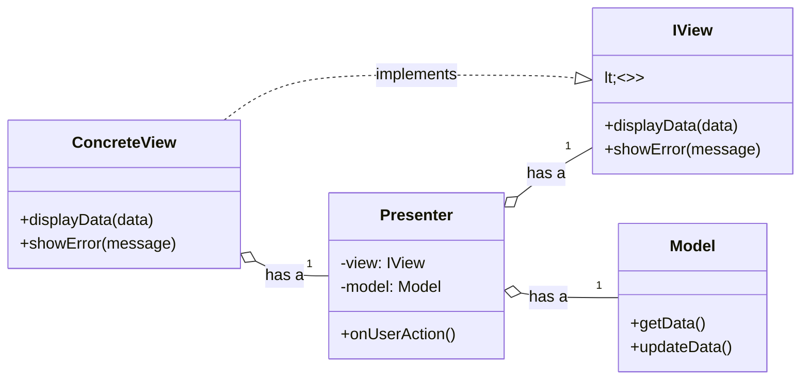

# MVP (Model-View-Presenter) Architecture

The **MVP** pattern is a user interface [[software-architecture/architectural-patterns/|architectural pattern]] that decouples an application's presentation from its business logic. Its primary goal is to make the code easier to test, maintain, and evolve by clearly separating responsibilities. This architecture is often used in **desktop** and mobile applications, but its principles are also applicable in the context of **web** applications.

---

## Core Principles:

* **[[soc|Separation of Concerns]]:** **MVP** divides the application into three interconnected components.
* **Testability:** The strict decoupling between the **View** and the **Presenter** allows the **Presenter**'s business logic to be tested independently of the user interface.
* **Presenter as a mediator:** The **Presenter** acts as an intermediary between the **Model** and the **View**. It receives user actions from the **View**, updates the **Model** accordingly, and then updates the **View** to reflect the changes.

---

## Key Components and Communication Flow

1.  **Model:** Represents the application's data and business logic. It is completely decoupled from the UI and has no knowledge of the View or Presenter.
2.  **View:** A **passive** component that displays data and routes user commands to the Presenter. The defining characteristic of MVP is that the View implements a specific interface (`IView`) that the Presenter uses to interact with it. The View itself should be as "dumb" as possible.
3.  **Presenter:** The heart of the pattern. It contains the presentation logic and acts as the mediator between the Model and the View. Crucially, the **Presenter only interacts with the View through the `IView` interface**, meaning it has no dependency on any concrete UI framework. It retrieves data from the Model, formats it, and then calls methods on the `IView` interface to update the display.

**Typical Data Flow:**
* The user interacts with the **View** (e.g., by clicking a button).
* The **View** notifies the **Presenter** of the action.
* The **Presenter** processes the action, interacting with the **Model** to retrieve/update data.
* The **Model** notifies the **Presenter** of a data change (or the **Presenter** checks the **Model** directly).
* The **Presenter** tells the **View** to update itself with the new data.

---

## Advantages and Technical Challenges

* **Advantages (Benefits):**
    * **High Testability:** This is the primary benefit. Because the **Presenter** depends only on an `IView` interface, not a concrete UI framework (like Android or WinForms), it can be tested with simple, fast unit tests. You can mock the `IView` to verify that the Presenter calls the correct methods in response to events, without ever needing to render a single pixel on screen.
    * **Improved Maintainability:** The separation of responsibilities simplifies maintenance. Changes to business logic do not affect the user interface, and vice versa.
    * **Portability:** The **Model** and **Presenter** can be reused with different **Views** (for example, a web application and a mobile application can share the same **Presenter** and **Model**).
* **Challenges:**
    * **Increased Complexity:** The **MVP** pattern introduces more classes and interfaces, which can make the initial code more complex to set up for simple applications.
    * **Tight Coupling (for passive views):** In the most common variant (**passive view**), the **Presenter** has a strong dependency on the **View** via its interface. This can be worked around with variants like **Supervising Controller**.
    * **Communication Overhead:** The communication between the three components can become verbose, especially with interfaces and notifications.

---

## Related Patterns, Concepts and Variations

MVP has two primary flavors that define how much logic the View is allowed to have:

*   **Passive View:** This is the purest (and most common) form of MVP. The **View** is completely passive and contains zero presentation logic. It exposes fine-grained setters (e.g., `setUserName(string name)`, `showErrorMessage(string message)`) that the **Presenter** uses to meticulously control every aspect of the UI. This provides maximum testability but can lead to more boilerplate code.

*   **Supervising Controller:** In this variation, the **View** is given more responsibility. It can handle simple UI logic and data binding on its own (e.g., binding a list of strings to a dropdown). The **Presenter** acts as a "supervisor," stepping in only to handle complex presentation logic or to coordinate with the Model. This reduces boilerplate but makes the View slightly harder to test in isolation.

*   **[[mvvm|MVVM (Model-View-ViewModel)]]:** MVVM can be seen as an evolution of MVP's Supervising Controller, where the data binding responsibilities are formalized into a `ViewModel`. The `ViewModel` exposes data and commands that the View binds to, almost completely eliminating the need for the Presenter/ViewModel to hold a direct reference to the View.

The **MVP** pattern, although sometimes considered "legacy" compared to **[[mvvm|MVVM]]**, remains a solid foundation for understanding the [[soc|separation of concerns]] in user interface applications. Its principles have directly influenced modern architectures and continue to form the basis for designing robust and testable software.

---

## **Resources & links**

### **Articles**

1.  **[Understanding the Model-View-Presenter (MVP) Pattern in Java – A Comprehensive Guide](https://moldstud.com/articles/p-understanding-the-model-view-presenter-mvp-pattern-in-java-a-comprehensive-guide)**

    This **MoldStud** article provides a detailed guide to the **Model-View-Presenter (MVP)** pattern in Java. It explains the roles of the **Model**, **View**, and **Presenter**, and emphasizes how this approach improves testability and the [[soc|separation of concerns]] in an application.

2.  **[Model-view-presenter (MVP)](https://java-design-patterns.com/patterns/model-view-presenter/)**

    This **Java Design Patterns** guide introduces the **MVP** pattern using a simple analogy (a restaurant) to explain the interaction between the three main components. It also provides a Java code example and discusses the advantages and disadvantages of the pattern.

---

### **Videos**

1.  **[What is MVP? A WinForms Demo Application](https://www.youtube.com/watch?v=XHw4bBLM8Vk)**

This video by **Robert G. Marquez** uses a **WinForms** demo application to explain the components of the **MVP** pattern and their interactions. The creator also discusses topics such as services and data repositories, as well as the structure of a Visual Studio project.

2.  **[Model-View-Presenter in iOS - An Introduction](https://www.youtube.com/watch?v=2Ew_j4GQYF4)**

This video introduces the **MVP** design pattern in the context of **iOS** application development. The creator explains the role of each component and shows basic and more advanced examples, as well as how **MVP** facilitates unit testing.