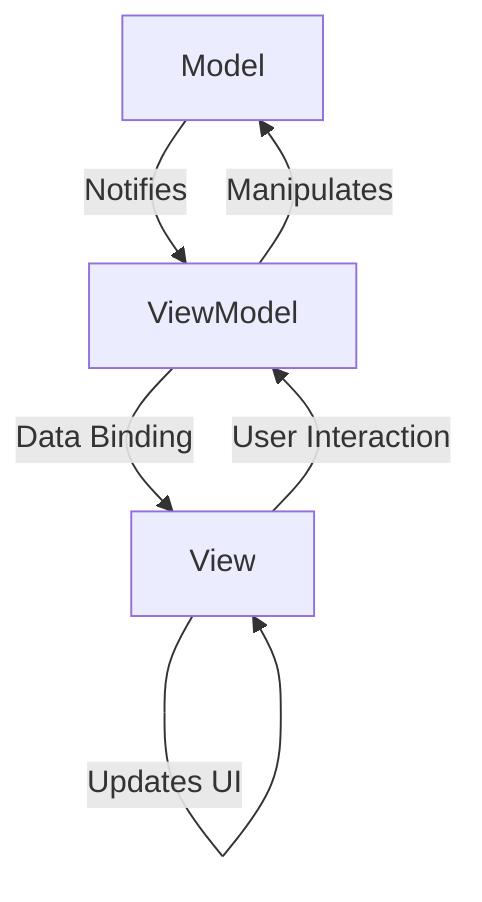

# Model-View-ViewModel(MVVM)

The **MVVM** pattern is a **UI architectural pattern** that clearly separates the user interface logic from the business logic. It is considered an evolution of the [[mvc|MVC]] and [[mvp|MVP]] patterns. Initially developed by Microsoft for frameworks like **WPF** and **Silverlight**, it is now widely used in **mobile** (**iOS**, **Android**) and **web** environments (**React**, **Vue.js**, **Angular**). It is often considered an evolution of the [[mvc|MVC]] pattern.

* **Core Principles:**
    * **Separation of Concerns:** This pattern divides the application into three interconnected components: the **Model**, the **View**, and the **ViewModel**. This separation facilitates development, testing, and maintenance.
    * **Data Binding and Commands:** **MVVM** relies heavily on bidirectional **data binding** to automatically synchronize data between the **View** and the **ViewModel**. User actions in the **View** are managed via **commands** in the **ViewModel**, eliminating the need to handle events directly in the **View**.
    * **Testability:** The **View** has minimal logic. The majority of the presentation logic resides in the **ViewModel**, which can be tested through **unit testing** without any dependency on the graphical interface.

---

## Key Components and Communication Flow

1.  **View:** The user interface. It is responsible for displaying the data provided by the **ViewModel** and capturing user interactions (clicks, input). The **View** is passive and declarative; it contains no business logic and very little presentation logic. It is often defined in **XML**, **XAML**, or **HTML/CSS**.
2.  **ViewModel:** Acts as a "model of the **View**". It exposes the **Model**'s data in a way that can be easily consumed by the **View**. The **ViewModel** contains all the presentation logic: data conversion, validation, and the logic to respond to user actions (via **commands**). It knows nothing about the concrete **View**, which makes it highly testable.
3.  **Model:** Represents the application's data and business logic. It is independent of the **View** and the **ViewModel**. It can include data access services (**database**, **API**), business objects (**entities**), and business validation rules.

---

## The Fundamental Role of Data Binding

**Data Binding** is the key mechanism that connects the **View** and the **ViewModel**. It is a technique that allows UI elements to be linked to data sources. Unlike an imperative approach where you have to write code to manually update each UI component, **data binding** automates this synchronization.

There are two main types of **binding**:
* **One-Way Binding:** Data flows from the **ViewModel** to the **View**. When a **ViewModel** property changes, the **View** is automatically updated. For example, displaying a user's name in a label.
* **Two-Way Binding:** Data flows in both directions, from the **ViewModel** to the **View** and vice versa. This is particularly useful for user input fields, such as a `text input`. When the user types text, the corresponding property in the **ViewModel** is immediately updated, and if the **ViewModel** property changes, the text field is updated.

This automation of data flow is what makes the **View** "passive" and the **ViewModel** "active" in managing the state and presentation logic, reinforcing the separation of concerns at the heart of the **MVVM** pattern.

---

## Technical Advantages and Challenges

* **Advantages (Benefits):**
    * **Strict Separation:** The separation between the **View** and the rest of the logic allows designers and developers to work in parallel.
    * **Testability:** The **ViewModel** can be tested independently of the **View**, which simplifies **unit testing**.
    * **Maintainability and Scalability:** Components are **[[cohesion-coupling|loosely coupled]]**, making the code easier to maintain and evolve.
    * **Reusability:** The **ViewModel** and the **Model** can be reused with different **Views**.

* **Challenges:**
    * **Initial Complexity:** Learning and implementing the pattern can be complex, especially for simple applications.
    * **Overhead:** **Data binding** and the creation of multiple components can lead to a slight performance **overhead** if not optimized.
    * **Coupling between View and ViewModel:** Although the **View** does not have concrete knowledge of the **ViewModel**, there is a certain implicit coupling through **data binding**, which can make debugging complex if synchronization does not work as expected.

---

## Variants and Derived Architectures

* **MVVM-C (Coordinator):** Adds a **Coordinator** layer to manage navigation and transitions between **Views** and **ViewModels**, making them even more independent.
* **RxMVVM:** Uses **reactive programming** frameworks like **RxJava** or **RxSwift** to manage data flows between components in a more efficient and declarative way.
* **Clean Architecture & MVVM:** **MVVM** is often used as a presentation pattern within larger architectures like **Clean Architecture**, where the **Model** is divided into **Domain** and **Data layers**.

The **MVVM** pattern has become an essential reference for user interface-based applications, providing a robust and testable approach to modern software design.

---

## **Resources & links**

### **Articles**

1.  **[Introduction to Model-View-ViewModel (MVVM)](https://learn.microsoft.com/en-us/dotnet/architecture/maui/mvvm)**

    This article from **Microsoft Learn** introduces the **Model-View-ViewModel (MVVM)** architectural pattern, emphasizing its role in separating an application's business and presentation logic from its UI. It details the components (Model, View, ViewModel), explains how they interact through data binding, and discusses connecting views and view models in .NET MAUI.

2.  **[Introduction to MVVM Architecture](https://medium.com/@onurcem.isik/introduction-to-mvvm-architecture-5c5558c3679)**

    Written by Onur Cem Işık, this **Medium** article provides an introduction to the **MVVM** architectural pattern. It explains the responsibilities of the Model, View, and ViewModel, highlights the importance of data binding, and outlines the benefits of using MVVM, such as improved maintainability, reusability, and testability.

---

### **Videos**

1.  **[What is the MVVM pattern, What benefits does MVVM have?](https://www.youtube.com/watch?v=AXpTeiWtbC8)**

    In this video, **James Montemagno** provides a comprehensive overview of the **MVVM** pattern, explaining its purpose and advantages. He demonstrates how MVVM helps in structuring code, making it more testable and loosely coupled from the UI, especially in XAML-based applications like .NET MAUI.

2.  **[What is MVVM (Model-View-ViewModel) Pattern?](https://www.youtube.com/watch?v=fo6rvTP9kkc)**

    This video from **Programming with Mosh** explains the **Model-View-ViewModel (MVVM)** pattern as an architectural pattern for user interfaces. It details the Model, View, and ViewModel components and discusses why MVVM is beneficial for unit testing presentation logic, particularly in frameworks like Xamarin.