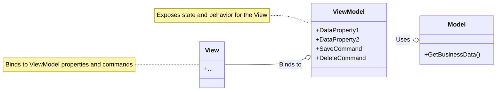

# Model-View-ViewModel(MVVM)

The **MVVM** pattern is a **UI [[software-architecture/architectural-patterns/|architectural pattern]]** that clearly separates the user interface logic from the business logic. It is considered an evolution of the [[mvc|MVC]] and [[mvp|MVP]] patterns. Initially developed by Microsoft for frameworks like **WPF** and **Silverlight**, it is now widely used in **mobile** (**iOS**, **Android**) and **web** environments (**React**, **Vue.js**, **Angular**). It is often considered an evolution of the [[mvc|MVC]] pattern.

* **Core Principles:**
    * **Separation of Concerns:** This pattern divides the application into three interconnected components: the **Model**, the **View**, and the **ViewModel**. This separation facilitates development, testing, and maintenance.
    * **Data Binding and Commands:** **MVVM** relies heavily on bidirectional **data binding** to automatically synchronize data between the **View** and the **ViewModel**. User actions in the **View** are managed via **commands** in the **ViewModel**, eliminating the need to handle events directly in the **View**.
    * **Testability:** The **View** has minimal logic. The majority of the presentation logic resides in the **ViewModel**, which can be tested through **unit testing** without any dependency on the graphical interface.

---

## Key Components and Communication Flow

1.  **View:** The user interface (UI). Its primary job is to declaratively bind to the properties and commands exposed by the ViewModel. The View is responsible for the visual structure and layout, but it contains no application logic. It is "dumb" by design.
2.  **ViewModel:** The heart of the pattern. It acts as an abstraction of the View and a container for the View's state and logic. It retrieves data from the Model and **transforms** it into a format that the View can easily display (e.g., converting a `Date` object to a formatted string). It also exposes **Commands** (e.g., `SaveCommand`, `DeleteCommand`) that the View can bind to. The ViewModel has no reference to any specific UI elements, making it highly testable.
3.  **Model:** Represents the application's non-visual business logic and data. It is completely independent of the UI and knows nothing about the ViewModel or the View.

---

## Data Binding and Commands: The Core Mechanisms

MVVM relies on two key mechanisms provided by UI frameworks to connect the View and the ViewModel.

### 1. Data Binding

This is the "glue" that connects the View and ViewModel. It's a technique that automatically synchronizes data between the two.
*   **One-Way Binding:** Data flows from the ViewModel to the View. When a ViewModel property changes, the UI updates automatically. Used for displaying data (e.g., text labels).
*   **Two-Way Binding:** Data flows in both directions. When the user edits a control (e.g., a text box), the underlying ViewModel property is updated. If the ViewModel property changes, the UI control is updated. Used for user input.

### 2. Commands

This mechanism decouples user actions (like button clicks) from the code that handles them.
*   Instead of handling a click event in the View's code-behind, a UI element (like a button) is bound to a `Command` object in the ViewModel.
*   The `Command` object encapsulates the action to be performed (e.g., saving data) and the logic to determine if the action can be executed (e.g., the "Save" button should be disabled if the form is invalid).
*   This keeps all action-related logic in the ViewModel, making the View purely presentational.

---

## Technical Advantages and Challenges

* **Advantages (Benefits):**
    * **Strict Separation:** The separation between the **View** and the rest of the logic allows designers and developers to work in parallel.
    * **Superb Testability:** This is a key advantage. Since the **ViewModel** has no reference to any concrete View or UI elements, its logic can be fully tested with fast, simple unit tests. You can verify every property and command without ever needing to interact with a UI framework.
    * **Maintainability and Scalability:** Components are **[[cohesion-coupling|loosely coupled]]**, making the code easier to maintain and evolve.
    * **Reusability:** The **ViewModel** and the **Model** can be reused with different **Views**.

* **Challenges:**
    * **Initial Complexity:** Learning and implementing the pattern can be complex, especially for simple applications.
    * **Overhead:** **Data binding** and the creation of multiple components can lead to a slight performance **overhead** if not optimized.
    * **Coupling between View and ViewModel:** Although the **View** does not have concrete knowledge of the **ViewModel**, there is a certain implicit coupling through **data binding**, which can make debugging complex if synchronization does not work as expected.

---

## Variants and Derived Architectures

* **MVVM-C (Coordinator):** Adds a **Coordinator** layer to manage navigation and transitions between **Views** and **ViewModels**, making them even more independent.
* **RxMVVM:** Uses **reactive programming** frameworks like **RxJava** or **RxSwift** to manage data flows between components in a more efficient and declarative way.
* **[[clean|Clean Architecture]] & MVVM:** **MVVM** is often used as a presentation pattern within larger architectures like **[[clean|Clean Architecture]]**, where the **Model** is divided into **Domain** and **Data layers**.

The **MVVM** pattern has become an essential reference for user interface-based applications, providing a robust and testable approach to modern software design.

---

## **Resources & links**

### **Articles**

1.  **[Introduction to Model-View-ViewModel (MVVM)](https://learn.microsoft.com/en-us/dotnet/architecture/maui/mvvm)**

    This article from **Microsoft Learn** introduces the **Model-View-ViewModel (MVVM)** architectural pattern, emphasizing its role in separating an application's business and presentation logic from its UI. It details the components (Model, View, ViewModel), explains how they interact through data binding, and discusses connecting views and view models in .NET MAUI.

2.  **[Introduction to MVVM Architecture](https://medium.com/@onurcem.isik/introduction-to-mvvm-architecture-5c5558c3679)**

    Written by Onur Cem Işık, this **Medium** article provides an introduction to the **MVVM** architectural pattern. It explains the responsibilities of the Model, View, and ViewModel, highlights the importance of data binding, and outlines the benefits of using MVVM, such as improved maintainability, reusability, and testability.

---

### **Videos**

1.  **[What is the MVVM pattern, What benefits does MVVM have?](https://www.youtube.com/watch?v=AXpTeiWtbC8)**

    In this video, **James Montemagno** provides a comprehensive overview of the **MVVM** pattern, explaining its purpose and advantages. He demonstrates how MVVM helps in structuring code, making it more testable and loosely coupled from the UI, especially in XAML-based applications like .NET MAUI.

2.  **[What is MVVM (Model-View-ViewModel) Pattern?](https://www.youtube.com/watch?v=fo6rvTP9kkc)**

    This video from **Programming with Mosh** explains the **Model-View-ViewModel (MVVM)** pattern as an architectural pattern for user interfaces. It details the Model, View, and ViewModel components and discusses why MVVM is beneficial for unit testing presentation logic, particularly in frameworks like Xamarin.