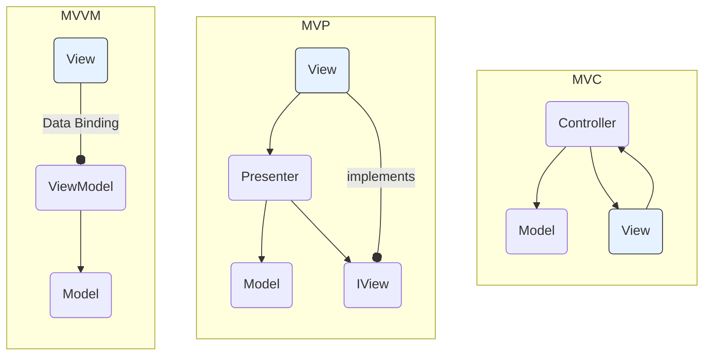

# Model-View-Whatever (MVW)

The term **MVW**, or **Model-View-Whatever**, isn't a strict [[software-architecture/architectural-patterns/|architectural pattern]] but a generic concept. It's used to describe a family of design patterns, including [[mvc|MVC]], [[mvp|MVP]], and **MVVM**, that share the fundamental principle of **[[soc|separation of concerns]]**. They divide application logic into three distinct layers: the **Model**, the **View**, and an intermediary that handles presentation logic and communication.

The "Whatever" highlights the flexibility of this approach. The main goal isn't to follow a specific pattern name but to apply sound design principles to create maintainable, reusable, and easily testable code. This philosophy is especially relevant in the modern web framework ecosystem, where each technology may have its own implementation.

---

## Key "Model-View" Patterns

### 1. [[mvc|MVC (Model-View-Controller)]]
The original pattern. Its key characteristic is that the **Controller** is responsible for receiving input and updating the **Model**. The **View** then updates itself, either by directly observing the Model (**Active MVC**) or by receiving data from the Controller (**Passive MVC**), which is more common in web frameworks. The View and Controller are often closely coupled.

### 2. [[mvp|MVP (Model-View-Presenter)]]
An evolution of MVC focused on improving testability. Its defining feature is the **Presenter**, which acts as a strong intermediary. The Presenter communicates with the View through a specific **interface (`IView`)**, which decouples it from any concrete UI framework. The **View** becomes completely passive, delegating all logic to the Presenter.

### 3. [[mvvm|MVVM (Model-View-ViewModel)]]
A refinement of MVP popular in modern UI frameworks. It replaces the Presenter with a **ViewModel** and largely eliminates the need for the intermediary to call the View directly. Instead, the **View** [[declarative-programming|declaratively]] **binds** to the ViewModel's properties and commands. When data in the ViewModel changes, the View updates automatically through the data-binding engine. This creates a very clean separation and excellent testability.

---

## Visual Comparison

This diagram shows the primary communication flows for each pattern, highlighting their key differences.

## Detailed Comparison ([[mvc|MVC]] vs. [[mvp|MVP]] vs. [[mvvm|MVVM]])

Here is a comparison table to better understand the nuances between these three patterns.

| Characteristic | MVC (Model-View-Controller) | MVP (Model-View-Presenter) | MVVM (Model-View-ViewModel) |
| :--- | :--- | :--- | :--- |
| **Intermediary's Knowledge of View** | Controller often has a direct reference to a concrete View. Tightly coupled. | Presenter holds a reference to the View **only through an interface**. Decoupled from UI tech. | ViewModel has **no reference** to the View. Completely decoupled. |
| **How the View is Updated** | Controller can update the View directly (Passive MVC) or the View updates itself by observing the Model (Active MVC). | The Presenter calls methods on the View's interface to update it manually. | The View updates automatically through a **data binding** engine. |
| **Primary Goal** | Separation of concerns between Model, View, and Controller. | **Testability**. By decoupling the Presenter from the concrete View, all presentation logic can be unit tested. | **Simplify the View**. Remove as much logic as possible from the View by leveraging data binding and commands. |

## Conclusion

**MVW** represents a pragmatic and flexible approach to software architecture. The choice between [[mvc|MVC]], [[mvp|MVP]], and [[mvvm|MVVM]] depends on the technology, project constraints, and user interface complexity. While [[mvc|MVC]] is ideal for traditional server-side architectures, [[mvp|MVP]] is often preferred for applications where testability is critical, and MVVM is the go-to for modern frameworks that leverage `data binding`, offering excellent separation and ease of maintenance.

---

## **Resources & links**

### **Articles**

1.  **[MVC vs MVP vs MVVM](https://www.bacancytechnology.com/blog/mvc-vs-mvp-vs-mvvm)**

    This **Bacancy Technology** article compares the [[mvc|MVC]], [[mvp|MVP]], and [[mvvm|MVVM]] architectural patterns. It explains their role in managing complex code and improving UI code cleanliness, analyzing their performance, testability, and ease of modification, particularly in the context of Android development.

2.  **[Architecture Patterns for Beginners: MVC, MVP, and MVVM](https://dev.to/chiragagg5k/architecture-patterns-for-beginners-mvc-mvp-and-mvvm-2pe7)**

    This article on **dev.to** is aimed at beginners and introduces the [[mvc|MVC]], [[mvp|MVP]], and [[mvvm|MVVM]] architectural patterns. It defines the common components (**Model**, **View**) and then details the specific roles of the **Controller**, **Presenter**, and **ViewModel** for each pattern, offering a comparison of their key differences.

---

### **Videos**

1.  **[Exploring UI Design Patterns: MVC, MVP, and MVVM](https://www.youtube.com/watch?v=tm_paZsPsrI)**

    This video from **Andrey Tech** explores the [[mvc|MVC]], [[mvp|MVP]], and [[mvvm|MVVM]] UI design patterns, focusing on their application in mobile development. It explains how these patterns organize and optimize the logic of the presentation layer to improve code modularity and testability.

2.  **[Everything You NEED to Know About Client Architecture Patterns](https://www.youtube.com/watch?v=I5c7fBgvkNY)**

    This video from **ByteByteGo** dives into the world of client architectural patterns, covering the workings of [[mvc|MVC]], [[mvp|MVP]], and [[mvvm|MVVM]] through a practical example of a user updating their profile picture. It also compares more advanced patterns such as **MVVC** and **VIPER**.