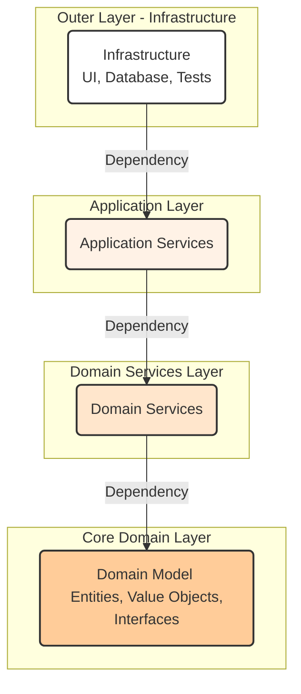

# **Onion Architecture**

The **Onion Architecture**, proposed by Jeffrey Palermo in 2008, is a software architectural style that emphasizes the [[cohesion-coupling|separation of concerns]] by organizing code into concentric layers. Its primary goal is to ensure that the **domain objects** and core **business logic** are completely independent of any external infrastructure. This makes the system easier to test, more resilient to technological changes, and more maintainable.

* **Core Principles:**
    * **[[solid|Dependency Inversion Principle]]:** Dependencies always point inward, from the outer layers to the core of the onion. Outer layers can only depend on inner layers.
    * **Core Domain as the Center:** The **domain model** and **business rules** are at the very center of the application and are completely independent of the infrastructure (databases, frameworks, UI).
    * **Interface Segregation:** Interfaces define the contracts for services. The core defines interfaces, and the outer layers implement them.
    * **Testability:** The core of the application can be tested in isolation, without the need for a database or other external services.

---

## **Key Components and Communication Flow**

1.  **Core Domain (Core):** Contains the most critical entities and business rules. It is the heart of the application and depends on nothing else. It defines interfaces for **repositories** for outer layers to implement.
2.  **Domain Services:** Encapsulate **business logic** that doesn't fit neatly into an entity. They orchestrate actions on the entities.
3.  **Application Services:** Coordinate the execution of **use cases**. They act as a façade for the rest of the application, using **domain services** to accomplish tasks.
4.  **UI/Infrastructure (Outer Layers):** Contain frameworks, databases, user interfaces (UI), and anything related to technology. These layers implement the interfaces defined by the inner layers to adapt to the core.

**Typical Data Flow:**
* The user interface (e.g., a **REST** controller) calls an **application service**.
* The **application service** uses the **domain services** and the **repository** interfaces to execute the **use case**.
* The **repository** implementations in the infrastructure layer (e.g., a **JPA** class) handle data persistence. Crucially, these implementations conform to the repository *interfaces* defined in the Core Domain. This inverts the control flow, ensuring the core remains independent of the database technology.
* Dependencies are inverted: the application layer depends on the domain layer, but the domain layer depends on nothing else.

---

## **Advantages and Technical Challenges**

* **Advantages (Benefits):**
    * **Maintainability and Flexibility:** Changes in the infrastructure layer (e.g., switching from **MySQL** to **PostgreSQL**) do not affect the core of the application.
    * **Testability:** The **business logic** is isolated and can be unit tested without external dependencies.
    * **True [[cohesion-coupling|Separation of Concerns]]:** The code is logically organized, making the system easier to understand and manage.

* **Challenges:**
    * **Complexity and Overhead:** For simple applications, setting up all the layers can seem like overkill. The architecture introduces additional complexity and **boilerplate code**.
    * **Risk of Anemic Domain Model:** A common pitfall is placing all business logic in the "services" layers, leaving the core "domain model" as just a collection of data structures (an anemic domain). This defeats the purpose of the architecture. The core domain entities should encapsulate as much business logic as possible.
    * **Learning Curve:** The principle of dependency inversion and the layered structure can be difficult for less experienced teams to master.

---

## Related Patterns, Concepts and Variations

**Onion Architecture**, Robert C. Martin's ("Uncle Bob") **[[clean|Clean Architecture]]**, and Alistair Cockburn's **[[hexagonal|Hexagonal Architecture]]** all share fundamental principles and are often considered [[modern-application-architectures|variations of the same core concept]].

* **Similarities:**
    * All three architectures focus on separating the **business logic** (the "core") from the infrastructure (UI, databases, etc.).
    * They use the **[[solid|Dependency Inversion Principle]]** to ensure that dependencies point inward.
    * The common goal is to create systems that are "agnostic" about their infrastructure and easy to test.

* **Differences:**
    * **Onion Architecture:** Focuses on concentric layers. The emphasis is on communication from the outside in, with dependencies always directed toward the core.
    * **[[hexagonal|Hexagonal Architecture]] (Ports and Adapters):** Uses "ports" and "adapters". A port is an interface (a contract) that the core application exposes or uses. An adapter is an implementation of that interface. The core is a hexagon with ports. Adapters (e.g., a database, a **REST API**) connect to these ports. This is a more interface- and external "actor"-focused view.
    * **[[clean|Clean Architecture]]:** This is a composite architecture that integrates the ideas of both **Onion** and **[[hexagonal|Hexagonal]]** and adds other layers like **use cases**. It proposes a more rigid structure with clearly named layers (Entities, Use Cases, Interface Adapters, Frameworks and Drivers) but follows the same core principles of dependency inversion and infrastructure independence.

In summary, these architectures are different ways to implement the same principles. **Onion Architecture** is an excellent starting point for understanding how to isolate the business core from infrastructure, a key concept for any modern software architect.

---

## **Resources & links**

### **Articles**

1.  **[The Onion Architecture: part 1](https://jeffreypalermo.com/2008/07/the-onion-architecture-part-1/)**

    The original article by **Jeffrey Palermo** introduces the **Onion Architecture** as a modern alternative to traditional layered architectures. It emphasizes placing the **Domain Model** at the core and ensuring that all dependencies point inward toward the center. This approach, which relies on the **[[solid|Dependency Inversion principle]]**, aims to reduce coupling and make the application's core business logic independent of external concerns like databases or user interfaces, thereby improving maintainability.

2.  **[Onion Architecture: Let's slice it like a Pro](https://medium.com/expedia-group-tech/onion-architecture-deed8a554423)**

    In this article, **Ritesh Kapoor** provides an in-depth look at the **Onion Architecture** based on **Domain-Driven Design (DDD)** principles. It breaks down the architecture's different layers—from the core **Domain Model** to the outer **Infrastructure Services**—and explains how the inward flow of dependencies enhances code quality, testability, and flexibility. The article highlights how this pattern allows for easy swapping of technologies and frameworks without impacting the business logic.

---

### **Videos**

1.  **[Onion Architecture - Software Design Patterns Explained](https://www.youtube.com/watch?v=oC2Ty8H9jck)**

    This video from the **Professional Programming** channel explains the concepts of **Onion Architecture**, **[[clean|Clean Architecture]]**, and **[[hexagonal|Hexagonal Architecture]]**. It uses diagrams to illustrate how these patterns solve the problem of tight coupling in traditional software design by putting the business logic at the center and abstracting external concerns like databases and user interfaces. The video provides a clear and visual introduction to the core principles of these architectural styles.

2.  **[Onion Architecture vs Clean Architecture Comparison](https://www.youtube.com/watch?v=KqWNtCpjUi8)**

    In this video, **Milan Jovanović** compares **Onion Architecture** and **[[clean|Clean Architecture]]**. He demonstrates that they are conceptually very similar, with both placing the **domain layer** at the core and enforcing a strict rule that dependencies must point inward. The video shows practical implementations of both architectures, highlighting their shared goal of decoupling the application from its infrastructure and ensuring the core business logic remains independent.