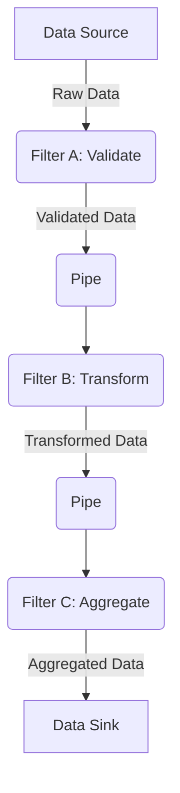

# Pipe and Filters Pattern

The **Pipe and Filters** is an architectural pattern that decomposes a data processing task into a series of independent and reusable processing steps, called **Filters**. These filters are connected by unidirectional communication channels called **Pipes**, which transport a stream of data.

* **Core Principles:**
    * **Modularity and [[solid|Single Responsibility]]:** Each filter performs a unique and specific transformation. It is unaware of the other filters in the chain.
    * **Unidirectional Data Flow:** Data moves in a single direction, from the source to the sink, through a sequence of filters.
    * **Decoupling:** Pipes decouple the filters. A filter does not need to know where the data comes from or where it is going, which allows for great flexibility.

---

## Key Components and Communication Flow

1.  **Source (or Pump)**: The origin point of the data. It can be a file, a network request, a sensor, etc. It initiates the flow.
2.  **Filter**: An autonomous processing component that performs a specific transformation. Common filter types include:
    *   **Transformer:** Modifies the input data (e.g., converting format, encrypting).
    *   **Tester:** Checks data against one or more criteria and may discard it or route it differently.
    *   **Aggregator:** Collects and combines multiple data points into one.
3.  **Pipe**: The connector that links the filters. It is a unidirectional channel that moves data from one filter to the next. In distributed systems, a pipe is often implemented with a **[[asynchronous-messaging|Message Queue]]** to provide buffering and asynchronicity.
4.  **Sink**: The final destination for the data after it has passed through the entire filter chain. Examples: a database, a file, a user interface.

**Typical Data Flow:**
*   The **Source** produces data and sends it into the first pipe.
*   **Filter A** reads data from the pipe as soon as it is available, processes it (e.g., validation), and writes the result to **Pipe 1**. Filter A can start its work before the Source has finished producing all the data.
*   The process repeats for each filter in the chain (**Filter B**, **Filter C**), with each filter potentially running in parallel on a different batch of data.
*   The **Sink** consumes the final data from the last pipe and stores or displays it.

---

## Implementation Models: Push vs. Pull

The data flow through the pipeline can be managed in two ways:

*   **Push Sequence:** The pipeline is driven by the data source. The `Source` "pushes" data down the pipeline. Each `Filter` receives data, processes it, and immediately pushes the result to the next filter. This model is simple to implement but can cause a filter to be overwhelmed if the preceding filter produces data faster than it can consume it.

*   **Pull Sequence:** The pipeline is driven by the data sink. The `Sink` "pulls" data by requesting it from the last filter. This request propagates up the pipeline, with each filter pulling data from its predecessor as needed. This model gives the consumer control over the data flow rate but can be more complex to coordinate.

---

## Advantages and Technical Challenges

* **Advantages (Benefits):**
    * **Reusability and Flexibility:** Filters are independent components that can be easily reused, reorganized, or replaced to build new pipelines.
    * **Parallelism and Performance:** The model allows for natural concurrent execution. Each filter can run on a separate thread or machine, which is ideal for processing massive data streams and optimizing performance.
    * **Development Simplicity:** Each filter has a unique and well-defined responsibility, making it simple to design, implement, test, and maintain.
    * **Scalability:** Processing capacity can be increased by parallelizing a specific filter that constitutes a bottleneck.

* **Challenges:**
    * **Common Data Format:** Filters must agree on a standard data format. Any format conversion between filters adds overhead and complexity.
    * **Complexity for Interactions:** This pattern is ill-suited for systems requiring complex interactions between components or a shared state. Communication is linear and non-interactive.
    * **Latency and Overhead:** Transporting data through pipes (copying, serialization/deserialization) can introduce significant latency, especially for large data volumes.
    * **Error Handling and Transactions:** Ensuring the reliability of the entire pipeline is complex. An error in one filter may require compensation or recovery mechanisms that are difficult to implement transactionally.

---

## Related Patterns, Concepts and Variations

The **Pipe and Filters** pattern is a foundation for many data processing systems.

* **Unix/Linux Command Lines:** The canonical example where commands (`grep`, `awk`, `sort`) are filters and the `|` character is the pipe.
* **ETL (Extract, Transform, Load) Pipelines:** At the core of Business Intelligence and Big Data systems for batch or stream processing of large amounts of data. Tools like Apache Spark, Flink, or AWS Data Pipeline are based on this concept.
* **Compilers:** The compilation process (lexical analysis, parsing, intermediate code generation, etc.) is a sequence of filters.
* **Multimedia Processing:** Software for image or sound processing (e.g., FFmpeg, GStreamer) applies a series of filters (codecs, effects, transformations) to a data stream.

## **Resources & links**

### **Articles**

1.  **[Pipes and Filters pattern (Microsoft Learn)](https://learn.microsoft.com/en-us/azure/architecture/patterns/pipes-and-filters)**

    Microsoft's documentation is an essential reference. It is clear, well-structured, and provides use cases, pros/cons, and implementation considerations, especially in a cloud context.

2.  **[Pipe and Filter Architecture - System Design (GeeksforGeeks)](https://www.geeksforgeeks.org/system-design/pipe-and-filter-architecture-system-design/)**
    
    This article provides a comprehensive overview of the pattern, its core concepts, benefits (modularity, scalability), and real-world examples like Unix command-line tools.

### **Videos**

1.  **[Building a Request Pipeline for Separating Concerns with Pipes & Filters (CodeOpinion)](https://www.youtube.com/watch?v=msXtN15qXOE)**
    
    This video explains how to use the pattern to build a request processing pipeline, separating concerns such as logging, validation, and exception handling into distinct steps.

2.  **[Pipe and Filter Pattern - Architectural Patterns (Devsena Mishra)](https://www.youtube.com/watch?v=ZbmpkiLgbwY)**
    
    A tutorial that describes the software architecture pattern and its use in Java, as part of a broader series on architectural patterns.