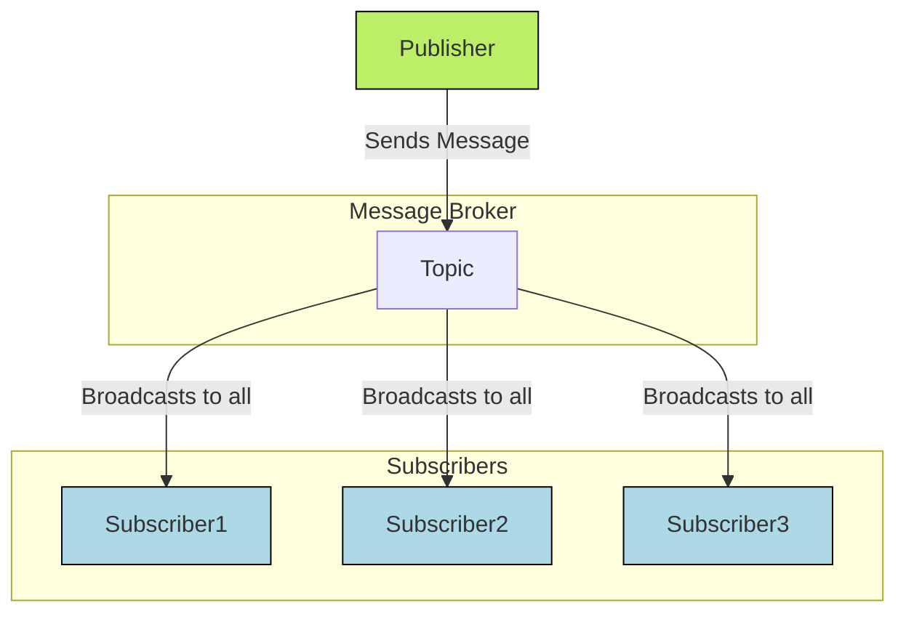

# **Publish-Subscribe Pattern**

The **Publish-Subscribe** (or Pub/Sub) [[software-architecture/architectural-patterns/|architectural pattern]] is one of the two primary models for [[asynchronous-messaging|asynchronous messaging]]. It enables one-to-many, broadcast-style communication where message senders (**Publishers**) are completely decoupled from message receivers (**Subscribers**).

Communication is organized by **topics** (sometimes called channels). Publishers send messages to a topic on a central **[[broker]]**, and all subscribers interested in that topic receive a copy of the message. This pattern is foundational to building scalable, [[event-driven]] systems.

---

## **Core Principles**

* **[[cohesion-coupling|Decoupling]]:** This is the key principle. Publishers and subscribers are completely independent of each other. A publisher does not know who (or how many) subscribers are listening to its messages, and vice versa. This temporal and spatial decoupling facilitates the independent development and evolution of services.
* **Asynchrony:** Communication is non-blocking. A publisher sends a message and does not expect an immediate response. The message is stored by the [[broker]] and delivered to the subscribers when they are available.
* **Topic-Based Messaging:** Messages are categorized by topics. Subscribers subscribe to one or more topics to receive the messages that interest them. This model allows for selective and efficient information broadcast.
* **Scalability:** It is very easy to add new publishers or subscribers without modifying existing components. The load can be distributed by adding new consumer instances.

---

## **Key Components and Communication Flow**

1.  **Publisher:** The entity that sends a message (an event or a command) without knowing the recipients. It only publishes to a topic.
2.  **[[broker|Message Broker]]:** The central component that receives messages from publishers and routes them to the relevant subscribers. It's the backbone of the architecture. Technologies like **RabbitMQ**, **Apache Kafka**, **Redis Pub/Sub**, or **Google Cloud Pub/Sub** are implementations of this [[broker]].
3.  **Subscriber:** The entity that subscribes to one or more topics to receive the messages. The same message can be consumed by multiple subscribers (one-to-many communication).

**Typical Data Flow:**
* A publisher sends a message to a specific topic on the [[broker|message broker]].
* The [[broker]] receives and stores the message.
* It either notifies (pushes) or allows subscribers to retrieve it (pulls).
* Each interested subscriber receives a copy of the message and can process it independently.

---

## **Advantages and Technical Challenges**

* **Advantages (Benefits):**
    * **Low [[cohesion-coupling|Coupling]]:** Services are independent and can be developed, deployed, and scaled autonomously.
    * **Resilience:** If a subscriber is offline, the [[broker]] can queue messages until it becomes available again. This prevents data loss and makes the system more robust.
    * **Scalability:** It's simple to add new functionalities by creating new subscribers that listen to existing topics. You can also add multiple instances of the same subscriber to handle a higher message volume.
    * **Flexibility:** Enables **one-to-many** communication without additional complexity on the publisher side.

* **Challenges:**
    * **Latency:** The Pub/Sub model is asynchronous by nature, which introduces a delay between a message being sent and its reception. This is not a flaw, but an **architectural trade-off** that must be considered for applications requiring very low latency (e.g., high-frequency trading).
    * **Operational Complexity:** The [[broker]] introduces a new component to manage, monitor, and secure.
    * **[[broker|Broker]] Dependency:** If the [[broker]] fails (SPOF), communication between all services is interrupted. High availability and clustering solutions are therefore essential.
    * **Message Durability:** Persisting messages in case of a [[broker]] crash needs to be carefully managed, which can impact performance.
    * **Message Ordering:** Maintaining message order in a distributed system can be complex, especially if messaging is partitioned.

---

## **Key Architectural Considerations**

### Push vs. Pull Models

How subscribers receive messages is a key implementation detail:
*   **Push Model:** The broker actively pushes messages to subscribers as soon as they are published. This minimizes latency but can overwhelm a subscriber if messages arrive too quickly.
*   **Pull Model:** Subscribers actively poll the broker to ask for new messages. This gives the subscriber control over its consumption rate but can introduce latency if polling is infrequent. Many modern streaming platforms (like Kafka) use a long-polling pull model to get the benefits of both.

### Topics vs. Event Streams

While the terms "Topic" and "Stream" are often used interchangeably, there is a key conceptual difference, particularly in modern data platforms like **Apache Kafka**.

*   **Topic (Classic Pub/Sub):** In a traditional message broker (like RabbitMQ or ActiveMQ), a topic is often a lightweight, transient routing mechanism. Once a message is broadcast to all current subscribers, it is typically removed. If a subscriber is offline, it may miss the message unless complex durability features are configured.

*   **Event Stream (Log-based Pub/Sub):** An event stream is a durable, ordered, and replayable sequence of events. It acts more like a log file than a simple message channel.
    *   **Durability:** Events are not deleted after being consumed. They are stored for a configurable period (e.g., days or forever), creating a persistent record of what happened.
    *   **Replayability:** New subscribers can join at any time and choose to read events from the very beginning of the stream, or from any other point in time. This allows for rebuilding state or adding new services that can process historical data.
    *   **Ordering:** Events within a partition of the stream are strictly ordered, which is critical for stateful processing and [[event-sourcing|event sourcing]].

This "log-based" approach has made event streams the backbone of modern [[event-driven]] architectures and real-time [[pipe-filters|data processing]] systems.

---

## Related Patterns, Concepts and Variations

The Publish-Subscribe pattern is a foundational concept that relates to and enables several other important patterns and architectures.

### Observer Pattern
Pub/Sub is often considered the distributed, asynchronous version of the classic **[[gof|Observer design pattern]]**.
*   **Observer Pattern:** An object (the "Subject") maintains a list of its dependents ("Observers") and notifies them directly of any state changes, usually through a method call. This creates direct, synchronous coupling.
*   **Publish-Subscribe Pattern:** The **[[broker|Broker]]** is introduced as an intermediary, breaking the direct link between the publisher (Subject) and subscribers (Observers) and allowing for asynchronous, distributed communication.

### Related Architectural Patterns
*   **[[event-driven|Event-Driven Architecture (EDA)]]:** Pub/Sub is the core communication mechanism for choreographed, event-driven systems. Producers publish events about state changes, and consumers subscribe to these events to trigger their own business logic.
*   **[[microservices|Microservices]]:** This pattern is a primary enabler of asynchronous communication between microservices, promoting loose coupling and resilience. Services can communicate without direct knowledge of each other's location or status.
*   **[[pipe-filters|Pipe and Filters]]:** In distributed data processing pipelines, Pub/Sub topics or streams often act as the "pipes," broadcasting data from one processing stage (a "filter") to one or more subsequent stages.
*   **[[cqrs|CQRS (Command and Query Responsibility Segregation)]]:** Pub/Sub is commonly used to keep the read and write sides of a [[cqrs|CQRS]] system synchronized. After a **Command** modifies data on the write side, an event is published. The **Query** side subscribes to this event to update its own read-optimized data store.

---

## **Resources & links**

### **Articles**

1.  **[What is Pub/Sub?](https://www.geeksforgeeks.org/system-design/what-is-pub-sub/)**

    This **GeeksforGeeks** article provides an introduction to the **Publish-Subscribe (Pub/Sub)** messaging pattern. It explains how this asynchronous messaging pattern works by decoupling senders (publishers) from receivers (subscribers) through a [[broker|message broker]], enhancing scalability and reliability in system design.

2.  **[What is the Publish Subscribe Pattern?](https://www.contentful.com/blog/publish-subscribe-pattern/)**

    This **Contentful** article explains the **Publish-Subscribe pattern**, a common asynchronous messaging paradigm. It defines publishers, subscribers, and [[broker|message brokers]], detailing how this pattern facilitates loose coupling and enables efficient communication between different parts of a system, particularly in event-driven architectures.

---

### **Videos**

1.  **[What is the Publish/Subscribe Pattern? (Pub/Sub)](https://www.youtube.com/watch?v=algmP8MGeL4)**

    This video from **Coder Grrrl** explains the **Publish/Subscribe (Pub/Sub)** pattern, focusing on its core components: publishers, subscribers, and the [[broker|message broker]]. It illustrates how Pub/Sub enables decoupled communication between services, making systems more scalable and resilient by removing direct dependencies.

2.  **[Publish Subscribe Pattern - Software Design Pattern](https://www.youtube.com/watch?v=O1PgqUqZKTA)**

    In this video, **ByteByteGo** introduces the **Publish-Subscribe (Pub/Sub)** software design pattern. It delves into the working mechanism of Pub/Sub, highlighting how it facilitates asynchronous communication and decoupling between different system components, which is crucial for building scalable and robust distributed systems.