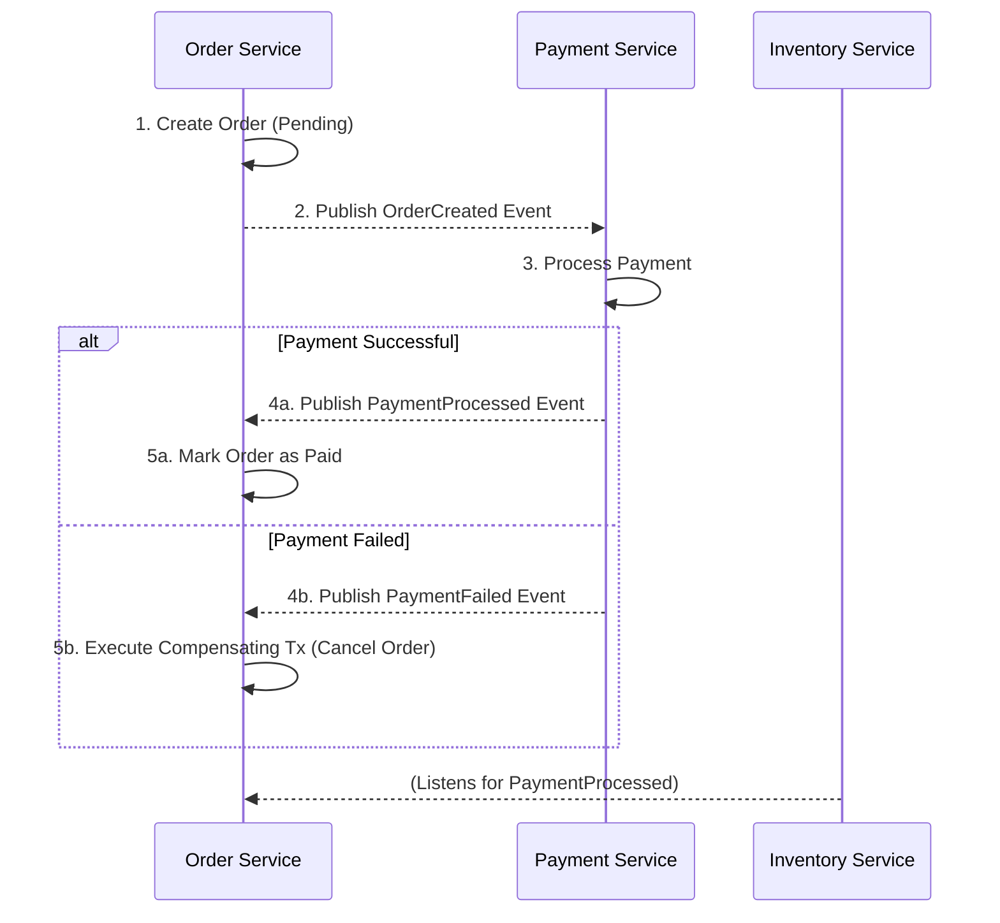
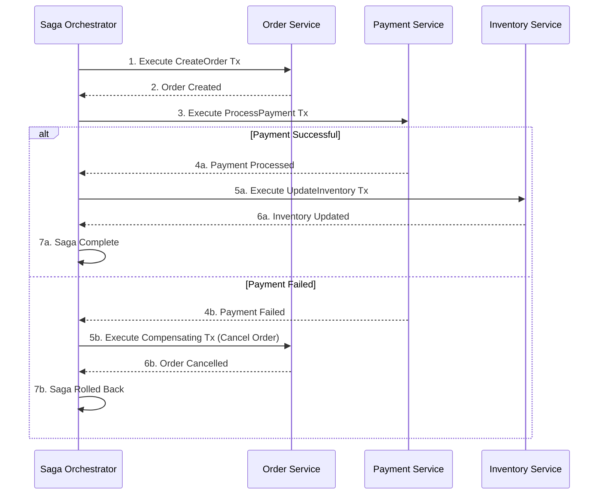
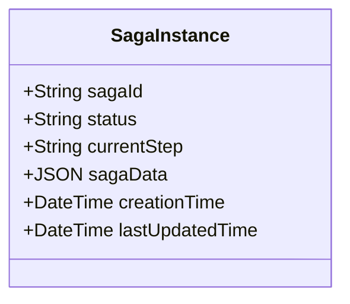

# Saga Pattern

The **Saga** pattern is an [[software-architecture/architectural-patterns/|architectural pattern]] for managing data consistency in a distributed [[microservices|microservices architecture]]. It provides a way to handle long-lived transactions (LLTs) that span multiple services without relying on traditional two-phase commit (2PC) protocols, which are often impractical in a distributed environment due to their locking nature. A saga is a sequence of local transactions where each transaction updates the [[software-architecture/databases/|database]] within a single service and publishes an event or message that triggers the next transaction in the saga.

* **Core Principles:**
    *   **Sequence of Local Transactions:** A saga is composed of a series of atomic, local transactions, where each one is executed by a different service.
    *   **Compensating Transactions:** If any local transaction fails, the saga must roll back the preceding transactions. This is achieved by executing a corresponding **compensating transaction** for each completed step, in reverse order. A compensating transaction is an operation that undoes the effect of a previous transaction (e.g., a `CancelOrder` action to compensate for a `CreateOrder` action).
    *   **Atomicity (All or Nothing):** The saga guarantees that either all local transactions in the sequence complete successfully, or the system state is returned to its initial condition through compensation.

---

## Key Components and Communication Flow

There are two main ways to coordinate a saga: **Choreography** and **Orchestration**.

### 1. Choreography-Based Saga

In this approach, there is no central coordinator. Each service participating in the saga subscribes to events from other services and acts accordingly.

*   **Pros:** Simple, decoupled, no single point of failure.
*   **Cons:** Can be hard to track the state of a transaction, risk of cyclic dependencies between services.

### 2. Orchestration-Based Saga

In this approach, a central **orchestrator** (or coordinator) is responsible for telling the saga participants what to do. The orchestrator manages the sequence of transactions and compensating transactions.

*   **Pros:** Centralized logic, easier to manage complexity, easier to debug and test.
*   **Cons:** Introduces a single point of failure (the orchestrator), services can be tightly coupled to the orchestrator.

---

## Advantages and Technical Challenges

* **Advantages (Benefits):**
    *   **Maintains Data Consistency:** Ensures data consistency across multiple services without using distributed transactions.
    *   **Improved Resilience:** Avoids the need for distributed locks, which improves system resilience and performance. Services are less coupled and can be scaled independently.
    *   **Flexibility:** Allows for long-running transactions that can last for hours or even days.

* **Challenges:**
    *   **Complexity:** Implementing sagas is complex. Developers need to design compensating transactions carefully.
    *   **Eventual Consistency:** The data is only consistent at the end of the saga. This can be challenging for developers and users who are used to immediate consistency.
    *   **Debugging:** Debugging a distributed transaction that spans multiple services can be difficult. Centralized logging and tracing are essential.
    *   **Lack of Isolation:** Unlike traditional ACID transactions, sagas do not have isolation. This means that other transactions can see the intermediate state of the saga. This needs to be handled carefully (e.g., by marking orders as "Pending").

---

## Saga Persistence

In the Saga pattern, it is often necessary to store and persist the state of the saga itself, especially if the distributed transactions it orchestrates are long-running, involve multiple services, and require fault tolerance and resilience against restarts or intermediate failures.

### The Need for Persistence

The need to persist the state of a saga depends on the implementation approach:

#### 1. Choreography-Based Saga

-   **Persistence Not Required (Generally):** In this approach, there is no central coordinator. Services communicate via events. Each service knows what to do when it receives an event from a previous service, including sending a compensating event in case of a local failure.
-   **Distributed State:** The state of the execution is implicit and distributed across the states of each participating service and the messages (events) they have produced and consumed.
-   **Minimal Persistence:** Each service must persist its own transactional state change before emitting the next event (often with the **Transactional Outbox** pattern or **Transaction Log Tailing**), but the "saga" as a single object is not persisted.

#### 2. Orchestration-Based Saga

-   **Persistence Required (Very Often):** Here, a dedicated service, the **Orchestrator** (or Saga Manager), manages the logic of the sequence of steps and compensations.
-   **Centralized State:** The Orchestrator must maintain the current state of the execution (what is the next step? which step failed? which steps need to be compensated?).
-   **Reasons for Persistence:**
    -   **Resilience:** If the orchestrator fails or restarts, it must be able to resume the saga exactly where it left off to avoid blocking the transaction or creating inconsistencies.
    -   **Audit/Traceability:** Allows tracking the progress and diagnosing problems.
    -   **Compensation:** The Orchestrator needs to know which steps have been completed to be able to trigger the appropriate compensation actions in case of a late failure.

### How to Persist a Saga (Orchestration)

If you opt for the Orchestration approach and need to persist the state, here are the common methods:

#### 1. Using a Relational or NoSQL Database

This is the most direct method for the Orchestrator:

-   **Saga Instance Entity:** Create a table (or a [[nosql|NoSQL]]  collection) to store saga instances.
-   **Typical Fields:**
    -   `sagaId` (primary key)
    -   `state` / `status` (e.g., `STARTED`, `STEP_1_COMPLETED`, `FAILED`, `COMPENSATING`, `COMPLETED`)
    -   `currentStep`
    -   `creationTime`, `lastUpdatedTime`
    -   `sagaData` (payload/context of the transaction, often stored in JSON)

-   **Transactional Update:** The state of the saga must be updated transactionally (or at least "atomically" if [[nosql|NoSQL]] ) before sending the command for the next step. This ensures that in case of a failure right after sending, the restarted orchestrator will know that it needs to send the command again (if it has not received a response) or that it needs to move forward.

#### 2. [[event-sourcing|Event Sourcing]] for the Saga

This is a powerful approach for complex and long-running sagas:

-   **Principle:** Instead of storing the current state of the saga, you store an immutable sequence of events (e.g., `SagaStartedEvent`, `Step1CompletedEvent`, `Step2FailedEvent`).
-   **Advantages:**
    -   The current state is determined by replaying the events.
    -   Provides a complete and unalterable history of the saga's execution (perfect for auditing).
    -   Simplifies the logic of resumption and compensation because the complete history is available.
-   **Implementation:** The Orchestrator stores these events in an **Event Store**. After a restart, it reloads the events for the relevant `sagaId` and rebuilds the state to resume work.

#### 3. Specialized Frameworks

For large-scale development, specialized frameworks for Distributed Transactions or Workflow Management can be used, and they often handle the persistence of the saga state for you (e.g., **Camunda**, **Zeebe**, **Temporal/Cadence**, **Axon Framework**). These tools are designed for the execution of persistent state and the management of long-running enterprise workflows.

---

## Related Patterns, Concepts and Variations

*   **[[microservices|Microservices]]:** The Saga pattern is a common solution for managing distributed transactions in a microservices architecture.
*   **[[event-sourcing|Event Sourcing]]:** Sagas can be implemented using events. In an event-sourced system, a saga can be seen as a process that reacts to events and produces new events.
*   **Transactional Outbox:** This pattern can be used to ensure that events are published reliably after a local transaction is committed. This is crucial for choreography-based sagas.
*   **Two-Phase Commit (2PC):** The Saga pattern is an alternative to 2PC. While 2PC provides strong consistency, it is often not suitable for distributed systems due to its blocking nature.

--- 

## **Resources & links**

### **Articles**

1.  **[Saga Pattern by Microsoft](https://docs.microsoft.com/en-us/azure/architecture/reference-architectures/saga/saga)**

    A comprehensive guide from Microsoft that explains the pattern in detail, with a focus on the orchestration and choreography approaches.

2.  **[Pattern: Saga by Chris Richardson](https://microservices.io/patterns/data/saga.html)**

    An excellent article by the author of "Microservices Patterns". It provides a clear explanation of the pattern and its trade-offs.

### **Videos**

1. **[The Saga Pattern in Microservices (EDA - part 2)](http://www.youtube.com/watch?v=C0rGwyJkDTU)** (A Dev' Story)

    Explains the **Saga Pattern** for managing **distributed transactions** across multiple **Microservices** that each have their own database. Details the two main implementation methods: **Orchestration** (centralized service controls the flow) and **Choreography** (services communicate via **Events**) with compensation logic for failures.

2. **[Saga Pattern For Microservice Architecture With Rebus And RabbitMQ](http://www.youtube.com/watch?v=dlXCodLxhag)** (Milan Jovanović)

    A practical deep dive showing how to implement the **Orchestrated Saga Pattern** in a .NET Core microservice environment. Uses the **Rebus** library and **RabbitMQ** as the message broker, with PostgreSQL for persistence, to ensure data consistency through a defined sequence of steps and handlers.