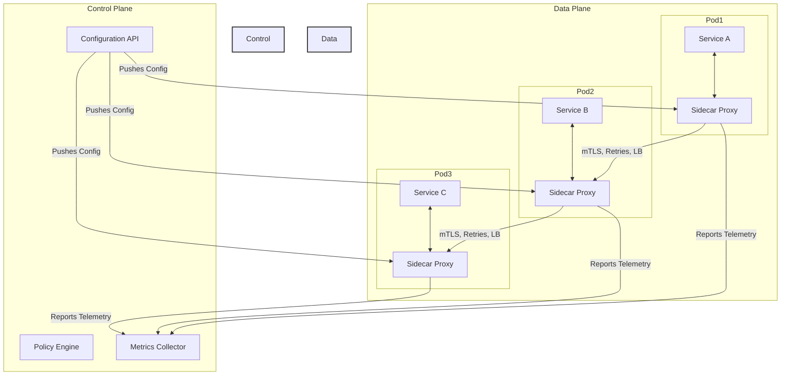

# Service Mesh Architecture

A **Service Mesh** is a dedicated, configurable infrastructure layer that handles inter-service communication in a microservices architecture. It provides a transparent and language-agnostic way to manage, secure, and observe services. Its primary goal is to move the logic governing communication out of individual services and into the platform itself.

A service mesh is implemented by extending the **[[sidecar]]** pattern. It works by deploying a network of lightweight proxy sidecars alongside each service instance. These proxies intercept all traffic between services, allowing the mesh to control how services interact without requiring any changes to the application code.

* **Core Principles:**
    * **Transparency:** The service mesh is largely invisible to the application code. Services are unaware that their communication is being intercepted and managed.
    * **Decentralized Data Plane, Centralized Control Plane:** The architecture is split into a **Data Plane** (the sidecar proxies that handle traffic) and a **Control Plane** (the management layer that configures the proxies).
    * **Language Agnostic:** Because the logic is handled in a sidecar proxy, the benefits of the mesh are available to all services, regardless of the language they are written in.
    * **Policy-Driven:** Communication rules (like routing, security, and retries) are defined as policies in the control plane and dynamically pushed to the data plane.

---

## Key Components and Communication Flow

1.  **Data Plane:** Composed of a fleet of **[[sidecar]]** proxies (e.g., Envoy, Linkerd) deployed alongside each service instance. The data plane is responsible for actually handling the traffic: intercepting calls, encrypting/decrypting data, applying routing rules, and collecting telemetry.
2.  **Control Plane:** The brain of the service mesh (e.g., Istio, Consul). It does not touch any request traffic. Its job is to manage and configure all the sidecar proxies in the data plane. It provides a central API for operators to define policies for routing, security, and observability.

**Typical Communication Flow:**
1.  An operator defines a policy in the **Control Plane** (e.g., "all traffic to Service B must have a 1-second timeout").
2.  The Control Plane translates this policy into a specific configuration and pushes it to all relevant sidecar proxies.
3.  When Service A wants to call Service B, its outbound call is transparently intercepted by its local sidecar proxy (Proxy A).
4.  Proxy A, using the configuration from the Control Plane, discovers an instance of Service B, applies the timeout policy, encrypts the traffic using mTLS, and forwards the request to the sidecar proxy of Service B (Proxy B).
5.  Proxy B receives the request, decrypts it, and forwards it to the local Service B instance.
6.  Throughout this process, both proxies collect detailed metrics and logs and send them back to the Control Plane for centralized observability.

---

## Advantages and Technical Challenges

* **Advantages (Benefits):**
    * **Uniform Observability:** Delivers consistent metrics, logs, and traces for all traffic within the mesh, providing deep insights into application behavior without instrumenting the code.
    * **Improved Security:** Enforces security policies like mutual TLS (mTLS) by default, securing all service-to-service communication.
    * **Enhanced Resilience:** Provides out-of-the-box implementations of resilience patterns like **[[posa|Retries]]**, **[[posa|Timeouts]]**, and **[[posa|Circuit Breakers]]**.
    * **Advanced Traffic Management:** Enables sophisticated deployment strategies like canary releases, A/B testing, and traffic shifting through fine-grained routing rules.

* **Challenges:**
    * **Operational Complexity:** A service mesh is a complex distributed system in its own right. It requires expertise to deploy, manage, and troubleshoot.
    * **Resource Overhead:** The sidecar proxies in the data plane consume additional CPU and memory for every service instance.
    * **Latency:** The extra proxy hop for every service call introduces a small amount of latency.
    * **Control Plane as a Single Point of Failure:** While the data plane can often continue to function if the control plane goes down, configuration changes and policy updates will not be possible.

---

## Related Patterns, Concepts and Variations

A Service Mesh is not a standalone concept; it integrates and implements several other patterns.

*   **[[sidecar]]:** The Service Mesh pattern is implemented *using* the Sidecar pattern. The data plane of a service mesh is a network of sidecar proxies.
*   **[[posa|Ambassador]]:** A service mesh can be seen as a sophisticated evolution of the Ambassador pattern, applied systematically to *all* services in a system for both inbound and outbound traffic, and managed by a central control plane.
*   **[[posa|Proxy]]:** The sidecar proxies that form the data plane are all instances of the Proxy pattern, as they intercept and manage network communication on behalf of the application.
*   **[[posa|Circuit Breaker]], [[posa|Retry]], [[posa|Timeout]]:** A service mesh provides out-of-the-box implementations of these resilience patterns, enforcing them at the platform level rather than in application code.

### Architectural Context

*   **[[microservices|Microservices]]:** A Service Mesh is considered a best-practice solution for managing the network complexity inherent in a large-scale microservices architecture. It addresses the challenges of reliability, security, and observability in a systematic way.
*   **[[broker|Broker]]:** While philosophically different ("smart pipes" in a classic broker vs. "dumb pipes" in a mesh), the Control Plane of a service mesh fulfills a broker-like role by centralizing the *control* and *policy* of communication, even though the execution is decentralized in the data plane.

---

## **Resources & links**

### **Articles**

1.  **[What is a Service Mesh? (Kong Inc.)](https://konghq.com/blog/learning-center/what-is-a-service-mesh)**

    This article defines a **Service Mesh** as a dedicated infrastructure layer for managing **east-west** (internal) communication between microservices. It works by routing all inter-service traffic through **sidecar proxies**, which offloads cross-cutting concerns (like security, reliability, and observability) from the application code. It explains the two main components: the **Data Plane** (the sidecar proxies, often Layer 7 proxies like Envoy) and the **Control Plane** (the centralized management system that configures the proxies). The mesh enables advanced **traffic management** features such as **[[load-balancing|load balancing]]**, **traffic splitting**, **canary releases**, and **[[circuit-breaker|circuit breaking]]**.

2.  **[Understanding Sidecar and Service Mesh (Medium)](https://medium.com/@dinesharney/understanding-sidecar-and-service-mesh-a-beginners-guide-to-kubernetes-patterns-787c6d90a96e)**

    This beginner's guide introduces the **Sidecar Pattern** as a single helper container running alongside the main application container within a Kubernetes Pod, handling tasks like logging or proxying. It then defines a **Service Mesh** as a network of coordinated sidecars that form a powerful traffic control system across multiple microservices. The mesh's architecture is broken down into the **Control Plane** (the brain for configuration and policies, e.g., Istio's components) and the **Data Plane** (the collection of sidecar proxies, e.g., Envoy). The core benefit is separating business logic from communication logic, leading to improved **modularity**, **observability**, and **security**.

---

### **Videos**

1.  **[Istio & Service Mesh - simply explained in 15 mins (TechWorld with Nana)](http://www.youtube.com/watch?v=16fgzklcF7Y)**

    This video explains the concept of a **Service Mesh** by first detailing the communication challenges in a microservices environment, such as the need for service discovery, security (mTLS), retries, and metrics for every service. It then shows how the mesh addresses this by introducing the **Sidecar** pattern, which automatically injects an **Envoy proxy** into every microservice pod. The video focuses on **Istio** as an implementation, describing its architecture with the **Control Plane (Istiod)** and the **Data Plane** (Envoy proxies). It highlights key features like **Traffic Splitting** (Canary Deployment) and the use of Kubernetes **CRDs** (Custom Resource Definitions) for configuration, and the role of the **Ingress Gateway** as the cluster's entry point.

2.  **[How Service Meshes Work in Kubernetes (Microsoft Developer)](http://www.youtube.com/watch?v=izVWk7rYqWI)**

    This presentation focuses on how a service mesh handles **east-west [[load-balancing|load balancing]]** (service-to-service communication) within a Kubernetes cluster. It emphasizes the deployment of the mesh as **Sidecar** containers. The three main benefits a mesh provides are detailed: **Authorization** (defining which services can talk to each other), **Experiments/Canary Releases** (traffic splitting, e.g., 99% to v1 and 1% to v2), and collecting **Metrics** (latency, errors). Finally, it introduces the **Service Mesh Interface (SMI)** as a standard API to ensure tooling interoperability across different service mesh implementations (e.g., Istio, Linkerd).