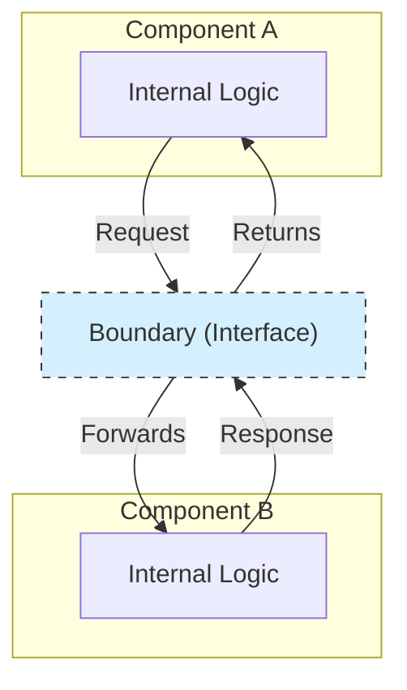

# Boundaries

In software architecture, **boundaries** are the lines of separation between different parts of a system. These lines define the points of interaction between software components and dictate how they communicate with each other. A well-defined boundary is an explicitly defined interface that hides the internal details of a component or system.

The primary goal of establishing clear boundaries is to manage complexity and reduce coupling, allowing different parts of a system to evolve independently.

---

## Why Are Boundaries Important?

By defining clear boundaries, architects and developers can:

1.  **Reduce Coupling:** Components do not need to know about the internal workings of other components. They only interact through a stable, well-defined interface at the boundary.
2.  **Improve Testability:** Each component can be tested in isolation by mocking or stubbing its dependencies at the boundary line.
3.  **Increase Maintainability:** Changes made within one component are less likely to break other parts of the system, as long as the boundary contract is respected.
4.  **Enable Parallel Development:** Different teams can work on different components simultaneously, as the boundary interface serves as a clear contract between them.
5.  **Defer Decisions:** Boundaries allow you to defer decisions about implementation details. For example, you can define a repository boundary (an interface) without having to immediately decide which database technology will implement it.

---

## Types of Boundaries

Boundaries can be logical (within a single process) or physical (across a network).

### 1. Logical Boundaries
These exist within a single deployable unit, like a monolithic application. They are enforced by code organization and language features.

- **Examples:**
    - The separation between layers in a [[layered|Layered Architecture]].
    - The interfaces between different modules in a [[modular-monolith|Modular Monolith]].
    - The separation between classes or packages in object-oriented programming.

### 2. Physical Boundaries
These exist between physically separate, independently deployable components. Communication across these boundaries typically involves network calls.

- **Examples:**
    - The API calls between [[microservices]] in a distributed system.
    - The communication between a client (e.g., a web browser) and a server.
    - The interaction between your system and a third-party API.

---

## Relationship with Other Principles and Architectures

The concept of boundaries is central to many other architectural principles:

-   **[[hexagonal|Hexagonal Architecture (Ports & Adapters)]]:** This pattern is explicitly about defining a clear boundary around the application core. The "ports" are the interfaces that define this boundary.
-   **[[policies-details|Policies vs. Details]]:** Boundaries are what separate high-level policies from low-level details. The boundary crossing is where data is transformed from a format convenient for the details (e.g., a database row) to a format convenient for the policy (e.g., a domain entity).
-   **[[cohesion-coupling|Low Coupling]]:** The primary goal of a boundary is to achieve low coupling.
-   **[[design-by-contract|Design by Contract]]:** A contract formally defines the obligations and guarantees for any interaction that crosses a boundary.
-   **[[service-mesh|Service Mesh]]:** In a microservices architecture, a service mesh is a dedicated infrastructure layer for managing communication and enforcing rules across physical service boundaries.
