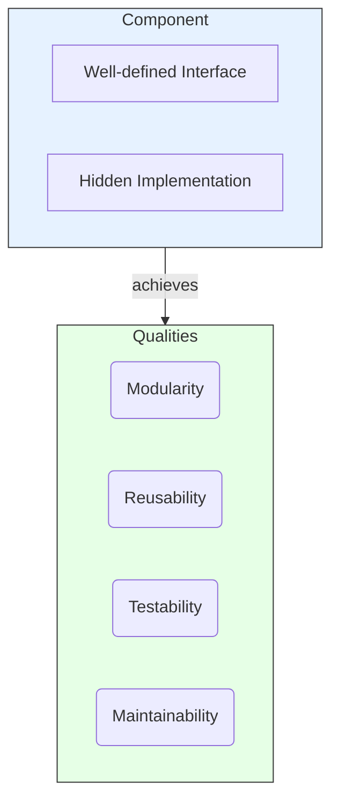
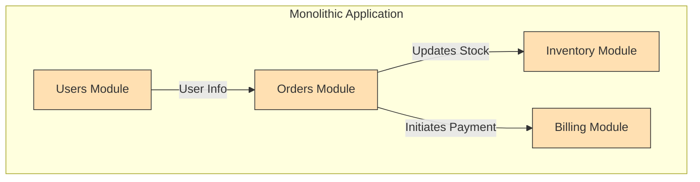
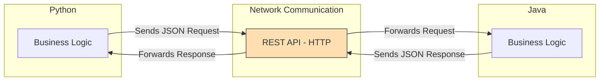

# Component Principles

Component principles in software architecture are guidelines for designing and implementing software components to ensure they are modular, reusable, and easy to understand, test, and maintain. Adhering to these principles leads to a more robust and scalable architecture.

The primary goal is to build systems from independent, interchangeable parts, which simplifies development and reduces the long-term cost of ownership.



This diagram illustrates the core concept of a component. It is a self-contained unit with two key aspects: a **well-defined interface** that acts as its public contract, and a **hidden implementation** (a "black box") that contains the internal logic. By adhering to this structure, a component achieves essential architectural qualities like modularity, reusability, testability, and maintainability.

---

## Key Principles

### 1. High Cohesion
A component should have a single, well-defined responsibility. All its internal elements should work together to achieve that one purpose. This is directly related to the [[solid#Single Responsibility Principle (SRP)|Single Responsibility Principle (SRP)]] and is a cornerstone of good design.
- **See also**: [[cohesion-coupling|Cohesion & Coupling]]

### 2. Low Coupling
Components should be as independent as possible. A change in one component should have minimal to no impact on others. This is achieved by communicating through stable, well-defined interfaces rather than sharing internal details.
- **See also**: [[cohesion-coupling|Cohesion & Coupling]]

### 3. Separation of Concerns (SoC)
A system should be divided into distinct components, each addressing a separate concern (e.g., business logic, data access, user interface). This prevents issues in one area from bleeding into others.
- **See also**: [[soc|Separation of Concerns (SoC)]]

### 4. Interface-Based Design
Components should expose their functionality through well-defined interfaces. Other components (clients) interact with the interface, not the implementation. This allows the underlying implementation to be changed or replaced without affecting the clients. This is the foundation of the [[solid#Dependency Inversion Principle (DIP)|Dependency Inversion Principle (DIP)]], the concept of [[program-against-abstractions|programming against abstractions]], and is closely related to [[design-by-contract]].

A good interface is a contract that clearly defines *what* the component does, but not *how* it does it.

**Code Example (TypeScript):**

Let's define a contract for a data repository.

```typescript
// The Interface (the "what")
export interface IUserRepository {
    getUserById(id: number): Promise<User | null>;
    saveUser(user: User): Promise<void>;
}
```

Now, we can create multiple implementations for this interface. One might use a SQL database, another might be for testing.

```typescript
// Implementation 1: PostgreSQL
export class PostgresUserRepository implements IUserRepository {
    async getUserById(id: number): Promise<User | null> {
        // Logic to query a PostgreSQL database...
        console.log("Fetching user from PostgreSQL");
        return null; // Placeholder
    }

    async saveUser(user: User): Promise<void> {
        // Logic to save user to PostgreSQL...
        console.log("Saving user to PostgreSQL");
    }
}

// Implementation 2: In-memory for testing
export class InMemoryUserRepository implements IUserRepository {
    private users: Map<number, User> = new Map();

    async getUserById(id: number): Promise<User | null> {
        return this.users.get(id) || null;
    }

    async saveUser(user: User): Promise<void> {
        this.users.set(user.id, user);
    }
}
```

A client component depends only on the `IUserRepository` interface, not a concrete class. This allows us to easily swap the real database for a mock one during testing, or change the database technology later.

```typescript
// Client depends only on the interface
class UserService {
    constructor(private userRepository: IUserRepository) {}

    async fetchUser(id: number) {
        return this.userRepository.getUserById(id);
    }
}
```

### 5. Reusability
Components should be designed to be reusable in different contexts and applications. This involves creating generic, context-agnostic logic. A reusable component should have no dependencies on its specific environment; instead, it should receive any required context via its interface (e.g., through parameters or configuration).

**Example: A Reusable UI Component (React)**

A `Button` component in a UI library is a classic example. It doesn't know *why* it's being clicked; it only knows that it *can* be clicked and will notify its parent via a callback. Its appearance and text can be customized via properties (`props`).

```jsx
// Button.jsx - A reusable component
function Button({ onClick, children, variant = 'primary' }) {
    const style = `button button-${variant}`; // e.g., 'button-primary', 'button-secondary'
    return (
        <button onClick={onClick} className={style}>
            {children}
        </button>
    );
}

// Usage in different contexts:

// 1. In a login form
<Button onClick={handleLogin}>Login</Button>

// 2. In a settings page, with a different appearance
<Button onClick={handleSaveSettings} variant="secondary">
  Save Settings
</Button>
```

### 6. Testability
Each component should be testable in isolation. High cohesion and low coupling are prerequisites for testability. By depending on interfaces (abstractions) rather than concrete implementations, we can easily replace real dependencies with "mocks" or "stubs" in our tests. This allows us to test a component's logic without needing to run its real dependencies (like a database or a network service).

**Code Example (Testing `UserService` with Jest):**

Using the `UserService` from the "Interface-Based Design" example, we can test it by providing a mock implementation of `IUserRepository`.

```typescript
// userService.test.ts
import { UserService } from './userService';
import { InMemoryUserRepository } from './userRepository'; // Using our in-memory version for the test

describe('UserService', () => {
    it('should fetch a user correctly', async () => {
        // Arrange: Use a mock/fake repository for the test
        const mockRepo = new InMemoryUserRepository();
        const testUser = { id: 1, name: 'John Doe' };
        await mockRepo.saveUser(testUser);
        
        const userService = new UserService(mockRepo);

        // Act: Call the method we want to test
        const user = await userService.fetchUser(1);

        // Assert: Check if the result is correct
        expect(user).toBeDefined();
        expect(user?.name).toBe('John Doe');
    });
});
```

### 7. Modularity
Modularity is the practice of breaking a large system into smaller, self-contained, and interchangeable modules or components. Each module encapsulates a specific part of the system's functionality, hiding its internal complexity behind a public interface. Think of them like LEGO bricks: each brick has a standard way of connecting to others, but you don't need to know how the plastic was molded to use it.

This principle is the practical application of [[cohesion-coupling|high cohesion and low coupling]]. Each module should be highly cohesive (focused on one business capability) and loosely coupled with other modules.

**Diagram Example: Decomposing a Monolith**

This diagram shows how a monolithic e-commerce application can be logically decomposed into distinct, modular units, even if they are all deployed as a single application ([[modular-monolith|Modular Monolith]]).



In practice, modularity is achieved through language features like packages (Java), namespaces (C#), or Python modules, which help enforce logical boundaries between different parts of the codebase. Architectural styles like [[microservices]] take this a step further by making these modules physically separate, deployable services.

### 8. Interoperability
Components should be able to communicate and work with each other, even if they are developed by different teams or in different technologies. This is achieved by adhering to standardized protocols and data formats.

- **Protocols**: Using well-known communication standards like **HTTP/REST**, **gRPC**, or **AMQP** (for messaging).
- **Data Formats**: Exchanging data in language-agnostic formats like **JSON**, **XML**, or **Protocol Buffers**.

**Diagram Example: Inter-service Communication**

This diagram shows two independent services, one written in Python and the other in Java. They can interoperate because they both communicate via a REST API using the JSON data format.



---

## Benefits

By following these component principles, software can be developed in a way that is:
- **Easy to understand, maintain, and extend.**
- **Less prone to bugs**, as changes are localized.
- **More reusable**, as components can be leveraged in different contexts.
- **Easier to test and deploy**, enabling faster development cycles.