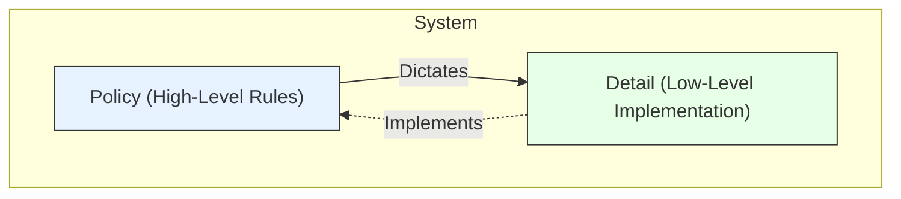

# Policies vs. Details (The Policy/Detail Dichotomy)

In software architecture, the distinction between **policy** and **detail** is a fundamental principle for creating stable, maintainable, and flexible systems. It refers to the separation of high-level business rules and architectural decisions from the low-level implementation mechanisms required to carry them out.

The core idea is that high-level policies should not depend on low-level details. This allows the details to be changed or deferred without impacting the core logic of the system.

---

## 1. What is Policy?

**Policy** represents the high-level decisions, business rules, and overall structure of a system. These are the rules that define *what* the system does and are the most stable and valuable parts of the application.

- **Characteristics:**
    - **Abstract:** Policies define rules, not implementations.
    - **Stable:** They change infrequently, as they are tied to core business needs.
    - **High-Value:** They embody the essential logic and purpose of the software.

- **Examples:**
    - The overall architecture (e.g., deciding to use a [[clean|Clean Architecture]]).
    - Business rules (e.g., "A user must be logged in to place an order," "A premium customer receives a 10% discount on all purchases").
    - The system's public API [[design-by-contract|contracts]] or interfaces.
    - The interaction and dependencies between major components.

Policy decisions are typically made by architects and senior designers and set the direction for the system.

---

## 2. What is Detail?

**Detail** refers to the low-level implementation choices required to realize the policies. These are the mechanisms that define *how* the system's functions are actually performed.

- **Characteristics:**
    - **Concrete:** Details are specific technologies, algorithms, and code.
    - **Volatile:** They can and should be changed or replaced as technology evolves or requirements shift.
    - **Low-Level:** They are concerned with the "how," not the "what."

- **Examples:**
    - The choice of a specific [[software-architecture/databases/|database]] (e.g., [[rdbms|PostgreSQL]] vs. MongoDB).
    - The UI framework used (e.g., React vs. Angular).
    - The specific algorithms or data structures used within a component.
    - The communication protocol for a network call (e.g., REST vs. gRPC).
    - The brand of a third-party API for sending emails.

Details are often implemented by developers and are responsible for the concrete functioning of the system.

---

## Why is This Separation Important?

Separating policy from detail is crucial for building robust systems:

1.  **Stability:** The most important parts of your system (the policies) are shielded from the volatility of the details. You can change the [[software-architecture/databases/|database]] or the UI framework without touching the core business logic.
2.  **Deferring Decisions:** It allows architects to defer decisions about details until later in the project. You can build and test the core business logic without needing a [[software-architecture/databases/|database]] or a UI.
3.  **Testability:** Policies can be tested in isolation without needing to spin up the entire application infrastructure (databases, web servers, etc.).
4.  **Flexibility and Maintainability:** It makes the system easier to maintain and extend. New features can be added by creating new detail implementations without breaking existing policies.

---

## Relationship with Other Principles and Architectures

This dichotomy is a central theme in many modern architectural patterns:

-   **[[clean|Clean Architecture]], [[onion|Onion Architecture]], [[hexagonal|Hexagonal Architecture]]:** These architectures are the ultimate expression of this principle. They place the core business policies at the center of the architecture, with the details (UI, database, external services) located in outer layers. Dependencies always point inward, from the details to the policies.
-   **[[solid#Dependency Inversion Principle (DIP)|Dependency Inversion Principle]]:** The DIP is the primary mechanism for achieving this separation. It states that high-level modules (policies) should not depend on low-level modules (details). Both should depend on abstractions. The policy owns the abstraction, and the detail implements it.
-   **[[program-against-abstractions|Program to an Interface, not an Implementation]]:** This is a direct application of the principle. The interface defines the policy (the [[design-by-contract|contract]]), while the concrete class provides the detail (the implementation).
