# The Twelve-Factor App

The Twelve-Factor App is a methodology for building software-as-a-service ([[soa|SaaS]]) applications that are robust, scalable, and maintainable. It provides a set of principles designed to enable applications to be deployed reliably, scaled quickly, and maintained consistently, especially in [[microservices|cloud-native]] environments.

The methodology was created by developers at Heroku and synthesizes observations from the development and deployment of hundreds of thousands of applications. It aims to minimize the time and cost for new developers, offer maximum portability between execution environments, and minimize divergence between development and production.

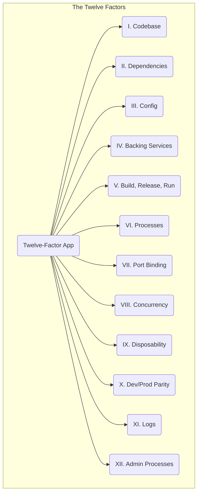

## I. Codebase

**One codebase tracked in revision control, many deploys.**

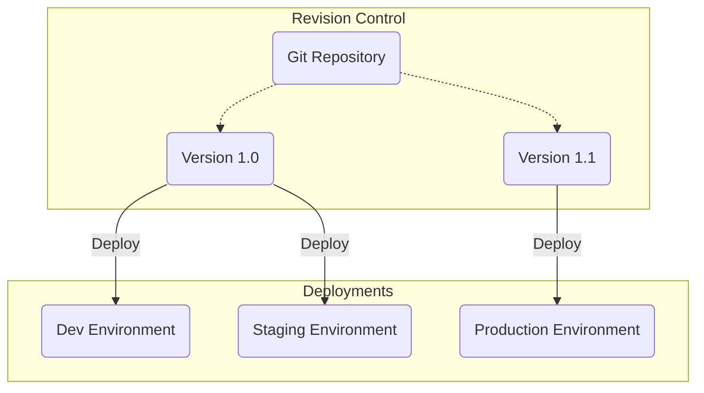

This diagram illustrates how a single codebase from a Git repository can be deployed to multiple, distinct environments. Different versions of the code (e.g., v1.0, v1.1) can be running in different environments simultaneously.

A twelve-factor app is always tracked in a version control system (like Git, Mercurial, or SVN). A single codebase corresponds to a single application. If there are multiple codebases, it's a distributed system, not a single app. Each component of a distributed system is a twelve-factor app and should have its own codebase.

There is a strict one-to-one relationship between the codebase and the app, but a one-to-many relationship between the codebase and its deploys. A deploy is a running instance of the app, such as a production site, a staging site, or a developer's local instance. Different deploys can run different versions of the same codebase.

### Rationale
This principle ensures that all application assets are centrally managed, version-controlled, and auditable. It provides a single source of truth, which simplifies collaboration and facilitates CI/CD processes. By enforcing a single codebase per app, it promotes a clear and understandable system architecture.

### Examples
*   Using a single Git repository for a microservice.
*   If multiple services share code, this shared code should be factored out into a library and included as a dependency.

## II. Dependencies

**Explicitly declare and isolate dependencies.**

A twelve-factor app explicitly declares all its dependencies, completely and exactly, **including specific versions**, via a dependency declaration manifest. It never relies on the implicit existence of system-wide packages and uses a dependency isolation tool during execution to ensure that no implicit dependencies "leak in".

### Rationale
Explicit dependency declaration, including locked versions, simplifies the setup for new developers and ensures deterministic, reproducible builds. It guarantees that the application behaves consistently across all environments, from local development to production, thus eliminating a whole class of "works on my machine" issues. It also makes it easier to manage security vulnerabilities in dependencies.

### Examples
*   **Python**: A `requirements.txt` (often with versions pinned by a tool like `pip-tools`) or a `pyproject.toml` file, used with a `Virtualenv` for isolation.
*   **Node.js**: A `package.json` file with a corresponding `package-lock.json` to lock down dependency versions.
*   **Java**: A `pom.xml` or `build.gradle` file for declaration.

    ```xml
    <!-- Maven pom.xml -->
    <dependencies>
        <dependency>
            <groupId>com.fasterxml.jackson.core</groupId>
            <artifactId>jackson-databind</artifactId>
            <version>2.13.4.1</version>
        </dependency>
    </dependencies>
    ```

## III. Config

**Store config in the environment.**

Configuration is anything that varies between deploys (e.g., development, staging, production). This includes [[software-architecture/databases/|database]] credentials, API keys for external services, and other environment-specific settings.

A twelve-factor app stores this configuration in environment variables. This provides a clean separation between the code and the configuration.

### Rationale
Separating config from code has several key benefits:
1.  **Security**: It prevents sensitive credentials from being checked into version control.
2.  **Portability**: A single build artifact can be promoted across different environments without any code changes. The same code can be deployed to development, staging, and production simply by providing a different set of environment variables. This directly supports the [[#V. Build, Release, Run|Build, Release, Run]] principle.
3.  **Flexibility**: Configuration can be updated easily without needing to rebuild or redeploy the application.

### Examples
Instead of hardcoding a [[software-architecture/databases/|database]] connection string, the application retrieves it from an environment variable:
```python
# Python example
import os
DATABASE_URL = os.environ.get("DATABASE_URL")
```
```javascript
// Node.js example
const databaseUrl = process.env.DATABASE_URL;
```

### Nuances: Configuration Files and the Hybrid Approach

While the Twelve-Factor principle is strict about using environment variables, modern practices have adopted a hybrid approach that respects its spirit while offering more flexibility.

The anti-pattern would be to package environment-specific configuration files (e.g., `config.prod.json`) directly into the build artifact. This violates the strict separation of code and config.

The recommended approach combines two strategies:

1.  **Config files for defaults**: A configuration file (`application.yml`, `appsettings.json`) is included in the build. It contains non-sensitive default values that do not change between environments (e.g., thread pool settings, default routes).

2.  **Overrides via the environment**: Any configuration that varies between environments ([[software-architecture/databases/|database]] credentials, API keys) or is sensitive (secrets) must be supplied via the environment, thereby overriding the default values. Modern frameworks like Spring Boot or ASP.NET Core handle this priority natively.

This approach is made possible and secure by ecosystem tools that externalize configuration and secret management:

*   **Container Orchestrators**:
    *   **Kubernetes ConfigMaps**: To inject non-sensitive configuration files or environment variables.
    *   **Kubernetes Secrets**: To securely manage and mount sensitive data like passwords or API tokens.
*   **Centralized Secret Managers**:
    *   **HashiCorp Vault**: A dedicated solution to centrally store, manage, and access secrets.
    *   **Cloud Services**: Managed services like **Google Secret Manager**, **AWS Secrets Manager**, or **Azure Key Vault** allow secrets to be stored securely and made available to applications at runtime, often via specific SDKs or integrations with the orchestrator.

By using these tools, the build artifact remains environment-agnostic, and secrets are never stored in plaintext or in the source code, thus respecting the fundamental principles of security and portability of the Twelve-Factor methodology.


## IV. Backing Services

**Treat backing services as attached resources.**

A backing service is any service the app consumes over the network as part of its normal operation. This includes [[software-architecture/databases/|databases]] (e.g., PostgreSQL, MongoDB), [[message-queue|message queues]] (e.g., RabbitMQ), caching systems (e.g., Redis), or even external SaaS products (e.g., Stripe, Datadog).

The twelve-factor app treats these services as attached resources, making no distinction between local and third-party services. To the app, they are all accessed via a URL or other locator/credentials stored in the [[#III. Config|config]].

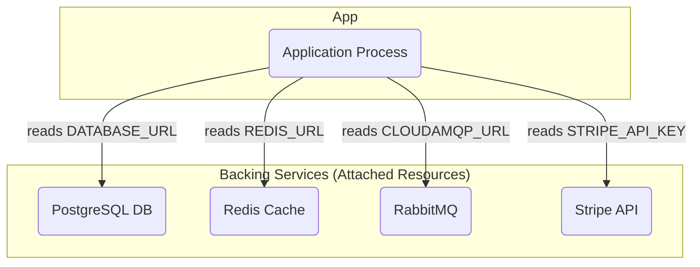

The diagram shows the application process consuming a variety of backing services. It connects to each service by reading its location and credentials from the configuration, without being tightly coupled to the service itself.

### Rationale
This principle promotes [[cohesion-coupling|loose coupling]] and architectural flexibility. By treating all backing services as interchangeable resources, the application becomes decoupled from their specific implementations.

This has powerful implications:
*   **Interchangeability**: A local [[rdbms|SQL database]] used in development can be swapped with a managed cloud [[software-architecture/databases/|database]] in production simply by changing a single environment variable.
*   **Architectural Evolution**: The architecture can evolve over time without code changes. For example, if a part of the application requires a dedicated, high-performance database, a new [[software-architecture/databases/|database]] can be provisioned, and the relevant application processes can be pointed to it just by changing their configuration.
*   **Resilience**: If a backing service fails, the application can be reconfigured to use a replica or a different service.

### Examples
*   Swapping a local [[rdbms|MySQL database]] for Amazon RDS.
*   Replacing a local SMTP server with a third-party service like SendGrid.
*   Switching from a local Redis [[caching|cache]] to a managed ElastiCache instance.

## V. Build, Release, Run

**Strictly separate build, release, and run stages.**

The deployment process must be strictly separated into three distinct stages:
1.  **Build Stage**: Transforms the code into an executable bundle (a "build"). This includes fetching dependencies and compiling code and assets.
2.  **Release Stage**: Combines the build with the config. The resulting release is immutable and contains both the build and the configuration for a specific environment.
3.  **Run Stage**: Executes the app by launching one or more processes from the release.

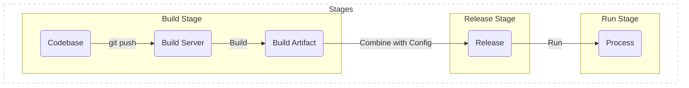

The three strict stages of a deployment pipeline: building the artifact, combining it with config to create a release, and running the release as one or more processes.

### Rationale
This strict separation ensures that releases are consistent, reproducible, and auditable. A release, once created, is immutable and should never be changed. If a change is needed, a new release must be created. This makes rollbacks simple and reliable, as you can always revert to a previous release. It also prevents changes from being made directly in production, which is a common source of errors.

### Examples
*   **Docker**: `docker build` creates an image (the build). A release is this image combined with a set of environment variables. `docker run` executes the release.
*   **CI/CD Pipeline**: A CI server builds an artifact. A CD server takes this artifact, injects environment-specific configuration, and deploys it to create a running application.

## VI. Processes

**Execute the app as one or more stateless, share-nothing processes.**

The app is executed as one or more stateless and share-nothing processes. This means that any data that needs to persist must be stored in a stateful backing service (like a [[software-architecture/databases/|database]] or a distributed [[caching|cache]]). Processes should not share memory or disk space, as this would make them stateful and difficult to scale.

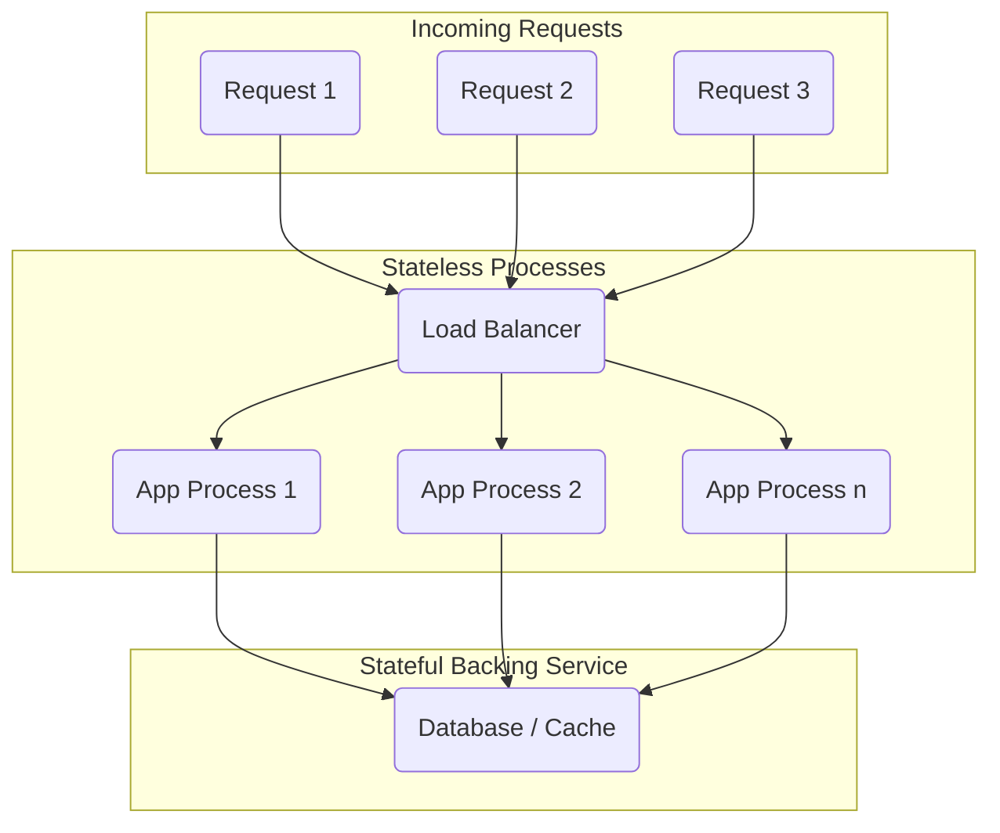

This diagram shows that any incoming request can be handled by any application process. The processes themselves do not store any state; instead, they read and write state to a shared, external backing service.

### Rationale
Stateless processes are fundamental to achieving horizontal scalability and fault tolerance. Because any process can handle any request, new processes can be added to handle increased load. If a process crashes, its workload can be seamlessly redistributed to the remaining processes withoutany loss of session data. This contrasts with stateful applications where a user's session is tied to a specific server, making scaling and recovery complex.

### Examples
*   Storing user session data in a shared, external datastore like Redis, rather than in the application's local memory.
*   Any file uploads should be stored in a distributed file system like Amazon S3, not on the local filesystem of a process. This is often implemented using the [[valet-key]] pattern, which allows the client to upload the file directly and securely.
*   The use of "sticky sessions" in a [[load-balancing|load balancer]] is a clear violation of this principle, as it attempts to route a user to the same stateful process for every request.

## VII. Port Binding

**Export services via port binding.**

The twelve-factor app is completely self-contained and exports its services (e.g., an HTTP API) by binding to a port and listening for requests. It does not rely on runtime injection of a web server (like a Java WAR file deployed into a Tomcat server).

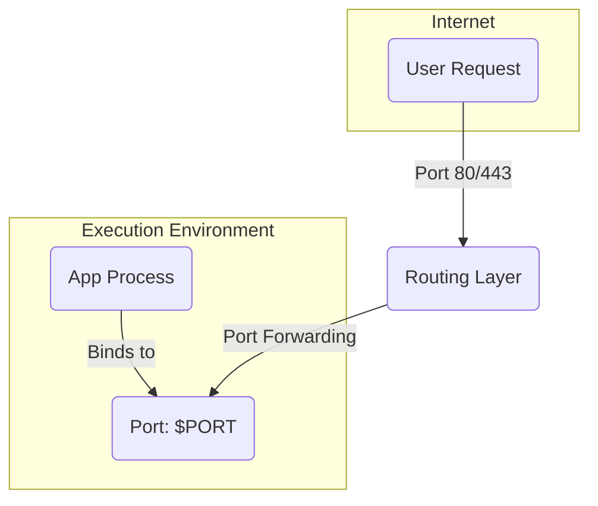

The diagram shows that the application process is completely self-contained, binding to an internal port defined by the `$PORT` environment variable. An external routing layer handles requests from the public internet (on standard ports like 80 or 443) and forwards them to the application's bound port.

### Rationale
This makes the application self-contained and independent of the execution environment. The app knows nothing about the public-facing network; it only binds to a port. This separation of concerns is key.

In production, a routing layer (like a [[load-balancing|load balancer]] or [[api-gateway|API gateway]]) handles **port forwarding** from the public port (e.g., 80) to the container/process-internal port. This allows multiple applications to run on the same host, each on its own internal port, without conflicting. It also simplifies development, as the app can be run locally with a simple command.

### Examples
*   A Python web application using Gunicorn to listen on a port specified by the `$PORT` environment variable.
*   A Node.js application using Express.js to listen on `process.env.PORT`.
*   A self-contained Java application packaged as a JAR with an embedded server like Jetty or Netty.

## VIII. Concurrency

**Scale out via the process model.**

The app scales out via the process model. Instead of a single, large [[monolithic|monolithic process]], the application is divided into smaller, independent processes. Each process should be [[#VI. Processes|stateless and share-nothing]] to allow for simple and reliable scaling.

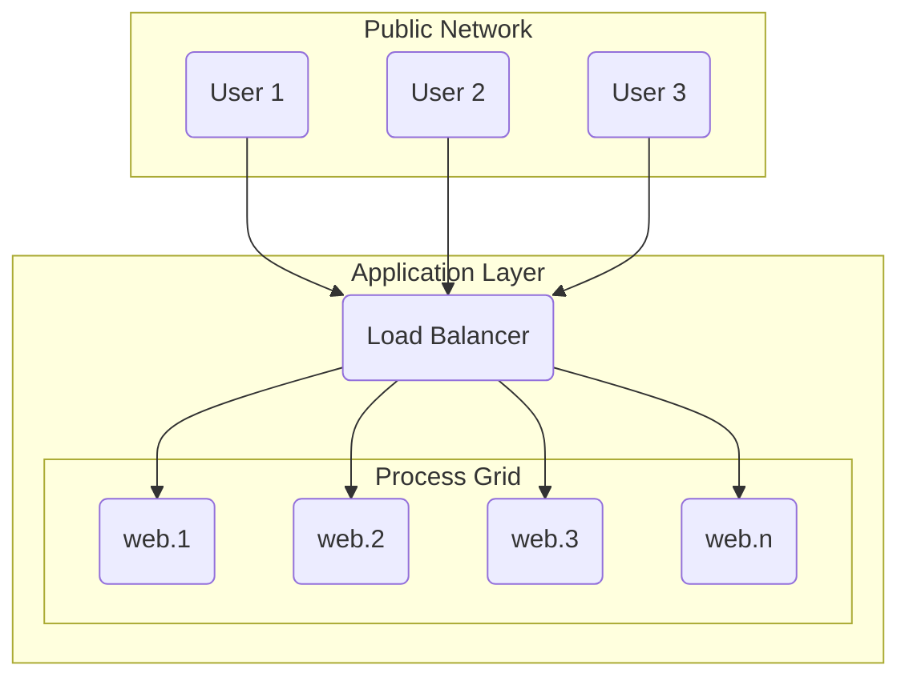

This diagram shows horizontal scaling: a [[load-balancing|load balancer]] distributes incoming requests from multiple users across a number of identical, concurrent `web` processes.

### Rationale
This approach enables simple **horizontal scaling** (adding more processes) as opposed to **vertical scaling** (making a single process more powerful). It allows different parts of the application to be scaled independently based on their specific workload. For example, CPU-intensive background jobs can be scaled separately from the web processes that handle user requests.

This model contrasts with traditional threading models within a single large process. While threads can be memory-efficient, the process model offers greater robustness, as a crash in one process does not affect the others.

### Examples
*   Increasing the number of `web` processes from 2 to 10 to handle a spike in HTTP traffic.
*   Adding more `worker` processes to process a large backlog of jobs from a [[message-queue]].

## IX. Disposability

**Maximize robustness with fast startup and graceful shutdown.**

Processes in a twelve-factor app are disposable, meaning they can be started or stopped at a moment's notice. They should strive to minimize startup time and shut down gracefully upon receiving a `SIGTERM` signal from the process manager.

### Rationale
Disposability is a prerequisite for a robust and elastic system. Fast startup times enable rapid scaling and quick deployments. Graceful shutdown ensures that current requests or jobs are completed or returned to a work queue, preventing data loss. This design is only possible because processes are [[#VI. Processes|stateless]]; since no critical state is held within the process, it can be terminated without fear of data corruption, making it truly 'disposable'.

### Examples
*   A web process, upon receiving `SIGTERM`, stops accepting new connections but continues to process existing requests before exiting.
*   A worker process, when signaled to shut down, returns its current job to the message queue to be reprocessed by another worker.
*   A Java example using a `Runtime` shutdown hook:
    ```java
    import java.util.concurrent.ExecutorService;
    import java.util.concurrent.Executors;
    import java.util.concurrent.TimeUnit;

    public class GracefulShutdownExample {
        private final ExecutorService taskExecutor = Executors.newFixedThreadPool(5);

        public void start() {
            System.out.println("Server started.");
            Runtime.getRuntime().addShutdownHook(new Thread(() -> {
                System.out.println("Shutdown signal received. Shutting down gracefully...");

                // 1. Stop accepting new tasks
                taskExecutor.shutdown();
                try {
                    // 2. Wait for existing tasks to complete
                    if (!taskExecutor.awaitTermination(5, TimeUnit.SECONDS)) {
                        System.err.println("Tasks did not complete in 5 seconds. Forcing shutdown.");
                        taskExecutor.shutdownNow();
                    }
                } catch (InterruptedException e) {
                    // (Re-)Cancel if current thread also interrupted
                    taskExecutor.shutdownNow();
                    Thread.currentThread().interrupt();
                }
                System.out.println("Server shut down.");
            }));
        }
    }
    ```

## X. Dev/prod parity

**Keep development, staging, and production as similar as possible.**

This principle advocates for minimizing the gaps between development and production environments. The three key gaps to minimize are:
1.  **The Time Gap**: Code should be deployed to production quickly after being written.
2.  **The Personnel Gap**: Developers should be involved in the deployment and monitoring of their applications (a core DevOps principle).
3.  **The Tools Gap**: Development and production environments should use the same technology stack.

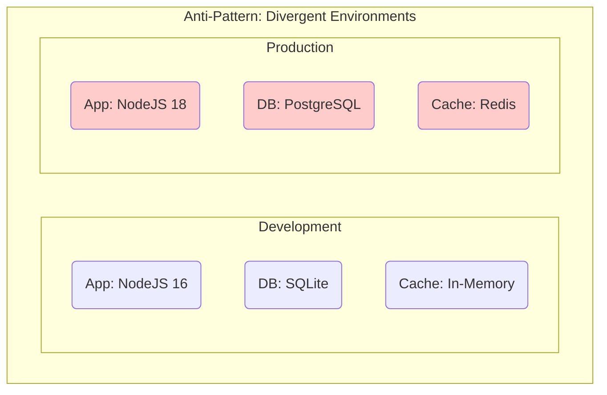
*This diagram shows an anti-pattern where development and production environments use different technologies, leading to a high risk of "works on my machine" errors.* 

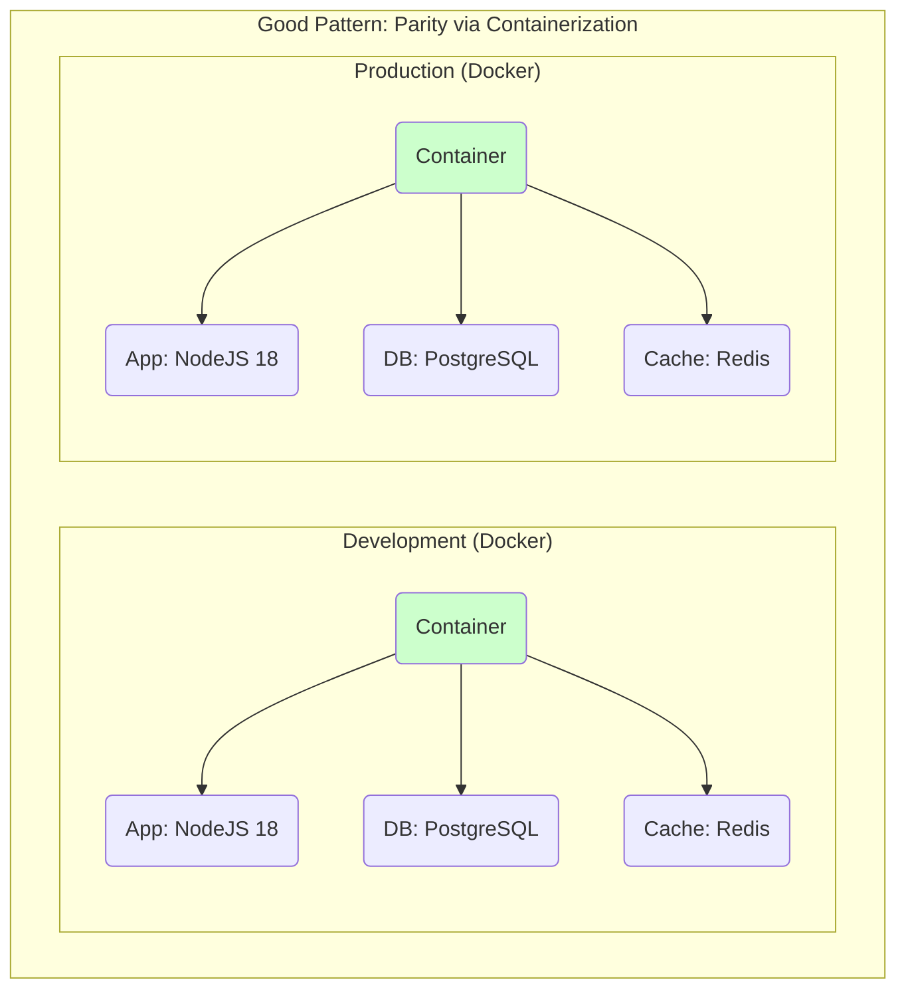
*This diagram shows how containerization helps achieve parity by using the exact same stack in both development and production.*

### Rationale
Historically, the gaps between development and production were large, leading to painful and risky deployments. Even small differences in the stack—like a minor version mismatch in a [[software-architecture/databases/|database]] or a dependency—can cause subtle bugs that only appear in production. The goal of dev/prod parity is to make the deployment process predictable, reliable, and continuous.

Modern tools like Docker have made achieving parity much easier. By packaging the application and its dependencies into a container, developers can run an environment locally that is identical to the one in production.

### Examples
*   Using containerization (like Docker) to create local development environments that closely mirror the production environment.
*   Using the same backing services (e.g., [[rdbms|PostgreSQL]] in all environments, not SQLite in dev).
*   Ensuring developers have access to production logs and monitoring tools to understand how their code behaves in the real world.

## XI. Logs

**Treat logs as event streams.**

Logs are treated as time-ordered [[event-driven|event streams]]. The application itself should never concern itself with routing or storage of its output stream. Instead, each running process writes its event stream, unbuffered, to `stdout`.

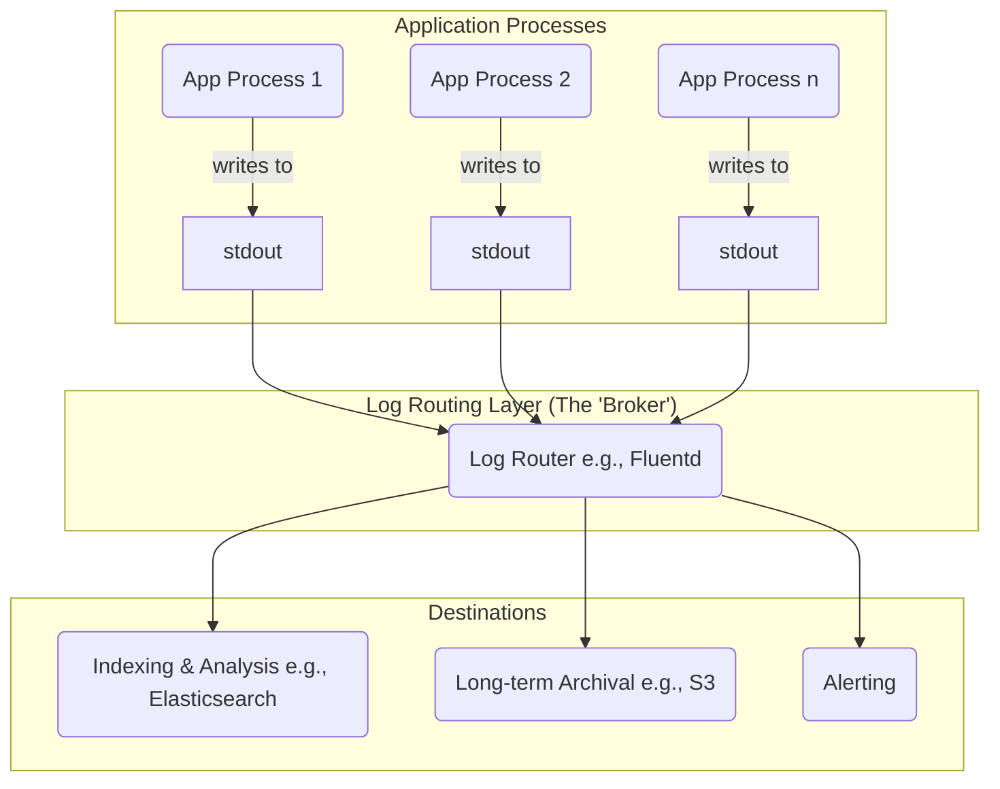

The diagram illustrates the log pipeline. Application processes are decoupled from log management; they simply write their event stream to `stdout`. A separate log routing layer then acts as a broker, collecting these streams and distributing them to multiple destinations for analysis, storage, and alerting.

### Rationale
This approach decouples the application from the log management infrastructure. The application doesn't need to know where its logs will end up. The execution environment takes on the responsibility of capturing, aggregating, and routing the log streams. This provides immense flexibility, allowing operators to change log analysis tools, add new destinations, or modify storage policies without touching the application code. It turns logging into a configurable and scalable backing service.

### Examples
*   An application writing a JSON object to `stdout` for each event.
*   A container orchestrator like Kubernetes capturing the `stdout` stream from all containers.
*   A log router like **Fluentd** or **Logstash** collecting these streams, parsing them, and forwarding them to multiple outputs like **Elasticsearch** for searching and **Amazon S3** for long-term archival.

## XII. Admin Processes

**Run admin/management tasks as one-off processes.**

Administrative tasks (e.g., [[software-architecture/databases/|database]] migrations, running a console/REPL, executing one-off scripts) should be run as one-off processes. These processes must execute in an identical environment to the regular application processes, using the same codebase, config, and dependency isolation.

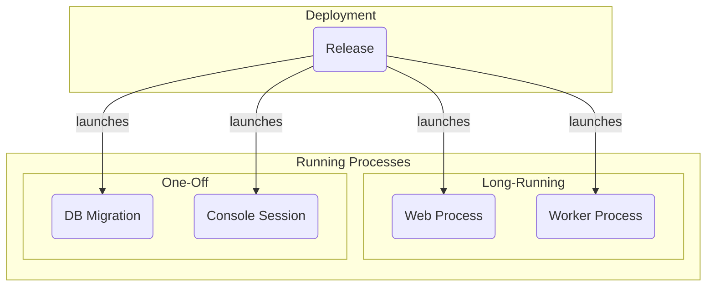

This diagram shows that a single, identical release is the source for all process types. Both long-running application processes (like `web` and `worker`) and one-off administrative tasks (like `db:migrate`) are launched from the same release, ensuring they run with the same code and configuration.

### Rationale
This ensures that administrative tasks are executed against the correct version of the code and configuration, preventing synchronization issues. Running a migration from a developer's local machine, which might have slightly different code or dependencies, can lead to subtle and hard-to-diagnose data corruption. By treating admin tasks as first-class citizens launched from the application's releases, you guarantee consistency and reliability.

### Examples
*   **Java**: Executing [[software-architecture/databases/|database]] migrations using a build tool plugin like `mvn flyway:migrate`.
*   **JavaScript/Node.js**: Running [[software-architecture/databases/|database]] migrations with a library like `knex`: `npx knex migrate:latest`.
*   **Python/Django**: Running [[software-architecture/databases/|database]] migrations using `python manage.py migrate` or opening a shell with `python manage.py shell`.

---

## Resources & Links

### Articles

1.  **[The Twelve-Factor App](https://12factor.net/)**
    This is the original manifesto written by Adam Wiggins. It is the canonical source for the twelve-factor methodology, providing a detailed explanation of each principle.

2.  **[An illustrated guide to 12 Factor Apps](https://www.redhat.com/en/blog/12-factor-app)**
    A blog post from Red Hat by Bob Reselman that offers a concise, illustrated overview of the twelve factors, making it a great starting point for understanding the concepts.

### Videos

1.  **[What is 12-Factor App?](https://www.youtube.com/watch?v=1OhmRmMsGdQ)**
    This video from KodeKloud provides a clear, step-by-step explanation of the methodology, focusing on its application in modern cloud-native and distributed systems.

2.  **[12-Factor App Explained](https://www.youtube.com/watch?v=FryJt0Tbt9Q)**
    In this video, Travis Media walks through each of the twelve factors, explaining their importance and encouraging developers to apply these principles to their own work.