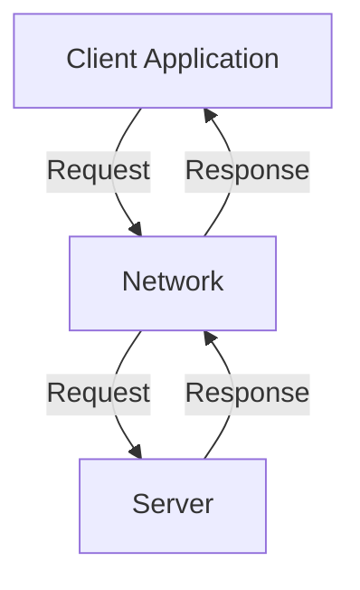

# Client-Server Architecture

The **Client-Server** architecture is a fundamental distributed [[software-architecture/architectural-styles/|architectural style]] where responsibilities are divided into two distinct roles. A **client** is an entity that requests services, while a **server** is an entity that listens for requests and provides the services. This model is based on message exchange over a **network**.

* **Core Principles:**
    * **Separation of Concerns:** The client handles the user interface and presentation logic, while the server is responsible for the business logic, data storage, and security. This separation simplifies the independent development, maintenance, and evolution of each part.
    * **Request/Response:** This is the standard communication pattern. The client sends a synchronous or asynchronous request, and the server provides a response.
    * **Stateless vs. Stateful:**
        * **Stateless:** Each request from the client to the server contains all the information needed for the server to process it. The server does not store any information about the client's session state between requests. This is the **HTTP** model, which is ideal for scalability.
        * **Stateful:** The server retains the client's session state. This can simplify client-side logic but makes the server more complex and less scalable.

---

## Key Components and Communication Flow

1.  **Client:** The entity that initiates requests. Clients can be categorized as:
    *   **Thin Client:** A client with minimal processing logic (e.g., a web browser rendering HTML). Most of the business logic resides on the server.
    *   **Thick Client:** A client that handles a significant amount of processing logic itself (e.g., a desktop application like a video game or a complex mobile app).
2.  **Network:** The communication channel that connects clients and servers. Typical protocols include **HTTP/HTTPS** for web traffic, **gRPC** for efficient inter-service communication, or **WebSockets** for real-time, bidirectional communication.
3.  **Server:** The powerful, centralized entity that listens for requests and provides services. It is responsible for the core business logic, data persistence, and security.

**Typical Data Flow:**
* The client opens a connection with the server.
* The client sends a formatted request (e.g., a `GET /api/data` in HTTP).
* The server processes the request, executes business logic, and interacts with other services (database, other APIs, etc.).
* The server sends a response back to the client (e.g., a **200 OK** status code and a **JSON** response body).
* The connection may be maintained or closed depending on the protocol.

---

## Advantages and Technical Challenges

* **Advantages (Benefits):**
    * **Centralized management:** The management of security, updates, and **data storage** is centralized on the server, which simplifies administration.
    * **Scalability:** The server can be scaled vertically (more power on a single machine) or horizontally (adding new machines) to handle a larger load. The use of **load balancers** and **server clusters** is common.
    * **Resource efficiency:** Clients can be lighter machines (**thin clients**), because most of the processing load is on the server.
    * **Flexibility:** Clients and servers can be developed with different technologies and platforms, as long as they adhere to a common communication protocol.

* **Challenges:**
    * **Single Point of Failure (SPOF):** If the central server fails, the entire system may become unavailable. Solutions include **redundancy** and **clustering**.
    * **Network dependency:** Performance and reliability depend on the quality of the network between the client and the server. **Latency** and **network congestion** can be issues.
    * **Server Bottlenecks:** The server can become a bottleneck if the number of requests becomes too large. **Scalability** is the answer, but it comes with a cost.
    * **Security risks:** The server, being a central point, is a primary target for attacks. Robust security measures are essential, such as **firewalling**, **SSL/TLS**, and authentication.

---

## Related Patterns, Concepts and Variations

The **Client-Server** architecture is the basis for many more sophisticated models, including:

* **2-Tier Architecture:** This is the basic model, with a client communicating directly with a server. Example: a desktop application connected to a database.
* **[[layered|3-Tier Architecture]]:** An intermediate level, the **Application Server**, is added between the client and the **Database Server**. This layer handles the business logic and communication, making the system more flexible and scalable. This is the most common model for enterprise applications.
* **[[layered|N-Tier Architecture]]:** An extension of the 3-Tier model, with multiple server layers to distribute the load and responsibilities.
* **[[microservices|Microservices]]:** A distributed architecture where each service is a mini **Client-Server**. Each microservice exposes an API (via **REST** or **gRPC**) and acts as a server for other services (its clients).

This architectural style, while old, remains the foundation for the majority of modern web and distributed applications. Its conceptual simplicity and robustness make it a pillar of software development.

## **Resources & links**

### **Articles**

1.  **[Client-Server Architecture Explained with Examples, Diagrams, and Real-World Applications](https://medium.com/nerd-for-tech/client-server-architecture-explained-with-examples-diagrams-and-real-world-applications-407e9e04e2d1)**

    This article by Harsh Gupta is an excellent starting point. It's well-structured, with clear diagrams and concrete examples for each concept. It covers the pros, cons, and real-world applications, making it a solid reference.

2.  **[Client-Server Architecture: Deep Dive](https://dev.to/tanishtt/client-server-architecture-deep-dive-1a2e)**
    
    This article goes further by detailing the different **Client-Server** architecture models: **2-Tier**, **3-Tier**, and **N-Tier**. This is a very useful resource for understanding how the basic model has evolved to adapt to more complex systems, a topic of particular interest to an architect.

---

### **Videos**

1.  **[Client Server Architecture | System Design Interview Basics](https://www.youtube.com/watch?v=yioOQ4ItYuo)**
    
    Although designed for **System Design** interviews, this video offers a concise and highly relevant explanation. It covers the basics effectively and links to modern concepts like Cloud service providers (**AWS**, **Azure**).

2.  **[Client-Server Architecture: The Backbone of Modern Software](https://www.youtube.com/watch?v=YPlU0vt5KYw)**
    
    This video is an excellent deep dive that doesn't just stick to the basics but covers aspects like **DNS lookup**, the **TCP handshake**, and how modern architectures like [[microservices|Microservices]] are derived from it. It's ideal for an experienced audience.
