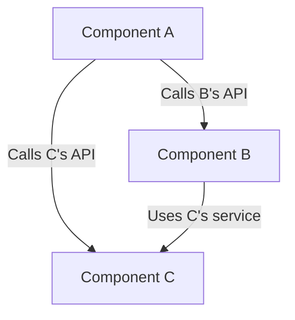

# Component-Based Architecture (CBA)

**Component-Based Architecture (CBA)** is a software architectural style that focuses on decomposing a system into reusable, independent, and self-contained software components. A **component** is a software unit with a clearly defined interface that encapsulates its functionality and data, without exposing its internal complexity.

* **Key Principles:**
    * **Encapsulation:** The component hides its internal implementation and exposes functionalities via a public interface (API).
    * **Clear Contracts:** Communication between components occurs only through their defined interfaces. This is crucial for ensuring independence.
    * **Independence:** A component is designed to be independent and interchangeable. It can be replaced by another one, as long as the new implementation adheres to the same contract.
    * **Decoupling:** Components are loosely coupled, which means that changes in one component have a minimal impact on others.

---

## Key Components and Communication Flow

1.  **Component:** A reusable, binary software unit that can be a simple code module or a more complex functional block. Examples include libraries like `React.js` for **UI components**, authentication services, or shopping cart management modules in an e-commerce application.
2.  **Interface (Contract):** The set of methods, events, or properties a component exposes for use by others. For instance, an `IAuthentication` interface might have a `login(username, password)` method.
3.  **Assembly:** The process of integrating different components to build a larger application or system. Assembly can be done via a platform, a framework, or directly through the application's code.

**Typical Data Flow:**
* A component (the **client**) needs a certain functionality.
* It calls the interface (API) of another component (the **service provider**).
* The **service provider** executes its internal logic.
* It returns the result to the caller. The process is transparent for the **client**, which doesn't need to know the implementation details.

---

## Advantages and Technical Challenges

* **Advantages (Benefits):**
    * **Reusability:** Components can be reused in different applications, which reduces development costs and time-to-market.
    * **Maintainability & Scalability:** Components can be updated or replaced in isolation without affecting the rest of the system.
    * **Parallel Development:** Different teams can work on separate components simultaneously.
    * **Robustness:** Encapsulation and decoupling increase the system's resilience to failures.

* **Challenges:**
    * **Dependency Management:** Complex projects can have numerous dependencies between components, making management and deployment difficult.
    * **Discovery & Suitability:** Finding or creating a component that precisely meets a need can be challenging. "Off-the-shelf" components may not be suitable and could require costly customization.
    * **Performance:** Inter-component communications can introduce overhead, especially if the components are distributed over a network.
    * **Assembly Complexity:** The phase of integrating components to form the application can be complex and may require specific tools or **Dependency Injection Frameworks** (e.g., Spring, Guice).

---

## Variations and Derived Architectures

**Component-Based Architecture** is a core principle that has given rise to several modern architectures:

* **[[soa|Service-Oriented Architecture (SOA)]]:** An evolution of CBA where components are distributed services accessible over a network via standard protocols like SOAP or REST.
* **[[microservices|Microservices]]:** A variation of SOA. Each microservice is a small [[client-server|Client-Server]] that represents a functional component and can be deployed and scaled independently.
* **User Interface Frameworks:** Libraries like `React` or `Angular` build user interfaces from reusable graphical components.

This architectural style is ubiquitous in modern software development, particularly in enterprise systems, web frameworks, and **cloud** service platforms. It promotes a modular approach and fosters the creation of more flexible and maintainable systems.

---

## **Resources & Links**

### **Articles**

1.  **[Component Based Architecture. Revamping the architecture thoughts](https://medium.com/omarelgabrys-blog/component-based-architecture-3c3c23c7e348)**
    
    This article discusses CBA principles in a simple, concise way. It draws a direct link between this architectural style and [[microservices|Microservices]], a very useful perspective for modern developers and architects.
    
2.  **[Component-Based Design in Software Architecture - DEV Community](https://dev.to/lovestaco/component-based-design-in-software-architecture-pbf)**
    
    This DEV Community article is very comprehensive. It covers not only the definition and principles but also the component-level design process, concrete examples, and best practices, making it an excellent reference guide.

### **Videos**

1.  **[What is Component Based Architecture? - A Simple Explanation - YouTube](https://www.youtube.com/watch?v=inu5XtR4VZ8)**
    
    This video offers a very clear and visual explanation of the **CBA**. It focuses on the basic concepts and how components can be assembled to create complex systems, making it a great starting point.

2.  **[Component Based Architecture Intro - YouTube](https://www.youtube.com/watch?v=X9hk56yyyu4)**
    
    This video, which we decided to keep, focuses on an application in video game development. It explains in great technical detail the principle of components as containers for discrete functions. This is a very relevant resource for an architect who wants to understand the deep mechanisms of this architectural style.