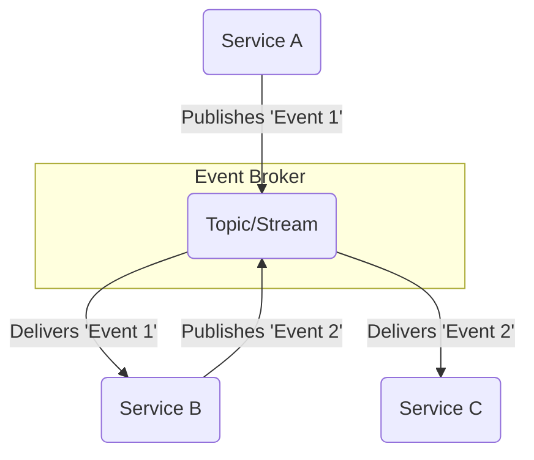
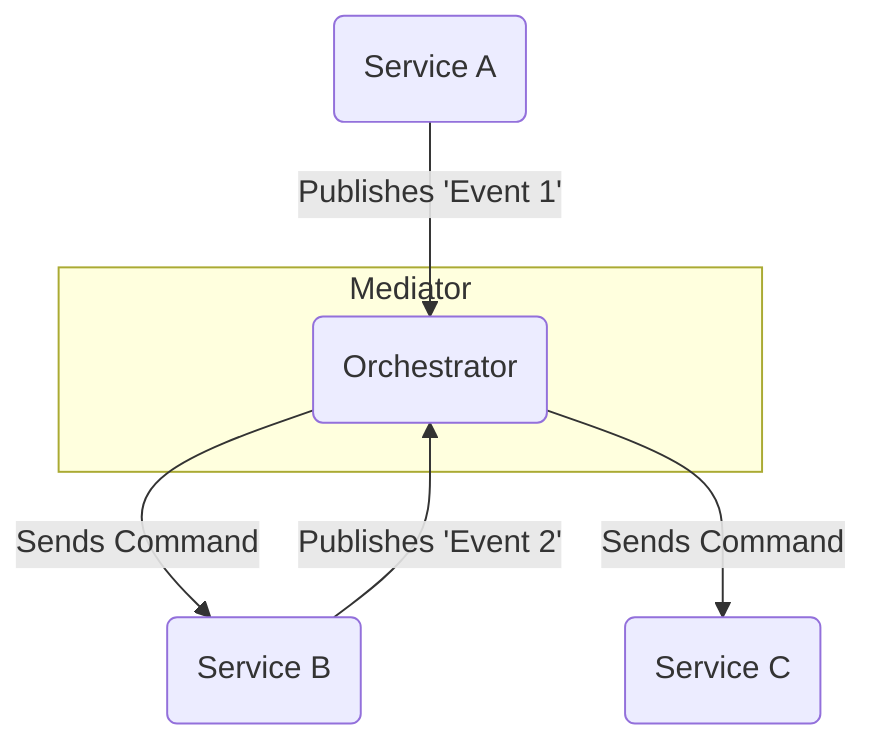

# Event-Driven Architecture (EDA)

**Event-Driven Architecture** (EDA) is a specific, popular implementation of a **[[message-driven|Message-Driven Architecture]]** where the messages are exclusively **events**.

An event is a declarative notification that a significant change in state has occurred (e.g., "Order #123 was shipped"). The service that produces the event (the producer) is not concerned with who is listening or what the outcome of the event will be. It simply broadcasts the fact that something happened. This approach promotes extreme loose coupling and is ideal for building highly responsive and scalable distributed systems.

### **Core Principles**

*   **Asynchronous Communication:** Components communicate without waiting for an immediate response. This non-blocking nature is fundamental to EDA.
*   **Loose Coupling:** Event producers are completely unaware of the consumers, and vice-versa. They only share knowledge of the event itself.
*   **Real-time Responsiveness:** Services can react to events as they happen, enabling dynamic and responsive applications.

---

## EDA Topologies: Orchestration vs. Choreography

There are two primary ways to structure an event-driven architecture:

### 1. Broker Topology (Choreography)

This is the most common and decentralized approach, and it is a direct implementation of the **[[publish-subscribe|Publish-Subscribe]]** pattern. There is no central orchestrator; each service is "smart" enough to know which events it should listen to and how to react. The system's workflow emerges from the independent actions of its components. This is often described as **"smart endpoints and dumb pipes."**

*   **Description:** The diagram illustrates a decentralized topology where services communicate through a central **Event Broker**. `Service A` publishes an event, which is received by `Service B`. `Service B` then processes it and publishes a new event, which is consumed by `Service C`. Each service reacts independently to the events it is subscribed to.

*   **Data Flow:**
    1.  `Service A` (producer) publishes an event (e.g., `OrderCreated`) to a specific topic on the **Event Broker**.
    2.  The Broker immediately delivers the event to all subscribed services. In this case, `Service B` (e.g., a notification service) is a subscriber.
    3.  `Service B` consumes the event, processes it (e.g., sends an email to the customer), and may publish a new, independent event (e.g., `NotificationSent`) to another topic.
    4.  `Service C` (e.g., a shipping service), which is subscribed to the `OrderCreated` event, also receives it and starts its own process. The flow is parallel and decentralized.

*   **How it works:** A service publishes an event to a central broker. Other services subscribe to that event and react by performing their own tasks, which may in turn publish new events.
*   **Pros:** Highly decoupled, resilient, and scalable. Services can be added or removed without reconfiguring a central workflow.
*   **Cons:** The overall business process flow can be difficult to see and debug, as it is distributed across many independent services.

### 2. Mediator Topology (Orchestration)

This approach uses a central **Mediator** or **Orchestrator** to manage and coordinate complex event workflows. The individual services are "dumb" and only know how to perform their specific task. The Mediator subscribes to events and sends explicit commands to other services, telling them what to do next.

*   **Description:** This diagram shows a centralized model where a **Mediator** (or **Orchestrator**) directs the flow of work. `Service A` sends an event to the Mediator, which then issues a direct command to `Service B`. After `Service B` completes its task, it notifies the Mediator, which in turn commands `Service C`. The logic is centralized in the Mediator.

*   **Data Flow:**
    1.  `Service A` publishes an initial event (e.g., `OrderPlacementRequested`) to the **Mediator**.
    2.  The Mediator receives the event and, based on its internal logic, sends a specific command (e.g., `ProcessPayment`) to `Service B` (the payment service).
    3.  `Service B` processes the payment and publishes a result event (e.g., `PaymentProcessed`) back to the Mediator.
    4.  The Mediator receives `PaymentProcessed`, and its orchestration logic determines the next step is to send a command (e.g., `ShipOrder`) to `Service C` (the shipping service). The flow is sequential and centralized.

*   **How it works:** An initial event is sent to the Mediator. The Mediator processes this event and sends a specific command to the next service in the workflow. This continues until the entire process is complete.
*   **Pros:** The business workflow is centralized and explicit, making it easier to understand, manage, and modify.
*   **Cons:** The Mediator can become a bottleneck or a single point of failure. It also introduces some coupling, as the Mediator needs to know about the downstream services.---

## Advantages and Technical Challenges

### **Advantages (Benefits)**

* **Loose Coupling:** Services can be developed, deployed, and managed independently.
* **Resilience:** If a consumer fails, the producer is not affected. Events can be replayed once the service is restored.
* **Horizontal Scalability:** It's easy to add new consumer instances to handle a larger load.
* **Flexibility:** New consumers can be added without impacting existing services.

### **Challenges**

* **Debugging and Traceability:** Following the path of an event across multiple asynchronous services can be complex. The use of **event IDs** and **distributed tracing tools** is critical.
* **State Management:** Managing the state of a long-running process is challenging because it is fragmented across different services.
* **Orchestration Complexity:** Ensuring the correct sequence of events and handling errors in a chain of services can be difficult.
* **Message Reliability:** You must ensure that messages are neither lost nor duplicated (**at-least-once** or **exactly-once delivery**).
* **Consumption Latency:** Although communication is asynchronous, a delay can exist between the time an event is emitted and when it is consumed, due to **queue congestion** or a **message backlog**.

---

## Related Patterns, Concepts and Variations

EDA is often implemented using other patterns that define how events are structured and used.

### Event Content Patterns

*   **Event Notification:** The event is a small, lightweight notification that a state change has occurred. It contains minimal data (e.g., just an ID). The consumer, upon receiving the event, must query the producer service to get the full details. This keeps events small but creates coupling, as the consumer now depends on an API from the producer.
*   **Event-Carried State Transfer:** The event contains all the data related to the state change. The consumer has all the information it needs to act without having to contact the producer. This promotes better decoupling but can lead to larger event payloads and data duplication.

### Related Architectural Patterns

*   **[[event-sourcing|Event Sourcing]]:** A pattern where all changes to an application's state are stored as a sequence of immutable events. Instead of storing the current state of a domain object, you store the history of events that led to that state. This provides a full audit log and allows for powerful temporal queries.
*   **[[cqrs|CQRS (Command and Query Responsibility Segregation)]]:** EDA is a natural fit for [[cqrs|CQRS]]. After a **Command** modifies data, an event is published. The **Query** side of the system can then subscribe to these events to update its own read-optimized data store.

---

## **Resources & Links**

### **Articles**

1.  **[Event-driven architecture](https://learn.microsoft.com/en-us/azure/architecture/guide/architecture-styles/event-driven)**
    
    This Microsoft article describes the fundamental principles of EDA, detailing the components, styles, and when to use this architectural pattern. It provides a comprehensive overview of the design considerations, including how to integrate EDA with Azure services, and outlines common use cases such as real-time processing and complex event processing.

2.  **[Event-Driven Architecture: Explained](https://www.confluent.io/learn/event-driven-architecture/#kafka-flink-and-confluent-for-fully-managed-event-driven-architecture-at-scale)**
    
    This guide covers the core concepts of EDA, explaining how events enable loose coupling and asynchronicity in a system. It presents the key benefits and common use cases of this architecture, with a specific focus on implementing event-driven systems using data streaming platforms like Apache Kafka and Flink.

### **Videos**

1.  **[Lesson 165 - Event-Driven Architecture](https://www.youtube.com/watch?v=P0aUV4ixvBQ)**
    
    This video presents the basic concepts of Event-Driven Architecture. It explains the roles of the key players in this pattern—producers, event brokers, and consumers—and illustrates the flow of events through the system.

2.  **[Event-Driven Architecture: Explained in 7 Minutes!](https://www.youtube.com/watch?v=gOuAqRaDdHA)**
    
    This video offers a concise, high-level explanation of the principles of EDA. It focuses on the advantages of the asynchronous and decoupled model, contrasting it with a more traditional synchronous architecture. It also provides a visual representation of the event flow to aid understanding.