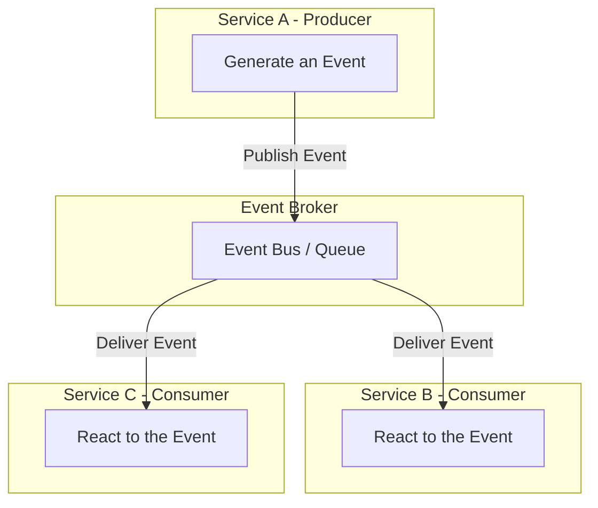

# Event-Driven Architecture (EDA)

**Event-Driven Architecture** (EDA) is an [[software-architecture/architectural-styles/|architectural style]] where the production, detection, consumption, and reaction to events govern system behavior. Instead of a synchronous, request-response communication between services, the system operates on an asynchronous flow of events. An **event** represents a significant state change, such as a payment being processed or a file being uploaded.

### **Core Principles**

* **Decoupling:** Services are independent. An event producer does not need to know about its consumers, and vice versa.
* **Asynchronicity:** Communication is non-blocking. A producer sends an event and continues its work without waiting for a response.
* **Responsiveness:** Components react to events in real time, which is ideal for systems that require quick responses.
* **Scalability:** Producers and consumers can scale independently to handle large loads.

---

## Key Components and Communication Flow

1.  **Event Producer:** The service or component that generates and publishes an event. It has no knowledge of the consumers.
2.  **Event [[broker|Broker]]:** A central service (often an **Event Bus**, a **queue**, or a **streaming platform** like **Apache Kafka** or **RabbitMQ**) that acts as an intermediary between producers and consumers. It receives events and routes them to interested services.
3.  **Event Consumer:** The service that subscribes to one or more event types and reacts to their reception by executing business logic.

### **Typical Data Flow:**

- The **producer** detects a state change and creates an **event**. 
- It publishes this event to the **Event Broker**. 
- The broker stores the event and notifies all subscribed **consumers**. 
- The consumers receive the event and execute their respective tasks (e.g., sending an email, updating a database). Each service performs its task independently, with no direct communication with the other services involved.

---

## Advantages and Technical Challenges

### **Advantages (Benefits)**

* **Loose Coupling:** Services can be developed, deployed, and managed independently.
* **Resilience:** If a consumer fails, the producer is not affected. Events can be replayed once the service is restored.
* **Horizontal Scalability:** It's easy to add new consumer instances to handle a larger load.
* **Flexibility:** New consumers can be added without impacting existing services.

### **Challenges**

* **Debugging and Traceability:** Following the path of an event across multiple asynchronous services can be complex. The use of **event IDs** and **distributed tracing tools** is critical.
* **State Management:** Managing the state of a long-running process is challenging because it is fragmented across different services.
* **Orchestration Complexity:** Ensuring the correct sequence of events and handling errors in a chain of services can be difficult.
* **Message Reliability:** You must ensure that messages are neither lost nor duplicated (**at-least-once** or **exactly-once delivery**).
* **Consumption Latency:** Although communication is asynchronous, a delay can exist between the time an event is emitted and when it is consumed, due to **queue congestion** or a **message backlog**.

---

## Variations and Derived Architectures

The **Event-Driven Architecture** has several variations:

* **Event Notification:** A service sends a notification about an event without including the data. Consumers must then call the original service to get detailed information.
* **Event-Carried State Transfer:** The event contains all the data needed for the consumer to act without having to contact the producer. This is a common model with [[microservices|microservices]].
* **Event Sourcing:** Instead of persisting an entity's current state, a chronological sequence of events that led to that state is stored. This provides a complete history of changes.
* **[[message-driven|Message-Driven Architecture]]:** This is a broader architectural pattern that includes EDA as a subset. It is based on messages rather than events, which implies more formal notions of **commands** and **queries**. In this pattern, a component sends a message with a specific intent (e.g., "create an order"), whereas EDA focuses on state changes (e.g., "an order has been created").

This architectural style has become the foundation of many modern systems, particularly in the areas of [[microservices|microservices]], **IoT**, and **real-time data platforms**.

---

## **Resources & Links**

### **Articles**

1.  **[Event-driven architecture](https://learn.microsoft.com/en-us/azure/architecture/guide/architecture-styles/event-driven)**
    
    This Microsoft article describes the fundamental principles of EDA, detailing the components, styles, and when to use this architectural pattern. It provides a comprehensive overview of the design considerations, including how to integrate EDA with Azure services, and outlines common use cases such as real-time processing and complex event processing.

2.  **[Event-Driven Architecture: Explained](https://www.confluent.io/learn/event-driven-architecture/#kafka-flink-and-confluent-for-fully-managed-event-driven-architecture-at-scale)**
    
    This guide covers the core concepts of EDA, explaining how events enable loose coupling and asynchronicity in a system. It presents the key benefits and common use cases of this architecture, with a specific focus on implementing event-driven systems using data streaming platforms like Apache Kafka and Flink.

### **Videos**

1.  **[Lesson 165 - Event-Driven Architecture](https://www.youtube.com/watch?v=P0aUV4ixvBQ)**
    
    This video presents the basic concepts of Event-Driven Architecture. It explains the roles of the key players in this pattern—producers, event brokers, and consumers—and illustrates the flow of events through the system.

2.  **[Event-Driven Architecture: Explained in 7 Minutes!](https://www.youtube.com/watch?v=gOuAqRaDdHA)**
    
    This video offers a concise, high-level explanation of the principles of EDA. It focuses on the advantages of the asynchronous and decoupled model, contrasting it with a more traditional synchronous architecture. It also provides a visual representation of the event flow to aid understanding.